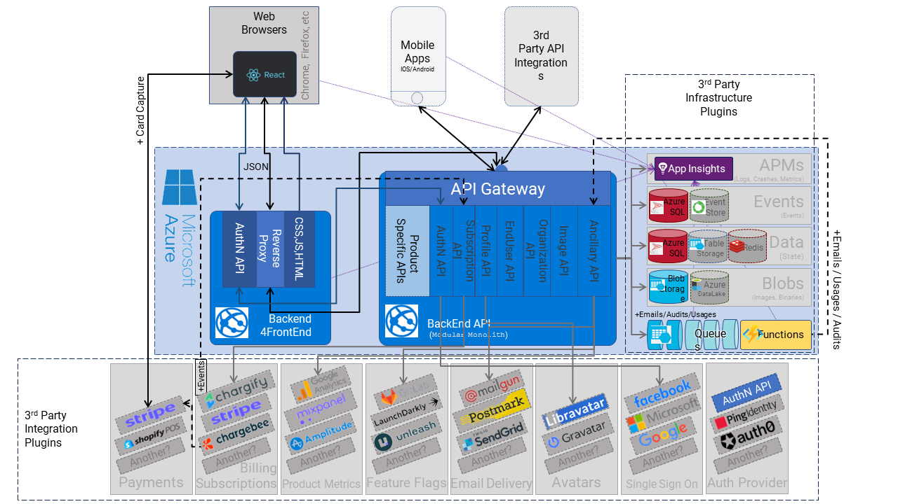
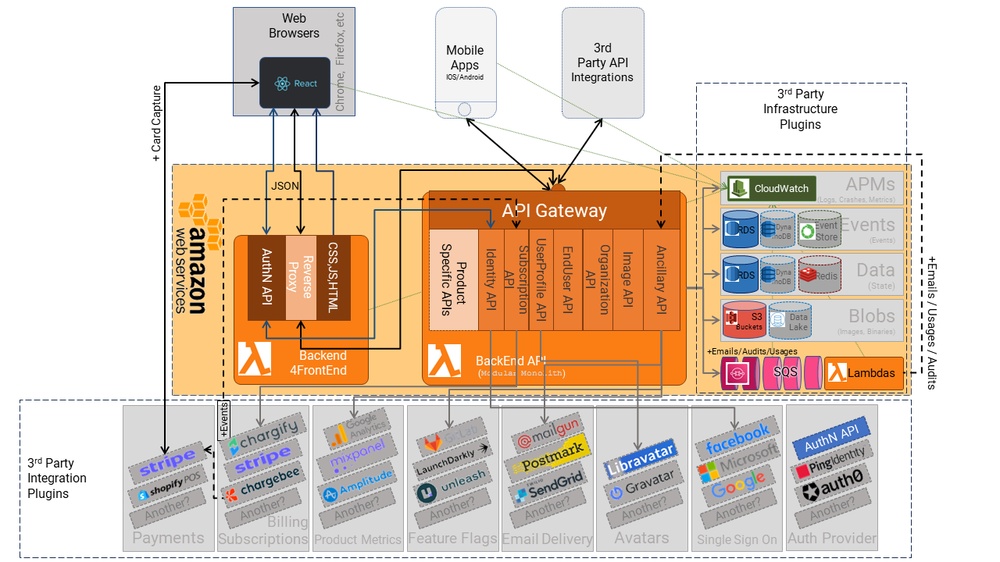
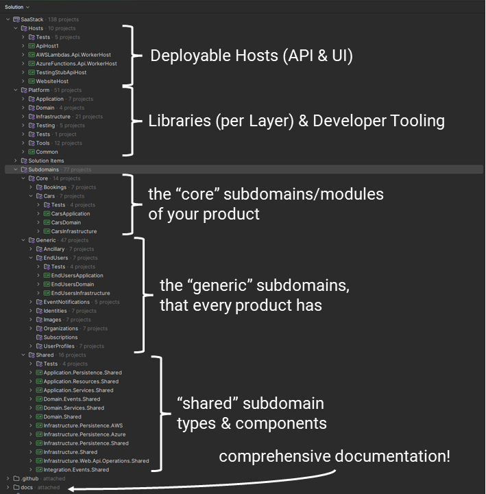

# SaaStack

Are you about to build a new SaaS product from scratch? On .NET?

Then, try starting with SaaStack codebase template.

It is a complete template for building real-world, fully featured SaaS web products.

Ready to build, test, and deploy into a cloud provider of your choice (e.g., Azure, AWS, Google Cloud, etc.)

> Don't spend months building all this stuff from scratch. You and your team don't need to. We've done all that for you already; just take a look, see what is already there, and take it from here. You can always change it the way you like it as you proceed. You are not locked into anyone else's framework.
>
> This is not some code sample like those you would download to learn a new technology or see in demos online. This is way more comprehensive, way more contextualized, and way more realistic about the complexities you are going to encounter in reality.
> This template contains a partial (but fully functional) SaaS product that you can deploy from day one and start building your product on. But it is not yet complete. That next part is up to you.

The codebase demonstrates common architectural styles that you are going to need in your product in the long run, such as:

* [A Pluggable Modular-Monolith](https://www.thoughtworks.com/insights/blog/microservices/modular-monolith-better-way-build-software) - always build a monolith first, then separate out to micro-services later if you need to
* [Clean Architecture, Onion Architecture, and Hexagonal Architecture](https://medium.com/@edamtoft/onion-vs-clean-vs-hexagonal-architecture-9ad94a27da91) all have the same principles - low-coupling, high-cohesion, a shareable and protected domain at the center
* Hosted behind a distributed REST API, or in a CLI, (or in another executable).
* [Domain Driven Design](https://martinfowler.com/bliki/DomainDrivenDesign.html) (with Aggregates and Domain Events) - modeling actual real-world behaviors, not modeling just anemic data
* [Event Sourcing](https://martinfowler.com/eaaDev/EventSourcing.html) - because you cannot predict upfront when you will need historical data later, and when you do, will be stuck, also makes domain events a cinch
* [Event-Driven Architecture](https://learn.microsoft.com/en-us/azure/architecture/guide/architecture-styles/event-driven) - to keep your modules de-coupled, distributed, and asynchronous from each other, focused on meaningful events across your product
* [Polyglot Persistence](https://martinfowler.com/bliki/PolyglotPersistence.html) - decouples you from infrastructure, makes your entire system easy to test, and then upgrades as your business scales later
* Extensive Test Automation (e.g., Unit, Integration, and E2E) so you can keep moving years into the future
* B2B or B2C Multitenancy, you choose
* Extensibility for all integrations with any 3rd party provider (e.g., Stripe, Twilio, LaunchDarkly, etc.) - because you want to start cheaply, and change over time as your new business changes and grows.

> The fundamental design principle behind this particular combination of architectural styles is to maximize change since it is change that you need to make efficient to succeed in SaaS startups. It is the cost of change in software that determines the cost of designing and building software in the long run.

This starter template gives you most of the things all SaaS products will need from day one while maximizing your ability to evolve the specific behaviors and infrastructure components of your specific product - for the long run (i.e., over the course of the next 1-5 years).

## What is in the box?

or if you prefer AWS:

## How is the code structured?

The best experience for working with this template is in an IDE like JetBrains Rider, or Visual Studio, or Visual Studio Code (opening the solution file).

> However, if working in an IDE is not your team's thing, then you can also rearrange the project folders into whatever structure you like. It is a starter template after all.

## Who is it for?

This starter template is NOT for everyone, nor for EVERY software project, nor for EVERY skill level.

> We need to say that because all software products are different, there is not one silver bullet for all of them.

* The people using this template must have some experience applying "first principles" of building new software products from scratch because it is a starter template that can (and should) be modified to suit your context. (It is a far better starting point than building everything from scratch again. You need to understand the principles, not have to rewrite them all over again!).

* The tech stack is a .NET core backend (LTS version 8.0 or later) written in C#, using (a few) but very popular and well-supported 3rd party libraries. (We've worked very hard to find a balance between too few and far too many).
* This starter template deliberately makes engineering trade-offs that are optimized for situations where:
  1. High maintainability is super important to you over long periods of time (e.g., long-lived codebases)
   2. Managing complexity over long periods of time is non-negotiable (~1-10 years), and avoiding big balls of mud (BBOMs) is paramount to you,
  3. Where many hands will touch the codebase (i.e., over the course of its entire life). Of course, if you are working alone on a project, you will have personal preferences, free from the practical constraints of working in teams.

## What is it for?

The kinds of '*known scenarios*' that this template is designed specifically for:

* Tech SaaS startups building their product from scratch
* or experienced developers who are very familiar with these patterns and concepts and wish to adapt them to their context

Can you use this template if your context is different?

* Yes, you can, but you need to be aware of why the trade-offs have been made in the way they have been made, then adapt them to your needs

Are these trade-offs suitable for any kind of software project?

* No, they are not.
   * However, some of them may fit your specific context well.

> Want to know what the initial design constraints, assumptions, and trade-offs are, then see our [Decisions Log](docs/decisions/README.md) and [Design Principles](docs/design-principles/README.md) for more details on that.

## What does it give you?

It is a starter "template," not a 3rd party library or a fancy 3rd party framework. Once you clone it it is all yours:

* You copy this codebase, as is, as your new codebase for your product.
* You rename a few things to the name of your product.
* You compile it, you run its tests, and you deploy its pieces into your cloud environment (e.g., Azure, AWS, or Google Cloud).
* You then continue to evolve and add your own features to it (by following the established code patterns).
* You then evolve and adapt the code to wherever you need it to go.
   * Don't like those patterns? then change them to suit your preferences. There are no rigid frameworks or other dev teams to plead with.
* At some point, you will delete the example subdomain modules (Cars and Bookings) that are provided as examples to follow and, of course, replace them with your own subdomain modules.
* Read the [documentation](docs/README.md) to figure out what it already has and how things work.
   * So that you either don't need to worry about those specific things yet (and can focus on more valuable things), or you can modify them to suit your specific needs. It is your code, so you do as you please to it.

Since this starter "template" is NOT a framework (of the type you usually depend on from others downloaded from [nuget.org](https://nuget.org)), you are free from being trapped inside other people's abstractions and regimes and then waiting on them to accommodate your specific needs.

> With this template, all you need to do: is (1) understand the code here, (2) change the code to fit your needs, (3) update the tests that cover those changes, and (4) move on. Just like you do with any and all the code you write when you join a new company, team or project. It is no different to that.

## Want it to scale?

What happens when the performance of this modular monolith requires that you MUST scale it out, and break it into independently deployable pieces?

> Remember: No business can afford the expense for you to re-write your product, - so forget that idea!

This codebase has been explicitly designed so that you can split it up and deploy its various modules into separate deployable units as you see fit (when your product is ready for that).

Unlike a traditional monolithic codebase (i.e., a single deployable unit), all modules in this Modular Monolith codebase have been designed (and enforced) to be de-coupled and deployed independently in the future.

You just have to decide which modules belong in which deployed components, wire things up correctly (in the DI), and you can deploy them separately.

> No more re-builds and extensive re-engineering to build a new distributed codebase when the time comes. It is all already in there for that future date.

## What does it contain?

It is a fully functioning and tested system with some common "base" functionality.

It demonstrates a working example of a *made-up* SaaS car-sharing platform just for demonstration purposes.

> You would, of course, replace that stuff with your own code! It is only there to demonstrate real code examples you can learn from.

The starter template also takes care of these specific kinds of things:

* Deployment
   * It can be deployed in Azure (e.g., App Services or Functions) or in AWS (e.g., EC2 instances or Lambdas)
   * It is designed to be split into as many deployable pieces as you want when needed. (You simply replace the "RPC adapters" with "HttpClient adapters").
* REST API
   * It defines a ruleset about how JSON is represented on the wire and how requests are deserialized (to cope with different client styles)
   * It localizes developer errors
   * It handles and maps common exceptions to standard HTTP status codes
   * It returns standard HTTP statuses for successful requests based on the HTTP method (e.g., GET = 200, POST = 201, PUT = 202, DELETE = 204)
   * Provides a Swagger UI.
* Infrastructure
   * All infrastructure components are independently testable adapters
   * It implements multi-tenancy for inbound HTTP requests (e.g., HTTP Host headers, URL keys, etc.)
   * It implements multi-tenancy (for data segregation) using either data partitioning, physical partitioning, or both.
   * It implements polyglot persistence, so you can use whatever persistence technology is appropriate for each module per data load (e.g., SQLServer, Postgres, Redis, DynamoDB, Amazon RDS, LocalFile, In-Memory, etc.)
   * It integrated 3rd party identity providers for authentication, 2FA, SSO, and credential management (e.g., Auth0, Microsoft Graph, Google, Amazon Cognito, etc.).
   * It integrates billing subscription management providers so that you can charge for your product use and determine feature sets based on subscription levels (e.g., Stripe, ChargeBee, Chargify, etc.).
   * It integrates feature flagging providers to control how to access your features and roll them out safely (e.g., LaunchDarkly, GitLab, Unleashed, etc.)
   * It integrates product usage metrics to monitor and measure the actual usage of your product (e.g., MixPanel, Google Analytics, Application Insights, Amazon XRay, etc.)
   * It integrates crash analytics and structured logging so you can plug in your own preferred monitoring (e.g., Application Insights, CloudWatch, Sentry.io, etc.).
   * It uses dependency injection extensively so that all modules and components remain testable and configurable.
   * It defines standard and unified configuration patterns (e.g., using `appsettings.json`) to load tenanted or non-tenanted runtime settings.
* Application
   * Supports one or more applications, agnostic to infrastructure interop (i.e., allows you to expose each application as a REST API (default) or as a reliable Queue, or any other kind of infrastructure)
   * Supports transaction scripts + anemic domain model or Domain Driven Design
   * Applications are aligned to audiences and subdomains
* Others
   * It provides documented code examples for the most common use cases. Simply follow and learn from the existing patterns in the codebase
  * It provides [how-to guides](docs/how-to-guides/README.md) for performing the most common things on a codebase like this, until you've learned the patterns.
   * It provides a [decision log](docs/decisions/README.md) so you can see why certain design decisions were made.
   * It provides documentation about the [design principles](docs/design-principles/README.md) behind the codebase so you can learn about them and why they exist.
   * It \[will\] provide an eco-system/marketplace of common adapters that other people can build and share with the community.
   * It demonstrates extensive and overlapping testing suites (unit tests, integration tests, and end-to-end tests) to ensure that production support issues are minimized and regressions are caught early on. As well as allowing you to change any of the existing base code safely
   * It defines and enforces coding standards and formatting rules
   * It utilizes common patterns and abstractions around popular libraries (that are the most up-to-date in the .NET world), so you can switch them out for your preferences.
   * It defines horizontal layers and vertical slices to make changing code in any component easier and more reliable.
   * It enforces dependency direction rules so that layers and subdomains are not inadvertently coupled together (enforcing architectural constraints)
