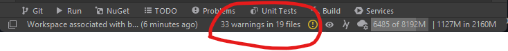
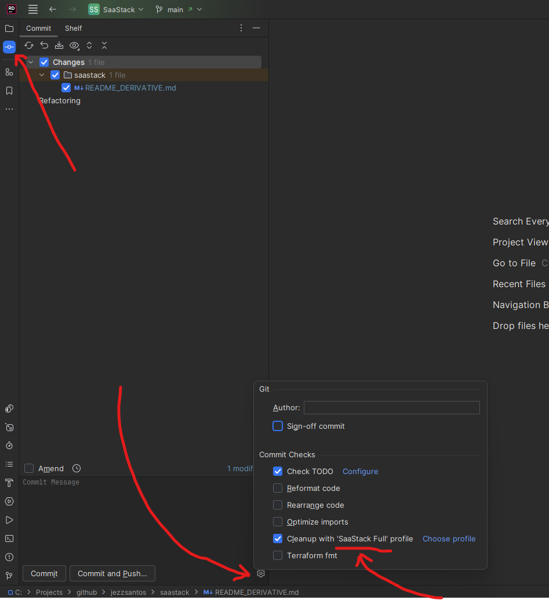
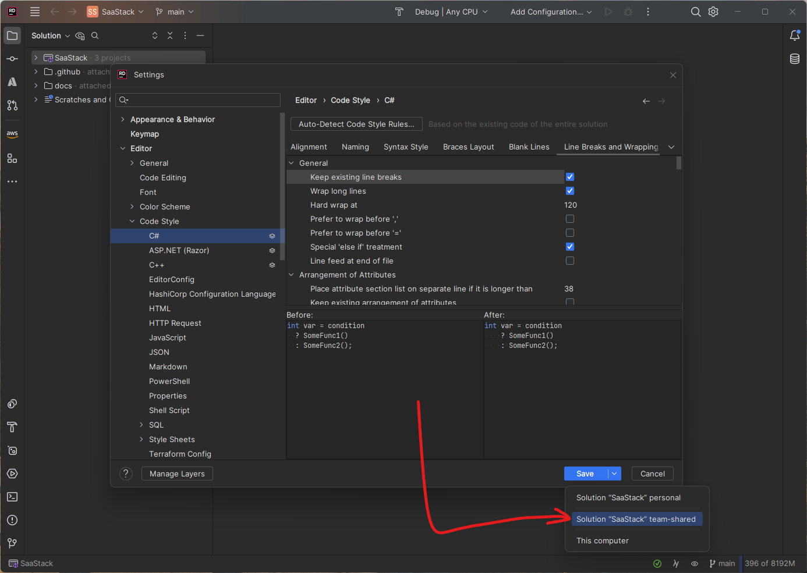

# <YourProjectName>

> This is a starter template for your projects' README.md file, which you should rename to `README.md` (replacing the one from this template)

# Install Environment

## Mandatory Tools

You will need the following development tools to build, run, and test this project:

* Windows or MacOS.
* Jetbrains Rider or Visual Studio (There is most support for JetBrains dotUltimate)
* Install the .NET7.0 SDK (specifically version 7.0.14). Available for [download here](https://dotnet.microsoft.com/en-us/download/dotnet/7.0)

> We have ensured that you wont need any other infrastructure running on your local machine (i.e. SQLServer database), unless you want to run infrastructure specific integration tests.

# Setup Environment

## Build The API

* Build the solution in Rider
* OR `dotnet build src\SaaStack.sln` in the terminal

## Memory Allocation

In Rider, 'Search Everywhere' for the action `change memory settings`, and set `8000M` of memory, then restart Rider.

## HTTPS Certificate

Open a terminal and run: `dotnet dev-certs https --trust`

## Optional Local Infrastructure

You only need the tools below installed if you are going to run specific `Integration.Storage` tests, for the storage adapters you need to use in your codebase.

* If using the `SqlServerDataStore`, install `SQL Server 2019 Developer`. Available for [download here](https://go.microsoft.com/fwlink/?linkid=866662)
* If using the `RedisInMemRepository`, install `Redis Server` locally to run the tests. Available for [download here](https://redis.io/download)
* If using the `EventStoreEventStore`, install `EventStore` locally to run the tests. Install using the Chocolatey command: `choco install eventstore-oss`

> We would normally run these storage integration tests in CI periodically.

## Azure Local Development

Only if you are deploying to Azure

### Azure Functions Host

For security, and to ensure the Azure Functions can run when running locally, you need to create your own version of `local.settings.json`.

In the `AzureFunctions.Api.WorkersHost` project:

1. Create a new file called `local.settings.json`
2. Copy the following JSON:
   ```json
   {
      "IsEncrypted": false,
      "Values": {
         "DebugMode": true,
         "AzureWebJobsStorage": "UseDevelopmentStorage=true",
         "FUNCTIONS_WORKER_RUNTIME": "dotnet-isolated",
         "APPINSIGHTS_INSTRUMENTATIONKEY": ""
      }
   }
   ```
3. Create a new file called `appsettings.local.json`
4. Leave the content blank for now

> DO NOT add these two files to source control!

### Azurite (Azure Storage Emulator)

> You only need to perform this step once, prior to running the `Integration.Storage` tests against Azure Storage infrastructure (e.g, Queues, Blobs, and Tables)

In a Terminal window:

1. Navigate up to the `tools` directory
   1. `cd ..`
   2. `cd /tools/azurite`

2. Run: `npm install`

# Build & Deploy

When pushed, all branches will be built and tested with GitHub actions

# Local Development, Debugging and Manual Testing

## Committing and Pushing Code

1. Ensure that the solution contains `0` warnings and `0` compile errors.

   

   > Note: Warnings are generated by the IDE, plugins and by Roslyn code analysis rules that run against the solution.

2. Run these tests:

   In Rider, run all C# tests with Category= `Unit` and `Integration.Web`

   > Note: Use `Group By > Category` in Rider's unit test explorer to view these three categories easily.

   OR, in a terminal:

   - `dotnet test --filter:"Category=Unit" src\SaaStack.sln`

   - `dotnet test --filter Category=Integration.Web src\SaaStack.sln`

3. Configure your "Commit " window to select the "Cleanup with 'Full Cleanup' profile".

   

## Changing IDE Settings

This solution contains comprehensive code formatting, and error-checking settings in the team-shared settings file `src\SaaStack.sln.dotSettings` that contains numerous code style rules, 'Live Templates', 'File templates', and other important settings that we need to share across the team for consistency.

When changing any settings in Rider, make sure you save them for the whole team (team-shared), then add the `SaaStack.sln.dotSettings` file to your next commit to save those rules for the rest of your team.



## Stubs and Fakes

We use various stubs/fakes (whichever definition you like) in concert with configuration settings (`appsettings.json`) and with `#if TESTINGONLY` sections to create different environments for testing and for production.

There are 3 environments you need to be aware of and how they differ in their dependencies and configuration:

1. Local (manual) testing (aka F5 debugging) - `Debug` or `Release`
2. Automated integration testing - `Debug` or `Release`
3. Production (and/or Staging etc) - `ReleaseForDeploy`

> Note: In all cases, in all environments, there should NEVER be any production settings nor **secrets** in any configuration file (i.e.  `appsettings.json` ) anywhere in this codebase! These production settings and secrets should only be defined in the CD pipeline, and replaced when a production build is packaged and deployed.

### Production Builds

In production builds, we build and deploy the code in the `ReleaseForDeploy` build configuration.

> Note: In this build configuration, certain testing stubs, certain testing endpoints, and certain hardcoded testing values and functions are compiled out of the code (e.g. behind the `#if TESTINGONLY` conditional compilation variable).
>
> We absolutely need to do this because these specific testing code pieces should never exist in the production codebase and may expose security vulnerabilities and exposures we simply don't want in production environments.

The various 3rd party *adapters* we need in production (e.g., `SendGridHttpServiceClient` and the `SqlServerDataStore`)
will be configured in the DI containers (of `Program.cs` of the `ApiHost1` project, and in the modules of each subdomain) to use code to talk to real 3rd party APIs and will be configured with specific production settings in the `appsettings.json` file (overwritten by your CD server).

These are the real 3rd party public API adapters, which, if used with production settings, in local CI environments, or in automated testing environments, may incur financial service charges, trigger rate-limiting quotas, and/or pollute or corrupt real customer data!

> Note: This should never happen by accident, but read and follow the next 2 sections to avoid the possibility of this happening. We have designed several safeguards in place that should make this impossible (albeit without working around it intentionally).

You will notice that in the production build (`ReleaseForDeploy`), we have configured the code:

* By injecting the `SqlServerDataStore` as the primary `IDataStore`.
* By injecting various other dependencies according to the current value of the `$(HostingPlatform)` MS build property (e.g., `HOSTEDONAZURE`).

> Note: that many of the other technology adapters (e.g., `SendGridHttpServiceClient`) will not need to be explicitly configured in the DI container (for specific build flavors), that is because these adapters can be configured to point to local stubs instead of pointing to production environments.

### Automated Integration Testing

> On the CI server, integration testing is run in the `Release` build configuration, which permits the inclusion of `TESTINGONLY` code in the compilation necessary for integration testing.
> Integration testing on your local machine should be done in the `Debug` build configuration. The only difference between `Debug` and `Release` in practice is that there are some compiler optimizations configured in `Release`, which are closer to code in Production.

In automated integration testing (executed on both your local machine and on the CI build server), we run the APIs you are testing in their original production DI configuration defined in the `Program.cs` file (in the respective `ApiHost` project of the API code you are testing).

That DI configuration is modified slightly to swap out the 3rd party adapters for that `ApiHost` so that we can program the 3rd party adapters to behave the way the tests need them to (and to query them for certain interactions).

This is what we modify and how:

* We run this API production DI code in-process in a Kestrel web server in the same process as your Integration Tests (e.g., in the process of `xunit.console.exe`, not as a separate process).
* We replace the `appsettings.json` file with the one in your integration testing project

  > Which should never ever contain ANY production settings or secrets!

* We then manipulate the DI container (seen in the constructor of your integration testing project) and replace certain dependencies (e.g., the 3rd party adapters like: `INotificationsService,` etc) with their respective hardcoded Stubbed equivalents (found in the `Stubs` directory of your integration testing project).

> Note: These integration testing stubs will likely use no configuration settings from `appsettings.json` as their responses and behavior are hardcoded/canned in the hardcoded classes of the integration test project.

You may wish to modify these stubs to add the ability to query them to ensure they are called in the right ways in testing.

### Local Manual Testing

> Note: When you are manual testing (like using F5 debugging), make sure that you compile the code and run it in `Debug` (or `Release`) build configuration that will include all code marked up by `#if TESTINGONLY` compilation variable.

When you run any of the `ApiHost` projects in this solution in your local environment, you are starting that `ApiHost` project at a specific IP address, which starts a separate Kestrel server in *external* processes of its own (e.g., `ApiHost.exe` for the API).

In local testing, all external services (i.e., SendGrid, Unleash, etc.) should be directed (via config) to point to the local Stubs `TestingStubApiHost,` which will respond with specific fixed responses to any calls to these external services.

The goal of this testing strategy is to make it possible to run locally without connecting to any real live services over the internet.

> Note: When you are doing manual testing on your local machine, either through the browser with PostMan, or with any other tools, you are actually running the code in production configuration as far as the adapters that DI injects into your code. However, most of these adapters will be using the configuration found in `appsettings.json` of the `ApiHost` project.

There will be numerous statements in the code using `#if TESTINGONLY` to determine which concrete dependencies are actually used in the `Debug` (or `Release`) configuration.

You will notice that in local debugging, we have switched out the currently configured `IDataStore` for the `LocalMachineFileDataStore`, so that you can do all your local debugging without a SQL database being available on your local machine.

The `LocalMachineFileDataStore` is configured to place your files in `Environment.SpecialFolder.LocalApplicationData`, which resolves to these folders:

* On Windows: `%appdata%`
* On MacOS: `/home/<you>/.local/share`

## Running The Code

1. Build the code:

   - Rebuild the solution
   - OR `dotnet build src\SaaStack.sln` in the terminal

2. Run the backend:

   * In Rider, run the `AllHosts` compound configuration (runs the `ApiHost1` server and the `TestingStubApiHost`)

3. Access the API on `https://localhost:5001`

#### Troubleshooting

Sometimes (especially on MacOS), after manually testing, the processes do not shut down properly, leaving ports: `5001` and `5656` occupied. This then throws an exception when you try to run again later.

The message looks something like this:

```
System.IO.IOException: Failed to bind to address https://127.0.0.1:5656: address already in use.
```

To kill these processes:

* On Windows, `taskkill /f /im dotnet.exe`
* On MacOS:
   * Find the processes: `lsof -Pni | grep "5001\|5101\|5656"`
   * Kill the processes: `kill -9 <processid>` where `<processid>` is the ID of the process in the list

  * Alternatively, in MacOS:

     * Use `lsof -ti :[PORT]` and locate the PID of the process, e.g., `lsof -ti :5656`.
     * Open "Activity Monitor", locate the process with that PID, and stop that process.

## Testing The Code

### Everyday tests

Run all C# tests with Category= `Unit` and `Integration.Web`

OR, in a terminal:

- `dotnet test --filter:"Category=Unit" src\SaaStack.sln`

- `dotnet test --filter Category=Integration.Web src\SaaStack.sln`

> Note: All tests will be run in parallel in `Rider` or in `dotnet test`.

### Storage Integration tests

These tests ensure that 3rd party persistence technology adapters that are used in production environments work correctly.

Only run these kinds of tests when the code in the persistence technology adapters changes. These tests should not be run frequently and can be scheduled to run as part of a nightly/weekly build.

> Warning: These tests connect to and test real 3rd party systems in the cloud (usually across HTTP or some other protocol). Some of these tests require that you have the respective technology installed on your local machine (e.g., SQL Server Database).
>
> Warning: They may incur charges, or they may trigger rate-limiting policies on the accounts they are run against.

`dotnet test --filter Category=Integration.Storage src\SaaStack.sln` (requires installing the server storage components listed at the top of this page)

> Note: If any of the `Integration.Storage` category of tests fail, it is likely due to the fact that you don't have that technology installed on your local machine, or that you are not running your IDE as Administrator, and therefore cannot start/stop those local services without elevated permissions.

> Note: Amazon infrastructure components require LocalStack to be running on your computer in order to work. After installing LocalStack, run `localstack start` in a terminal.

### External Integration tests

These tests ensure that 3rd party technology adapters that are used in production environments work correctly.

Only run these kinds of tests when the code in the technology adapters changes. These tests should not be run frequently and can be scheduled to run as part of a nightly/weekly build.

> Warning: These tests connect to and test real 3rd party systems in the cloud (usually across HTTP).
>
> Warning: They may incur charges, or they may trigger rate-limiting policies on the accounts they are run against.

`dotnet test --filter Category=Integration.External src\SaaStack.sln` (requires internet access to external services)

# Versioning the Code

> Note: We use the 2 dot [Semantic Versioning](https://semver.org/spec/v2.0.0.html) scheme.

The latest changes for this new version are recorded in [CHANGELOG.md](CHANGELOG.md) and they follow a [keep a changelog](https://keepachangelog.com/en/1.0.0/) convention.

> All assemblies and all hosts will share the same version number.
>
> We will be using a tool called [release-it](https://github.com/release-it/release-it) to update the version and changelog when creating new releases.

First, make sure that all changes are documented in the various sections of the `[Unreleased]` section of the [CHANGELOG.md](CHANGELOG.md)

2. Copy the new version number to `src/GlobalAssemblyInfo.cs`

> For example:

* `[assembly: AssemblyVersion("2.0.0.0")]`
* `[assembly: AssemblyFileVersion("2.0.0.0")]`
* `[assembly: AssemblyInformationalVersion("2.0.0")]`

4. Commit, tag, and push the new version changes.

> Note: Each build in CI will automatically append the last build number to the SemVer and update the version in `GlobalAssemblyInfo.cs`