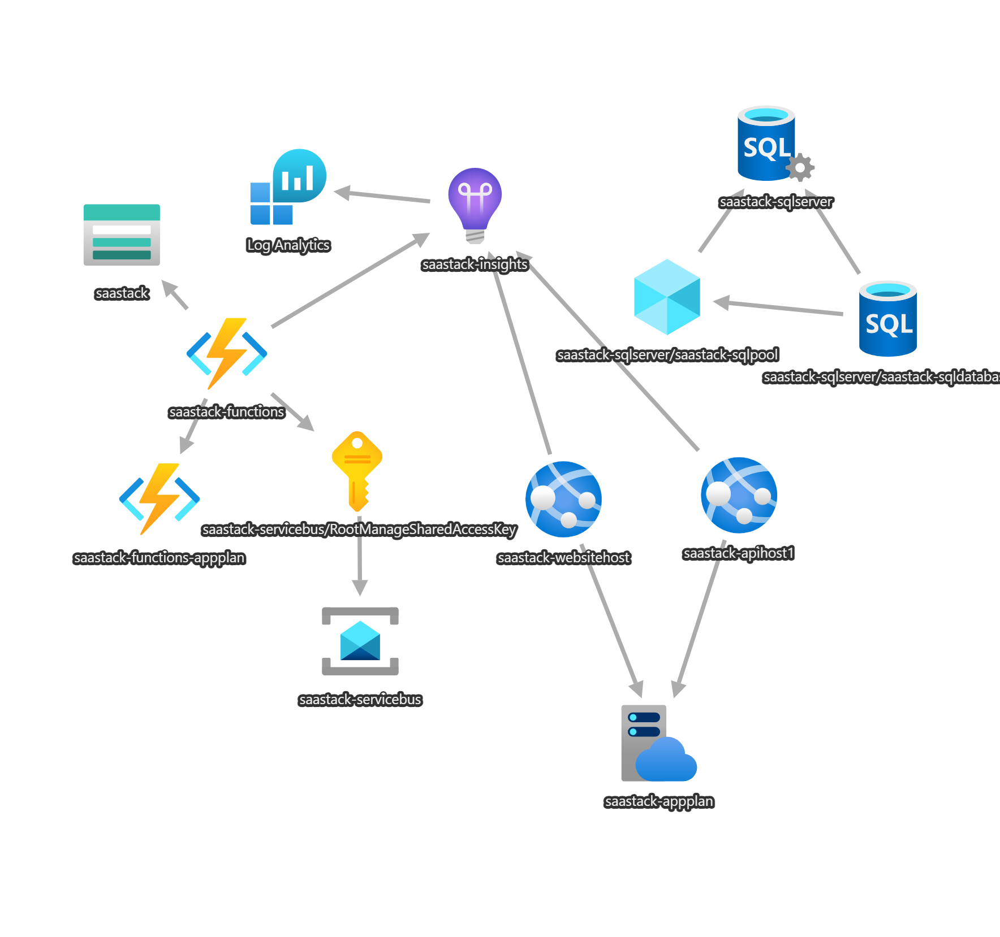

# Deployment of SaaStack

This document details the basic steps required to deploy your software into a production environment.

> Your production environment might be in the cloud or on premise. We assume the cloud, and we assume either Azure, AWS or GC.
>
> The deployment process will be similar in either case, except for the tools you choose to perform the deployment.

By default, deployment is assumed to take place from a GitHub repository using GitHub Actions, from a build that is triggered with a specific commit message. Other mechanisms are possible too.

> You can use any CI/CD tool you prefer, many of the steps below will be similar, but will differ based on the toolset you use.

## Automated deployment

The deployment process is automated using GitHub Actions.

This deployment process is defined in the following files:
* [deploy-azure.yml](../.github/workflows/deploy-azure.yml) for deploying to Microsoft Azure.
* [deploy-aws.yml](../.github/workflows/deploy-aws.yml) for deploying to Amazon AWS.

> You can read and understand and reverse engineer these YML files to understand how the deployment process works for your environment or toolset.

Essentially we are deploying the following pieces of infrastructure in the cloud:
* Azure:
  * An Azure "App Service" for each API Host (i.e., `ApiHost`) for the Backend APIs.
  * An Azure "App Service" for the `WebsiteHost` for the Frontend website.
  * An Azure "Functions Host" for the `AzureFunctions.Api.WorkerHost` that contains functions that monitor queues and message buses.
  * An Azure Service Bus for publishing `domain_events` to various registered subscribers (i.e., `ApiHost1`).
  * An Azure Storage Account for its Queues and Blob storage.
* AWS:
  * An AWS "Lambda" for each API Host (i.e., `ApiHost`) for the Backend APIs.
  * An AWS "Lambda" for the `WebsiteHost` for the Frontend website.
  * An AWS "Lambda" for the `AWSLambdas.Api.WorkerHost` with Queues for each of the Lambdas that monitor queues and message buses.
  * An AWS "SNS" for publishing `domain_events` to various registered subscribers (i.e., `ApiHost1`).
  * An AWS "S3 bucket" for Blob storage.

To deploy any of these services to the respective cloud provider, we will use standard GitHub Actions to perform the deployment, available from the [GitHub Actions Marketplace](https://github.com/marketplace?type=actions).

## Configuration

Each one of the deployable pieces of software to this infrastructure will likely require production specific configuration, using variables/secrets that must be defined outside the source code. One such safe place, to store them, is in the GitHub repository, targeted to a specific deployment "environment".

We define a deployment "environment" in the GitHub project first, then we define the variables and secrets in that specific environment.

> Unlike, variables in GitHub (which are only available to a specific environment), secrets in GitHub can be defined at the organization level, or at the repository level, or at the environment level. When reading secrets from GitHub, they are combined from Organization, Repository and Environment when accessed from any GitHub action.

The list of the settings is defined in the `appsettings.json` files of each of the deployable hosts in the solution.

Some of these settings have default values already in `appsettings.json`, and some will mandate that they are re-written to target a specific deployment environment (i.e., Production). Rather than defining those secrets/variables in adjacent `appsettings.json` files for specific environments e.g., `appsettings.Production.json` or in ASPNET secrets files stored in source control, or on the local disk, we have decided on a different scheme.

In this scheme, the value of these specific settings will not be known at development time, and MUST NEVER be defined in the source code. However, knowing that a specific setting is required to be re-written in production, is acceptable. 

Since, adding new configuration settings is common as products evolve, we need a reliable way to mark up settings as being necessarily "required" to be overwritten in a production environment.

>  As opposed to using the default values already defined in the `appsettings.json` files. 

To this end, in the `appsettings.json` file, there is an additional section: `Deploy -> Required -> Keys` which declares the settings that MUST be overwritten for deployment to any environment.

> This list is not inclusive of all other variables that you may want to change for your production environment, this list is the bare minimum that you are mandating that must be REQUIRED to be replaced for deployment. If you add other secrets/variables to your GitHub project (using the same naming convention below), they will also be automatically applied to any `appsettings.json` files in the repository in the deployment pipeline also.

To be able to overwrite any settings in `appsettings.json` at deployment time, we must define an equivalent environment variable or secret in the GitHub project, using a specific naming convention. 

The naming convention is to take the fully qualified name in `appsettings.json`, and convert it to uppercase, and replace all but the following characters, with an underscore (`_` character.

* Converted characters: anything but uppercase or lowercase alphanumeric characters (i.e. `A-Z` or `a-z` or `_`). 

For example, if you had this setting in `appsettings.json`:
```json
{
  "ApplicationServices": {
    "Persistence": {
      "Kurrent": {
        "Connection-String1": "esdb://localhost:2113?tls=false"
      }
    }
  }
}
```
The equivalent GitHub variable/secret name of the setting above, to substitute, would need to be defined: `APPLICATIONSERVICES_PERSISTENCE_KURRENT_CONNECTION_STRING1`.

### Defining required settings

As an engineer adds new settings to their `appsettings.json` files, they will be expected to determine if that setting either has a default value that is appropriate to "local" development AND "production", or whether this setting "requires" being substituted, and "requires" a unique value in a "production" environment.

If they decide that this setting is "required" to be replaced in a specific "production" environment, then they can 'mark it up' in the following way, using a `Deploy -> Required -> Keys` section.

```json
{
  "ApplicationServices": {
    "Persistence": {
      "Kurrent": {
        "Connection-String1": "esdb://localhost:2113?tls=false"
      }
    }
  },
  "Deploy": {
    "Notes": "Lists the required configuration keys that must be overwritten (by the GitHub configuration action) when we deploy this host",
    "Required": [
      {
        "Description": "General settings from this appsettings.json",
        "Keys": [
          "ApplicationServices:Persistence:Kurrent:Connection-String1",
        ]
      }
    ]
  }
}
```

Then, what should happen (in some out-of-band process) is that the engineer makes arrangements to define the equivalent secret or variable in the GitHub project. In the example above, it is clearly a secret, and they would define the variable in a secret in the GitHib project, as `APPLICATIONSERVICES_PERSISTENCE_KURRENT_CONNECTION_STRING1`.

However, it is possible that the engineer, either forgets this step, or they get distracted/blocked in harvesting the actual secret value, and the task is never completed.

> Clearly, if the code that required this setting went to production, you would expect something in production to fall over, because the replacement setting was never defined.  This produces an avoidable production issue.

By using the custom GitHub Action `VariableSubstitution` (defined in the repository), the deployment pipeline will detect the missing GitHub variable/secret, and fail the deployment pipeline, with clear error identifying the missing "required" GitHub variable/secret. 

This is one of the safeguards provided by the `VariableSubstitution` custom action. 

### GitHub environment variables

Most of the required variables defined in the `Deploy -> Required -> Keys` section of `appsettings.json` should be self-explanatory.

Here are ones that might need further explanation, about their origin and use, and in some cases how to generate them.

**NOTE:** You MUST define these variables in a specific "production" environment for deployment. As GitHub does not support variables at the Organization or repository levels (as is the case for secrets).

#### Operator whitelist

Setting name: `HOSTS_ENDUSERSAPI_AUTHORIZATION_OPERATORWHITELIST`

This is a semicolon `;` delimited list of email addresses of user accounts that are authorized to act as operators in the system.

This list is populated before the respective user accounts are registered. When they are registered (later), that user will be automatically promoted to the `PlatformRoles.Operations` role.

**IMPORTANT**: You should always have at least one operator account email address defined in this list before your software goes to production for the first time, otherwise you will have no other way to promote other operators in the system later.

> For user accounts that already exist, they can be promoted by existing operator accounts.

### GitHub secrets

The following MUST be defined as secrets in your GitHub project, NOT as environment variables:

> We recommend that these are defined in the secrets of a specific "production" environment. However, they can also be defined at the repository level, or at the organization level.

**IMPORTANT**: You MUST generate new crypto related secrets for your deployed services!
**IMPORTANT**: You MUST never re-use the crypto related secrets defined in this repository in your specific "production" environment. They are far too well known to anyone who has access to this public repository. Using them compromises the security measures in place for your "production" deployment, and is an easy attack vector.

#### HMAC signing key

This is a symmetrical crypto secret used to secure communications between various HTTP clients to the `ApiHost1` host.

**IMPORTANT:** This crypto secret must be the same for all clients talking to the same host (the host is the master record for it).

> You CAN reuse this secret for communications to other hosts too. However, it is recommended to have a different secrets where possible, in case one of the clients or host is compromised.

* sec: `HOSTS_APIHOST1_HMACAUTHNSECRET` Generate a random value using the [HMACSigner.GenerateKey()](https://github.com/jezzsantos/saastack/blob/main/src/Infrastructure.Web.Api.Common/HMACSigner.cs) method.
* sec: `HOSTS_ANCILLARYAPI_HMACAUTHNSECRET` Generate a random value using the [HMACSigner.GenerateKey()](https://github.com/jezzsantos/saastack/blob/main/src/Infrastructure.Web.Api.Common/HMACSigner.cs) method.

> Note: You can run the unit tests for this class and copy the value of the generated key in the first test.

#### PrivateInterHost signing key

This is a symmetrical crypto secret used to secure communications between various hosts (e.g., `ApiHost1` and `ApiHost2`).

**IMPORTANT:** This crypto secret must be the same for all hosts.

> You SHOULD NOT reuse the value of the HMAC signing key above for this secret.

* sec: `HOSTS_PRIVATEINTERHOST_HMACAUTHNSECRET` Generate a random value using the [HMACSigner.GenerateKey()](https://github.com/jezzsantos/saastack/blob/main/src/Infrastructure.Web.Api.Common/HMACSigner.cs) method.

> Note: You can run the unit tests for this class and copy the value of the generated key in the first test.

#### CSRF secrets

These crypto secrets are used to secure communications to the `WebsiteHost` BEEFE. The HMAC crypto secret is a symmetrical crypto key used to sign the CSRF cookie used between the JSApp and the `WebsiteHost` BEFFE. The AES crypto secret is a symmetrical crypto key used to encrypt the CSRF token used in the CSRF cookie.

* sec: `HOSTS_WEBSITEHOST_CSRFHMACSECRET` Generate a new random value using the [HMACSigner.GenerateKey()](https://github.com/jezzsantos/saastack/blob/main/src/Infrastructure.Web.Api.Common/HMACSigner.cs) method, as above for HMAC secrets.

> Note: You will want to use a different value than the HMAC signing keys above, never the same value.

* sec: `HOSTS_WEBSITEHOST_CSRFAESSECRET` Generate a new random value using the [AesEncryptionService.GenerateAesSecret()](https://github.com/jezzsantos/saastack/blob/main/src/Infrastructure.Common/DomainServices/AesEncryptionService.cs) method.

> Note: You can run the unit tests for this class and copy the value of the generated key in the first test.

#### Single Sign-On

This is a symmetrical crypto secret used to encrypt the values of persisted SSO provider tokens that are stored at rest in the `IDataStore` (for example, the auth tokens from providers like Microsoft, Google, etc.). 

* sec: `APPLICATIONSERVICES_SSOPROVIDERSSERVICE_SSOUSERTOKENS_AESSECRET` Generate a new random value using the [AesEncryptionService.GenerateAesSecret()](https://github.com/jezzsantos/saastack/blob/main/src/Infrastructure.Common/DomainServices/AesEncryptionService.cs) method.

> Note: You can run the unit tests for this class and copy the value of the generated key in the first test.

#### JWT signing key

This is a symmetrical crypto secret used to sign the JWT authorization tokens (produced by this API) and passed between all API hosts and all HTTP clients. 

* sec: `HOSTS_IDENTITYAPI_JWT_SIGNINGSECRET` Generate a new random value using the [JwtTokenService.GenerateSigningKey()](https://github.com/jezzsantos/saastack/blob/main/src/IdentityInfrastructure/ApplicationServices/JWTTokensService.cs) method.

> Note: You can run the unit tests for this class and copy the value of the generated key in the first test.

### Additional GitHub secrets and variables

In order to deploy your code to Cloud based infrastructure (such as Azure or AWS) you will be using standard GitHub Actions to perform the deployment.

Most of these actions will require additional configuration with secrets to access your cloud provider and cloud accounts.

#### 3rd party technology adapters

By default, the following 3rd party technology adapters are injected into the deployed code (see [AncillaryModule](https://github.com/jezzsantos/saastack/blob/main/src/AncillaryInfrastructure/AncillaryModule.cs), [UserProfilesModule](https://github.com/jezzsantos/saastack/blob/main/src/UserProfilesInfrastructure/UserProfilesModule.cs) and  [HostExtensions](https://github.com/jezzsantos/saastack/blob/main/src/Infrastructure.Web.Hosting.Common/Extensions/HostExtensions.cs)):

* `FlagsmithHttpServiceClient` - for managing feature flags
* `GravatarHttpServiceClient` - for fetching default user profile avatars
* `MailgunHttpServiceClient` - for delivering emails
* `TwilioHttpServiceClient` - for delivering SMS text messages
* `UserPilotHttpServiceClient` - for tracking product metrics

These services require the following secrets and variables in your GitHub deployment environment:

* var: `APPLICATIONSERVICES_FLAGSMITH_BASEURL` (Could be: `https://edge.api.flagsmith.com/api/v1/`)
* sec: `APPLICATIONSERVICES_FLAGSMITH_ENVIRONMENTKEY` (Sign in to your FlagSmith account, select your project, and find the environment key in the SDK Keys)
* var: `APPLICATIONSERVICES_GRAVATAR_BASEURL` (Should be: `https://www.gravatar.com`)
* var: `APPLICATIONSERVICES_MAILGUN_BASEURL` (Should be: `https://api.mailgun.net/v3/`)
* var: `APPLICATIONSERVICES_MAILGUN_DOMAINNAME` (Sign in to your Mailgun account, select Send -> Sending -> Domains, and copy your domain)
* sec: `APPLICATIONSERVICES_MAILGUN_APIKEY` (Sign in to your Mailgun account, select Your Account -> API Security -> and create a new Mailgun API Key)
* sec: `APPLICATIONSERVICES_MAILGUN_WEBHOOKSIGNINGKEY` (Sign in to your Mailgun account, select Send -> Sending -> Webhooks -> HTTP Webhook signing key)
* var: `APPLICATIONSERVICES_TWILIO_BASEURL` (Should be: `https://api.twilio.com`)
* sec: `APPLICATIONSERVICES_TWILIO_ACCOUNTSID` (Sign in to your Twilio account, Admin -> Account Management -> Manage account -> General settings, copy your Account SID)
* sec: `APPLICATIONSERVICES_TWILIO_AUTHTOKEN` (Sign in to your Twilio account, Admin -> Account Management -> Keys & Credentials -> ApPI Keys & Tokens, copy your AuthToken)
* var: `APPLICATIONSERVICES_TWILIO_SENDERPHONENUMBER` (Sign in to your Twilio account, Account Dashboard -> Develop -> Phone numbers -> Manage -> Active numbers, and copy one of the phone numbers)
* var: `APPLICATIONSERVICES_TWILIO_WEBHOOKCALLBACKURL` (Should be: `<HOSTS_ANCILLARYAPI_BASEURL>/webhooks/twilio`)
* var: `APPLICATIONSERVICES_USERPILOT_BASEURL` (Should be: `https://analytex-eu.userpilot.io/v1`)
* sec: `APPLICATIONSERVICES_USERPILOT_APIKEY` (Sign in to your UserPilot account, Configure -> Environment, and copy the API Key)

> Tip: Depending on the specific deployment environment you are deploying, you may find some of these values defined in your own copy of `appsettings.Testing.json` and `appsettings.Testing.local.json` in the `Infrastructure.Shared.IntegrationTests` project.  

#### Azure deployments

When using the `deploy-azure.yml` file, you will need to define login secrets in order to deploy your code to Azure Infrastructure.
You can read about this process and the credentials required to do it in the [Azure Login Action](https://learn.microsoft.com/en-us/azure/app-service/deploy-github-actions?tabs=openid%2Caspnetcore).

For deploying to Azure, (using the `deploy-azure.yml` deployment workflow) you will also need to define the following secrets and variables in your GitHub deployment environment:
* sec: `DEPLOY_AZURE_CREDENTIALS`

> These are used to automate the deployment to your Azure subscription.

then, you will need these to define the physical components to deploy your code to:
* var: `DEPLOY_AZURE_APIHOST1_APP_NAME`
* var: `DEPLOY_AZURE_WEBSITEHOST_APP_NAME`
* var: `DEPLOY_AZURE_AZUREFUNCTIONS_APP_NAME`

> Note: We use the prefix `DEPLOY_` to group these settings as distinct from others in the GitHub project.

#### AWS deployments

TBD

## Triggering a deployment

The deployment script (`deploy-azure.yml` and `deploy-aws.yml`) are both triggered manually (by a human), on the `main` branch

> See the GitHub event [workflow_dispatch](https://docs.github.com/en/actions/writing-workflows/choosing-when-your-workflow-runs/events-that-trigger-workflows#workflow_dispatch).

This simple mechanism is a simple safety feature to prevent accidental deployments in the course of normal development of your product. 

> This step should be very intentional in any "production" environment where you are not practicing "Continuous Deployment".

## Initial Deployment

By default, we assume that before deployment of any software, you have already (manually/automated) the creation of the actual target infrastructure, in your preferred cloud environment. (i.e, in Azure, AWS or GC).

When the automated deployment steps are run in the deployment pipeline, those steps are (by default) only deploying new software packages to existing running infrastructure components in the cloud.

> It is possible, to create a more automated deployment process where the infrastructure itself is re-provisioned every time a deployment occurs. You can do this with tools like Bicep and Terraform, etc. However, this automation is not discussed here.

### Azure infrastructure

This represents the main infrastructural pieces in an Azure Deployment.



To build out an initial infrastructure in Azure, we can use an ARM template like that found in [Azure-Seed.json](../iac/Azure/ARM/Azure-Seed.json).

> This template can be easily customized, and run once to create your initial infrastructure in Azure.
>
> It has made some "low cost" choices to get started with, but lower cost is possible with some services, like SQLServer, ApplicationInsights and Storage accounts. 

1. Determine the name of your new resource group in Azure (e.g. `saastack`). 
   - This will be referenced in the commands below as `<resourcegroupname>`

2. Edit the template, and review and change the values you see the `parameters` section at the start of the file

   > These are essentially the names of the resources that will be created in your resource group in you Azure subscription, and you may want to change them to match your product

3. Execute this template, use the following commands:

   * `az login` and sign in to your Azure subscription. Your subscription ID will be listed.

   * `az account set --subscription <subscriptionid>`

   * `az group create --name <resourcegroupname> --location 'Central US'` use the following command to list the regions `az account list-locations` (and use the `displayName` from this list)

   * `az deployment group create --name saastack-initial --resource-group <resourcegroupname> --template-file '../iac/Azure/ARM/Azure-Seed.json'`

     >  You will be prompted for the admin username and password for the SQL server database (SQL authentication).


#### Deployment credentials

When the infrastructure is created, we now need to create a Service Principal to retrieve credentials, and the build pipeline will use these credentials to perform the automated deployment.

Run this command:

```powershell
az ad sp create-for-rbac --name "saastack" --role contributor --scopes /subscriptions/<subscriptionid>/resourceGroups/<resourcegroupname> --json-auth
```

* where, `<subscriptionid>` is your azure subscription id

* where `<resourcegroupname>` is the name of the resource group you created

> **Warning**: this service principal actually gives access to all the resources in your specific resource group, rather than just specific resources.

This command will return a response as a block of JSON, like this:

```json
{
  "clientId": "a5c33a65-2773-4215-a3b2-d347a83fd094",
  "clientSecret": "r~E8S~-acDDM8tFpLLy.klcEW221HxucBCzcxcYT",
  "subscriptionId": "43d46a07-e36e-448c-af7e-e2b02366cc9b",
  "tenantId": "c979adb7-5649-468e-b2e8-a53891a07cf9",
  "activeDirectoryEndpointUrl": "https://login.microsoftonline.com",
  "resourceManagerEndpointUrl": "https://management.azure.com/",
  "activeDirectoryGraphResourceId": "https://graph.windows.net/",
  "sqlManagementEndpointUrl": "https://management.core.windows.net:8443/",
  "galleryEndpointUrl": "https://gallery.azure.com/",
  "managementEndpointUrl": "https://management.core.windows.net/"
}
```

Now, just copy and paste the whole output JSON (`{` to `}` like the above) into a GitHub secret called: 

* sec: `DEPLOY_AZURE_CREDENTIALS` either at the GitHub repository level, or as a secret into the GitHub deployment environment you are using.

#### Deployment variables and secrets

Now, that your Azure environment is provisioned, you need to update the following variables and secrets in your GitHub Project.

Assign these GitHub variables (or secrets) in your deployment environment, depending on the technology adapters you are using :

* sec: `APPLICATIONINSIGHTS_CONNECTIONSTRING` (read from Azure Portal: AppInsights -> Configure -> Properties -> Connection String)
* sec: `APPLICATIONSERVICES_PERSISTENCE_AZURESERVICEBUS_CONNECTIONSTRING` (read from Azure Portal: ServiceBus -> Settings -> Shared Access Policies -> RootManageSharedAccessKey -> Primary Connection String)
* sec: `APPLICATIONSERVICES_PERSISTENCE_AZURESTORAGEACCOUNT_ACCOUNTKEY` (read from Azure Portal: Storage Account -> Security + networking -> Access keys -> key1 -> Key)
* sec: `APPLICATIONSERVICES_PERSISTENCE_SQLSERVER_DBCREDENTIALS` (as defined in initial setup, in format: `User Id=<USERNAME>;Password=<PASSWORD>`)
* var: `APPLICATIONSERVICES_PERSISTENCE_AZURESTORAGEACCOUNT_ACCOUNTNAME` (as defined in initial setup)
* var: `APPLICATIONSERVICES_PERSISTENCE_SQLSERVER_DBSERVERNAME` (as defined in initial setup)
* var: `APPLICATIONSERVICES_PERSISTENCE_SQLSERVER_DBNAME` (as defined in initial setup)
* var: `DEPLOY_APIHOST1_APP_NAME` (as defined in initial setup)
* var: `DEPLOY_WEBSITEHOST_APP_NAME` (as defined in initial setup)
* var: `DEPLOY_AZUREFUNCTIONS_APP_NAME` (as defined in initial setup)
* var: `HOSTS_ALLOWEDCORSORIGINS` (as defined in initial setup, in format: `https://<DEPLOY_WEBSITEHOST_APP_NAME>.azurewebsites.com`)
* var: `HOSTS_ANCILLARYAPI_BASEURL` (as defined in initial setup, in format: `https://<DEPLOY_APIHOST1_APP_NAME>.azurewebsites.com`)
* var: `HOSTS_APIHOST1_BASEURL` (as defined in initial setup, in format: `https://<DEPLOY_APIHOST1_APP_NAME>.azurewebsites.com`)
* var: `HOSTS_IDENTITYAPI_BASEURL` (as defined in initial setup, in format: `https://<DEPLOY_APIHOST1_APP_NAME>.azurewebsites.com`)
* var: `HOSTS_IMAGESAPI_BASEURL` (as defined in initial setup, in format: `https://<DEPLOY_APIHOST1_APP_NAME>.azurewebsites.com`)
* var: `HOSTS_WEBSITEHOST_BASEURL` (as defined in initial setup, in format: `https://<DEPLOY_WEBSITEHOST_APP_NAME>.azurewebsites.com`)

#### Initialize SQL Database

Your database has been created, but it has no schema at this point.

You will need to initialize the schema manually.

Using your favorite database tool (e.g. Microsoft SQL Server Management Studio), connect to the database in Azure.

> By default, your Azure SQL database is protected by a firewall.
>
> In order to connect your local machine to Azure, you will need to set a firewall rule in the Azure Portal to allow access from your IP address.
>
> Go to Azure Portal: SQL server -> Security -> Networking, then in the firewall rules, select "Add your client IPv4 address", and hit Save

Once you have access to your database, you can write the database schema files located at: `../iac/Azure/SQLServer`.

For each of these files, (in no particular order):

1. Open the file
2. Change the name of the database in the `USE` statement, on the first line
3. Execute the entire file.

#### Deploy your build

Now that your Azure cloud infrastructure is up and running, it is time to trigger a build and deploy the code to your infrastructure.

In [this pipeline](https://github.com/jezzsantos/saastack/actions/workflows/deploy-azure.yml), manually deploy the latest build from the `main` branch to your Azure subscription.

### AWS infrastructure

TBD

