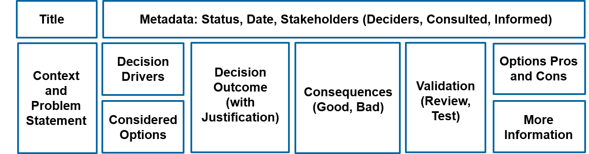

This is a decision log for storing our architectural decision records (ADR).

We are choosing to follow the guidelines here: [ADR GitHub organization](https://adr.github.io/)

## Definitions

* An Architectural Decision Record (ADR) - captures a single AD and its rationale; the collection of ADRs created and maintained in a project constitute its decision log.
* An Architecturally Significant Requirement (ASR) - is a requirement that has a measurable effect on a software system’s architecture and quality.
* An Architectural Decision (AD) - is a justified software design choice addressing a functional or non-functional requirement that is architecturally significant.

## Template

We are choosing a variant of the [MADR template](https://github.com/adr/madr/blob/main/template/adr-template.md) to capture our ADs


Name your file in this format: `0000-name.md` (lowercase, hyphenated) where the numbers increment by 10 for each new markdown file.

> This numbering allows omissions to be added later between the numbers to maintain a specific ordering.

```markdown
# {TheFileName}

> The title assigns a {name} to the AD to be identified and searched for efficiently. 
> Ideally, it should convey the essence of the problem solved and the solution chosen.

* status: {proposed | rejected | accepted | deprecated | … | superseded by }
* date: {YYYY-MM-DD} when the decision was last updated
* deciders: everyone involved in the decision
* (optional) consulted: everyone whose opinions are sought and with whom there is a two-way communication (such as subject-matter experts)
* (optional) informed: everyone who is kept up-to-date on progress in one-way communication

# Context and Problem Statement

> Describes the context and problem statement in a few sentences.
> One may want to articulate the problem in the form of a question or provide an illustrative story that invites to a conversation.
> Links to collaboration boards or issue management systems can go here too.

## (Optional) Decision Drivers

> Desired qualities, forces, faced concerns are identified here:
>   * {decision driver 1}
>   * ...

## Considered Options

The options are:
1. {ChosenOption}
2. {NextOption}

> Lists the alternatives (or choices) investigated:
>   * {title/name of option 1}
>   * ...

> The template recommends listing the chosen option first (as a project-wide convention). 
> One needs to make sure to list options that can solve the given problem in the given context (as documented in Section “Context and Problem Statement”). 
> They should do so on the same level of abstraction; a mistake we have seen in practice is that a technology is compared with a product, or an architectural style with a protocol specification and its implementations. 
> Pseudo-alternatives sometimes can be found too, but do not help.

## Decision Outcome

`{ChosenOption}`
- {justification1}
- {justification2}
- {justification3}

> A justification should be given as well: {name of option 1} because {justification}. 
> For example: 
>  - it is the only option that meets a certain k.o. criterion/decision driver;
>  - it resolves a particular force;
>  - it comes out best when comparing options.

> See [this post](https://www.ozimmer.ch/practices/2020/04/27/ArchitectureDecisionMaking.html#good-and-bad-justifications) for more valid arguments.

### (Optional) Consequences

> Discusses how problem and solution space look like after the decision is made (and enforced).

> Positive and negative consequences are listed as “Good, because …” and “Bad, because …”, respectively. An example for a positive consequence is an improvement of a desired quality. A negative consequence might be extra effort or risk during implementation.

### (Optional) Validation

> This optional section describes how the implementation of/compliance with the ADR is evaluated (aka enforced), for instance, by way of a review or a test. See “A Definition of Done for Architectural Decision-Making” in this blog for related hints.

### (Optional) Pros and Cons of the Options

> Here, the alternatives that address the problem can be explained and analyzed more thoroughly.

> The template advises to provide an example or a description of the option. Then, “Good” and “Bad” options properties are asked for. For noteworthy “Neutral” arguments, the template suggests the form Neutral (w.r.t.), because {argument}.

## (Optional) More Information

> Here, one might want to provide additional evidence for the decision outcome (possibly including assumptions made) and/or document the team agreement on the decision (including the confidence level) and/or define how this decision should be realized and when it should be re-visited (the optional “Validation” section may also cover this aspect). 
> Links to other decisions and resources might appear in this section as well.
```
