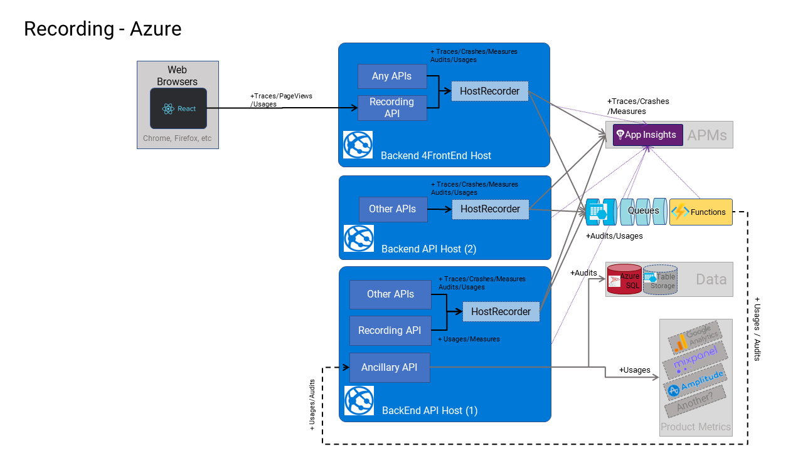
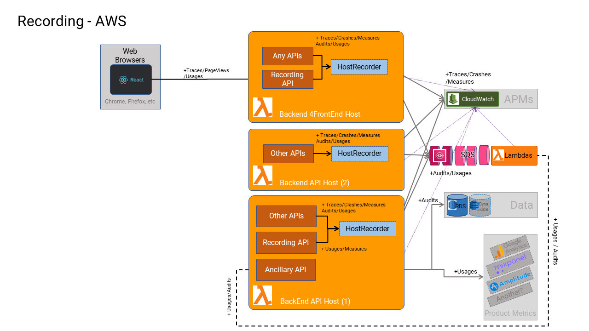

# Recording

## Design Principles

1. We want to take care of: crash reporting, diagnostics, auditing, system metrics, and usage metrics throughout all layers of the architecture, and we don't want to be injecting 5 different abstractions to do that - one abstraction is good enough, and one injected interface is most optimal (for code complexity).
2. We recognize that each of these application-level "facets" of monitoring the system is treated differently, and varies in all these dimensions:
   1. Location: Where the data is stored. (e.g., it could be stored in application databases, file systems, cold storage, or third-party services.)
   2. Frequency: The data could be captured at all times while the system is running or only at certain times (e.g., diagnostics may not be ON at all times)
   3. Content: The captured data may contain different details at different times (e.g., log levels)
   4. Retention: The data may be stored for different retention periods. (e.g., audit logs or permanent diagnostic logs may be rotated every 30 days)
   5. Partitioning: Data may need to be related to other data but stored separately (e.g., diagnostics captured across several hosts will require correlation to identify specific sagas)
3. Since each of these facets varies, we cannot treat all this as just "logging."
4. The data we capture (and where it is routed and persisted) needs to be different in different environments. e.g., in local development (or testing), we do not want to be uploading data to remote 3rd party APM systems.
5. Any 3rd party systems that we choose to use, must be pluggable (via dependency injection) and will vary depending on the hosting platform we are using. e.g., you might use Application Insights, RayGun, or Sentry.io when hosted in Azure, but use CloudWatch X-Ray when hosted in AWS.

## Implementation

The `IRecorder` abstraction is used to give access to all these monitoring services.

* `ICrashReporter` is for reporting crashes in the system. Handling either unhandled exceptions (that would unexpectedly occur but terminate a thread), or deliberating to signal a critical process was broken (perhaps like a network error that should not ever fail).
* `IAuditReporter` is for capturing application-level business-defined, regulatory/compliance auditable events in the software. e.g., an end-user accepted a certain version of an EULA. Or an end-user deleted a critical resource being managed by the tenant, etc.
* `IUsageReporter` is for capturing usage metrics about end-users using the system. In general, these are application-level, business-interest (product-outcomes) that drive important business metrics, like activation, acquisition, referral, retention, etc.
* `IMetricReporter` is for capturing metrics about the system, like performance metrics of the system or metrics about the data in the system. e.g., how many events exist for a specific aggregate.
* `ILogger`(a.k.a Logging) is for the typical diagnostic traces that engineers supporting the system are accustomed to seeing in production logs, that help them identify what happened, usually when experiencing an outage or defect in the software.

### Structured Logging

In this codebase, many of the different facets support a "structured logging" formatting.

This is where the message (defined in code by a developer) is expressed as a "template" containing "placeholders" for a collection of "data" that may vary at runtime. The "data" and the "template" are both captured and processed separately to aid analysis and filtering.

Each "field" of the "data" is substituted into the "template" (positionally) to render a final populated message. The fields of the data are stored and indexed for searching separately (i.e. as done by popular structured logging frameworks like 'Serilog').

> In C# code, unfortunately, structured logging, syntactically, looks to be very close to the syntax for string interpolated formatting, and so these two C# statements may look very similar, but only the second statement provides structured logging benefits. The first statement just uses string interpolation, and is not structured.

```c#
logger.LogInformation($"User {user.Id} saved the car booking on {booking.Date}"); // is not structured
```

versus:

```c#
logger.LogInformation("User {UserId} saved the car booking on {BookingDate}", user.Id, booking.Date); // is structured
```

In the first example, string interpolation is used to construct a complete message at runtime, but the substituted parameters are lost. In the second example, a message template is defined with separate parameters.

Extra care must be taken using escape characters if you want to construct a message template using string interpolation that yields a structured message template. For example:

```c#
logger.LogInformation($"User {{UserId}} saved the {car.Color} car booking on {{BookingDate}}", user.Id, booking.Date);
```

### Crash Reporting

a.k.a Crashlytics

One anti-pattern that is very common by developers who only understand "logging" is to capture all critical errors (in the system) in trace logs together with all trace diagnostics. This approach is fraught with operational issues since the two facets are wildly different in many of the ways we manage the data sets.

Given that we are designing a system that treats [exceptions as exceptional cases](../decisions/0060-control-flow.md), we need to deal with their occurrence separately from the occurrence of diagnostic traces.

It is very common in SaaS web-based systems to configure global exception handlers for all exceptions that bubble up to the top/bottom of the stack of a process/thread and log the exception before allowing the exception to abort the process or thread.

Capturing these unhandled exceptions generally calls for some corrective action to take place in the product that indicates a new use case to design for, or identifies edge cases not previously accounted for.

**Lifetime**: Generally, these "crashes" have a lifetime of a few days/weeks/months, within which they are useful for tracking an initial occurrence but may be kept for longer periods of time (like months/years) to help identify re-occurrences and patterns in the system before they are overwritten or discarded.

**Occurrence**: Any single interaction with a system (i.e., a single HTTP web request) generally yields in the order of **~10<sup>0</sup> crashes**, as the existence of them generally terminates the process//thread/request. So, ensuring that they are *reliably* caught, stored, and forwarded is more important than optimizing for performance benefits.

**Storage**: Crash analytics are usually delivered to APM systems (like Application Insights or other centralized logging services) or stored locally (on their respective source systems) for collation, examination and analysis at some future date. Crash logs are generally kept separately from diagnostic logs in APM tools.

**Partitioning**: Crash analytics are generally centralized across whole systems (because of the impact that they have on the system). They are usually correlated to other recorded types (diagnostics, audits, metrics) across system boundaries (i.e. with correlation identifiers).

**Filtering:** When these crashes occur, they require detailed context capture and analysis (hence the stack trace details). They are usually far more important than diagnostics as they alone may contain all the information required to diagnose these cases, but most of the time still require other diagnostics leading up to them to investigate root causes.

When crashes happen, product teams need to be notified immediately. The general idea of having them is to identify and eliminate all crashes in a product over time. They simply should not happen.

**Crash logs are almost never turned OFF** deliberately in production, and capturing them is generally more expensive than capturing diagnostics. They often involve some latency (at runtime due to reliable delivery) before being viewed after they occur.

### Auditing

Most digital products today mature to a point where, for compliance needs, they will need to record more than just what the code is doing for diagnostic purposes, but also for auditing: who did what? when? and how? This is usually to comply with security policies (and non-repudiation), privacy policies, legal policies, government regulations, etc.

**Lifetime**: Generally, these "audits" are required to be kept permanently for the lifetime of the product, and are never overwritten or discarded.

**Occurrence**: Any single interaction with a system (i.e., a single HTTP web request) generally yields on the order of **~10<sup>0</sup>-10<sup>1</sup> audits**. So, ensuring that they are *reliably* caught, stored, and forwarded is more important than optimizing for performance benefits.

**Storage**: Audits are usually delivered to permanent centralized storage systems (e.g. write-optimized stores) for investigation and litigation at some future date. Only sometimes are they queried by the system, but more likely by other external tools.

**Partitioning**: Audits are generally centralized across whole systems (because of the meaning that they have across the whole system). They can be correlated to other recorded types (diagnostics, audits, metrics) across system boundaries (i.e., with correlation identifiers), but those other types will likely not exist when it comes time to audit.

**Audits logs are always ON** and never turned OFF in production, and are certainly stored separately from crash logs or diagnostic logs.

> Note: There are many application-specific things to audit in a product, and those cannot be summarized here. From a security/privacy/legal perspective, however, these are the kinds of things that could be considered: [OWASP Cheat Sheet](https://cheatsheetseries.owasp.org/cheatsheets/Logging_Cheat_Sheet.html#which-events-to-log)

### Product Usage Metrics

a.k.a Analytics

In all digital SaaS products, tracking what users are actually doing with the whole system is vital. Knowing this information is critical for planning and designing the remainder of the system and for running experiments for the effectiveness of delivered features.

e.g., knowing how many times users complete a particular sequence of features of the product, as indicators of how valuable and frequently used the software is used (e.g., for calculating Activation and Retention occurrences).

These can include technical usage events, such as how many times a specific API was used, in order to help understand how the system should be paid for. They are as varied as the products that produce them, and for the most part (apart from common features like Login/Logout/Register etc), are specific to those products.

**Lifetime**: Generally, these "events" are required to be kept for either the lifetime of the product (capturing enduring usage data) and never discarded so that historical records can be searched as well. In practice, they are never deleted from storage, and it is only the code that once created them that could be removed.

**Occurrence**: Any single interaction with a system (i.e., a single HTTP web request) generally yields on the order of **~10<sup>0</sup>-10<sup>1</sup> events**. So, ensuring that they are *reliably* caught, stored, and forwarded is more important than optimizing for performance benefits.

**Storage**: Usage events are usually delivered to dedicated Product Usage Analytic systems (like Mixpanel or Amplitude, Application Insights or Google Analytics), as these tools offer many ways to aggregate, filter, and report on activity over time.

**Partitioning**: Events are generally centralized across whole systems (because of the meaning that they have across the whole system). They can be correlated to other recorded logs (e.g., diagnostics, audits, metrics) across system boundaries (i.e., with correlation identifiers).

### Measures

In most digital products (especially ones where lots of user experiments are carried out) there is often a requirement to count or track occurrences about certain things or behaviors that are performed by users in the software.

e.g., how many times a certain feature has been used in a certain timeframe. Or how many users achieved a specific behavioral goal.

These are generally non-technical or system performance-related events but more about users who use the system that is used to measure and determine the effectiveness of the software. They are as varied as the products that produce them, and for the most part (apart from common features like calling an API endpoint etc), are specific to those products.

**Lifetime**: Generally, these "metrics" are required to be kept for either the lifetime of the product (capturing enduring metrics) or only for the scope of a usability experiment before they are overwritten or discarded. In practice, they are never deleted from storage, and it is only the code that creates them that is removed.

**Occurrence**: Any single interaction with a system (i.e., a single HTTP web request) generally yields on the order of **~10<sup>0</sup>-10<sup>1</sup> events**. Reliability is not so important in this case, but performance should not suffer as a result of introducing these events.

**Storage**: Metrics are usually delivered to APM systems (like Application Insights or forwarded to analytics services like Google Analytics), as these tools offer many ways to relate, filter, and analyze the analytics over time. Event logs are generally kept separately from diagnostic logs and crash logs in APM tools.

**Partitioning**: Metrics are generally centralized across whole systems (because of the meaning that they have across the whole system). They can be correlated to other recorded logs (e.g., diagnostics, audits, metrics) across system boundaries (i.e., with correlation identifiers).

### Logging

This is simply achieved by leveraging the infrastructure of the `ILoggerFactory` of .NET.

## The Recorder

The `HostRecorder` is used in all running hosts (e.g., ApiHosts, WebsiteHost, FunctionHosts and TestingHosts).

The adapters that are used by the `HostRecorder` to send telemetry to its various infrastructure components are configurable via `RecordingOptions,` which are tailored for each host and to the specific cloud environment the `HostRecorder` is running in (i.e. Azure or AWS).

For example, this is the default infrastructure that is used by the `HostRecorder` when deployed to Azure.



When deployed to AWS, Application Insights is replaced by Cloud Watch, the queues are replaced by SQS queues, and the Audits are stored in an RDS database.



No matter what the host actually is, there are two main flows of data that are handled by the `HostRecorder`. Both are high in reliability and both are asynchronous.

### Traces, Crashes, Measures

When deployed to Azure, all Traces, Crashes, and Measures are offloaded to Application Insights directly using the Application Insights `TelemetryClient` SDK.

> The client SDK for Application Insights manages buffering and store-and-forward of this data asynchronously so that individual HTTP requests can return immediately without paying the tax of uploading the data to the cloud. The SDK supports buffering, retries, and other strategies to deliver the data reliably (using the `ServerTelemetryChannel`). See https://learn.microsoft.com/en-us/azure/azure-monitor/app/telemetry-channels for more details.

When deployed to AWS, all Traces, Crashes and Measures are offloaded to CloudWatch X-Ray using the client SDK.

### Audits and Usages

Audits are ultimately destined to be stored permanently in a database. Usages are typically relayed to a remote 3rd party system (i.e. Google Analytics, MixPanel, Amplitude etc).

In both cases, to avoid tying up the client's HTTP request, the telemetry for these types is first "scheduled" on a reliable queue, and then later, an API call to the Ancillary API is issued that "delivers" the telemetry to its final destination.

> On Azure, an Azure Function is triggered when the telemetry arrives on a queue, and the Azure Function simply calls an API in the Ancillary API to deliver the telemetry to its destination. The Azure Function Trigger is a reliable means to handle this process, since if the API call fails, the message will return to the queue, and subsequent failures will result in the message moving to the poison queue, to be dealt with manually.

> In AWS, a Lambda does the same job as the Azure Function above, and the SQS adapter is configured with poison queues (a.k.a a dead-letter queue) to operate in exactly the same way.

## Website Hosts

JavaScript applications running in a browser will want to capture individual page requests, measure the performance of requests, and record traces and crashes, as do all backend components. They should also participate with the same Recorder infrastructure.

> Note: Auditing should not be performed by JavaScript applications and should be tightly controlled by APIs only.

The `WebsiteHost` offers a simple recording API to the JavaScript application that can be used to relay telemetry from the JavaScript application to the BEFFE (Back end for front end).

### Tracking Browser Data

Today, many browsers in use are tightening up on privacy and not allowing JS applications to send tracking data of any kind except to their own domains. The impact of this means that 3rd party SDKs running in JavaScript in the browser (e.g., Application Insights SDK) will be blocked from sending tracking data to the cloud! This is a significant problem and one that browsers are getting more strict on in 2024.

To work around this problem, the JavaScript application can instead relay that telemetry to their BEFFE, and then the BEFFE can forward it to the remote cloud service.

Again, the `WebsiteHost` can provide the relay mechanism, but the data capture part (in the browser) still is best performed in JavaScript.

> It is technically feasible to use the vendor's SDKs to capture the data in the browser, but instead of relaying it to the 3rd party cloud endpoints, direct it to the BEFFE recorder API to relay. 
>
> For example, when using the Application Insights JavaScript SDK, you can overwrite the `endpointUrl` to point to your own BEFFE. Then, standup a custom API (in the BEFFE) that looks like the Application Insights API in Azure, and then translate the data that the `HostRecorder` can forward onto Application Insights itself. See: https://github.com/shaneochotny/ApplicationInsights-JS-Proxy for more details.