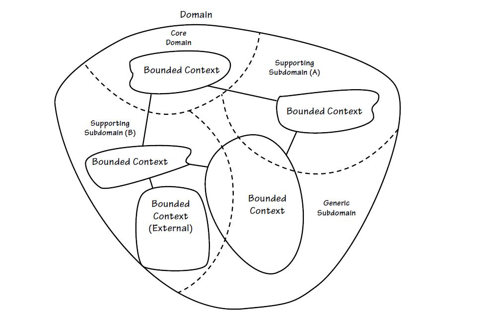
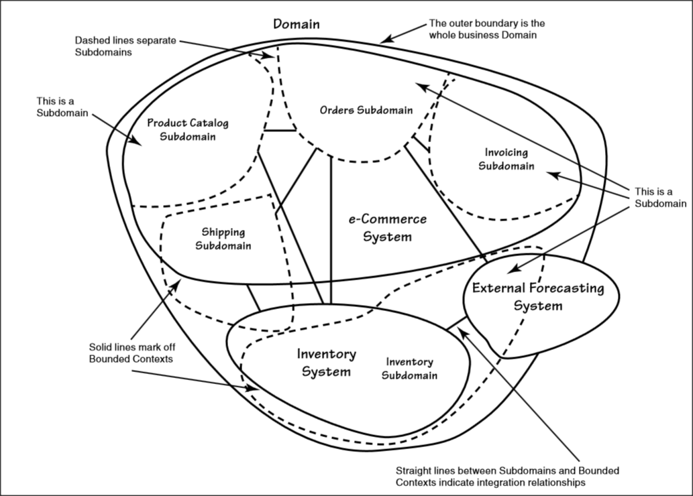
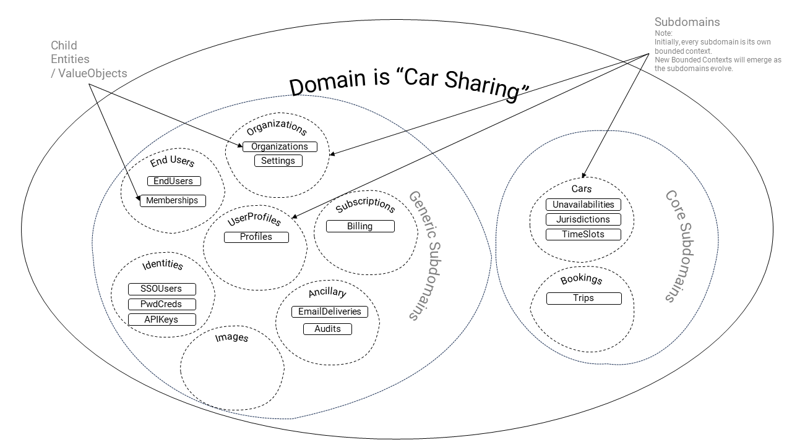
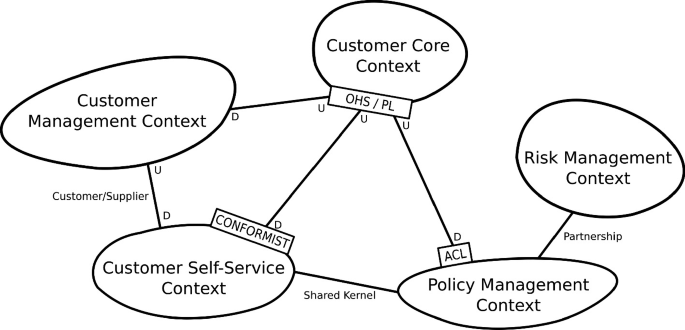
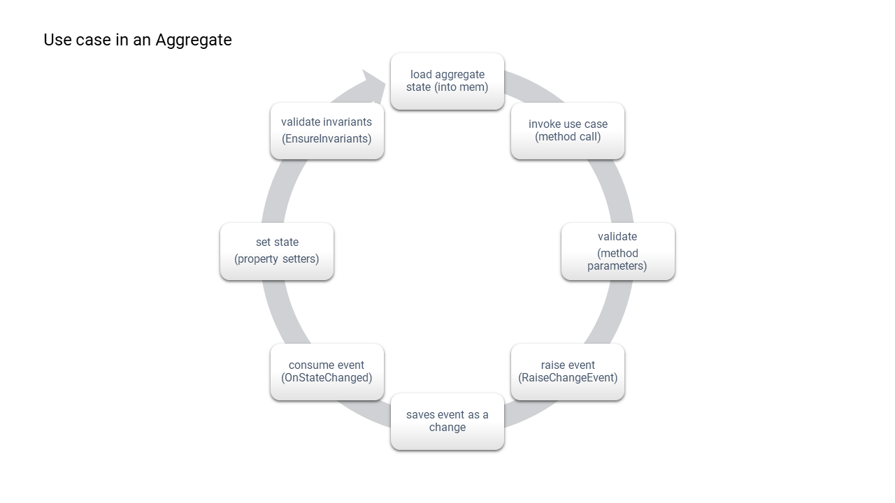
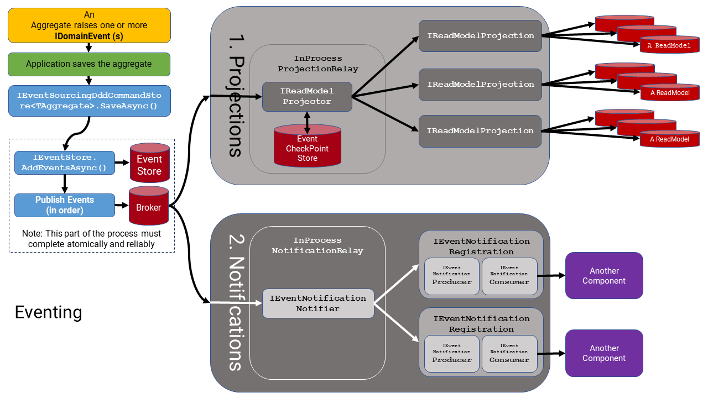

# Domain Driven Design



## Design Principles

1. We want to design our software according to the use cases we understand from the real world. Thus, focusing on [modeling behaviors](../decisions/0040-modeling.md) in the software rather than modeling the data (a.k.a Data-Modeling) required to enable the software to operate. Data modeling is too database and technology focused.
2. We want to define discrete boundaries of "state" changes, and thus, we want to use the notion of "aggregates" to do that where an aggregate represents the smallest atomic unit of state change.
3. We want to define at least one root aggregate per explicit subdomain. (Ideally, one per subdomain).
4. We want aggregates to be the source/producer of "domain events" that represent atomic units of change, and have them communicated to other subdomains (either: remotely over HTTP, or in-process), using a pub-sub mechanism.
5. We want aggregates to use `Result<Error>` return values instead of throwing exceptions for [control flow](../decisions/0060-control-flow.md) For example, returning common error codes for expected things like: validation of incoming data to the domain, verification of entity invariants, and asserting domain rules.
6. Aggregates will generate their own unique identifiers.
7. An Aggregate's initial state (in-memory) will be constructed by either: (1) replaying domain events from an event stream in chronological order (from an Event Store), or (2) rehydrating the in-memory state in a single operation (from a data store, like a SQL/NoSQL database).
8. An Aggregate's state changes (in-memory) will be persisted in either: (1) a stream of domain events (to go into an Event Store), or (2) by dehydrating the in-memory state in data (to go into a data store, like a SQL/NoSQL database).
9. When an Aggregate's state change is persisted, the domain events (that it created) will be published to any consumers registered to receive them. These consumers may be other subdomains in the same process, or running in other processes.
10.
11. We want to re-use the design principles of DDD, such as "AggregateRoots", "Entities", "ValueObjects", "Repositories", "Factories", "Subdomains" etc. Where:
12. All Aggregates, Entities, and ValueObjects will be instantiated by class factories. They will validate all data entering the domain. They will return `Result<Error>` for any validation errors.
13. They will ensure that no Aggregate ("Aggregate" being the graph of all child/ancestor Entities and ValueObjects) is ever in an invalid state at any time.
14. Aggregates will verify their own "invariants" whenever there is a state change. Invariants are the things about an aggregate that don't change.
15. ValueObjects will always be immutable and only "equal" based on their internal state.
16. Entities and Aggregates will be mutable, and "equal" by their unique identifier (despite differences in their internal value).
17. A subdomain defines the initial bounded context for a Root Aggregate. Other bounded contexts will evolve as the product evolves.
18. We want to leverage Hexagonal/Onion/Clean architecture principles:
19. The Application Layer defines one (or more) external interfaces/contracts for the Subdomain.
20. All dependencies only point inward. i.e., The Domain Layer strictly has no dependency on the Application Layer, nor on the Infrastructure Layer. In contrast, the Infrastructure Layer and Application Layer can have dependencies on the Domain Layer (directly or indirectly).
21. We want to avoid building [Transaction Scripts (and anemic domain models)](https://martinfowler.com/eaaCatalog/transactionScript.html) in the Application Layer, as that encourages tight coupling, and anemic domain models.
22. Application interfaces/contracts will be composed of commands and queries (CQRS):
   1. For "commands" it will delegate the command to one (or more) Root Aggregates (i.e., that results in a change of state).
   2. For "queries" it will delegate the query directly to a read model in an `IDataStore`. In rare cases, the query may involve an Aggregate to check access rules.
23. The Application Layer delegates all decisions (in a command or query) to an Aggregate. The only decisions that should exist in the Application Layer, are:
   1. The statelessness of the contract. Stateless or Stateful.
   2. Where to pull data from (which ApplicationService/Repository) and where to push it (which ApplicationService/Repository) and when.
   3. Which Aggregate use case to invoke, when.
24. The Application Layer is responsible for providing the Domain Layer with all the data it needs to execute the specific use case. Also, may require domain services for data processing.
25. The Application Layer is responsible for converting all data it obtains (either from Repository/ApplicationService, or from its contract parameters) into ValueObjects that the Domain Layer requires. Domain Layer does not accept variables in anything but primitives and ValueObjects.
26. The Application Layer will use the [Tell Don't Ask](https://martinfowler.com/bliki/TellDontAsk.html) pattern to instruct the Aggregate to execute the use case, no matter how complex the use case is (or isn't). The [Law of Demeter](https://en.wikipedia.org/wiki/Law_of_Demeter) also applies to reading any data from an Aggregate.
27. The Application Layer will convert all changed domain states (in any command or query responses) into shared DTOs (e.g., Resources) that can be shared with all other Application Services. e.g., A REST API is one such Application Service, as is any adapter to any 3rd party system.
28. We want to use [Dependency Injection](0060-dependency-injection.md) to inject the necessary dependencies into the Application Layer (as Application Services) and Domain Layer (as Domain Services), such that they remain decoupled from concrete adapter implementations.
29. We expect that there will be far fewer Domain Services than Application Services. Both kinds of services will be designed in terms of the needs of the consuming subdomain component (and perhaps combined into a more general abstraction if being consumed by multiple subdomains). They shall be as domain-specific as possible and not be described in terms of the technology that implements them (upholding the SOLID principle of [ISP](https://en.wikipedia.org/wiki/Interface_segregation_principle)).
30. The Application Layer can be exposed to any number of interfaces (e.g., a REST API, a Queue, or a Service Bus) or as consumer of domain events notifications.
31. We want to capture, measure, and monitor usage activity, diagnostics, and audit key events in the system by using the [Recorder](0030-recording.md).

## Implementation

### Generic versus Core Subdomains

In DDD parlance, a "Generic" subdomain is one that is generic to all products. In other words, a subdomain that is not unique to your product. These subdomains could (in theory) be integrated with and provided by other products/systems outside your product.

A "Core" subdomain is unique to your product and a vital characteristic of it.

> That is not to say that the Generic subdomains are not vital; they are absolutely vital for operation. It is just that it is not vital that you build them yourself.



Among the subdomains will exist one or more "bounded contexts". In DDD, a bounded context is simply a defined boundary within which the semantics of the aggregates and use cases in the subdomains are well-known and unambiguous. Given that in the real world, many aspects of the same thing/concept are only relevant in specific contexts. That is exactly what a bounded context is meant to be. A codified specific context, where meaning is clear, using names of things that can other meanings in different contexts.

For example, in this codebase, we have provided two "Core" subdomains: `Cars` and `Bookings`. Together, these two subdomains alone are understood together to represent the "core" of a bounded context of borrowing cars with the "Car Sharing" domain.

The other subdomains are all "Generic" subdomains, and form another more technical bounded context where they work together to provide consistency and rules that govern things like multi-tenancy, ownership and payment authority, etc:

- `EndUsers`, `Organizations`, `UserProfiles`, `Identities`, and `Subscriptions` are all generic subdomains related to the multi-tenancy and identity management within a typical SaaS product.
- `Ancillary`, `Images` (and `Workers`) are all generic subdomains related to the operation of a typical SaaS product.

#### Your first few Subdomains

When starting a new product, many developers who are unfamiliar with DDD wonder how to start defining the new core subdomains of their products. It is a fair question. They are (more often than not) used to thinking about software design in terms of the data tables, columns, and data types required by relational databases (a.k.a. data modeling). So, they expect that there is some similar way of working in DDD that can be easily translated. This is not really the case.

A lot of work has been done on what is called "strategic" design in DDD. Whole books have been written on it; some like [Eric Evans's "blue book"](https://www.domainlanguage.com/ddd/) are very comprehensive and well worth the read. They guide you through understanding and designing the subdomains and bounded contexts of your software using context maps and things like that. Most of that material makes a lot of sense, but getting started with applying it before you have any software built is still quite challenging, particularly when building software products from scratch.

However, what is not so hard is answering this question:

Q. What are the use cases for using the software you want to build? a.k.a What, specifically, should your software do?

If you can answer that question, then you are already designing the "Subdomains" of your domain.

We recommend that you just get started focusing on your use cases, and the database design will fall out of the back of that process. It would be very scary and risky if you were data modeling, but you are not doing that now; you are doing "domain modeling" instead.

Just take the answer to the question above, then group the use cases into groups around a common concept, and then make each one of those concepts a new subdomain.

Q. What should you call the subdomains?

Well, best call them the same things that you use to describe them in the real world. This will eventually become your ubiquitous language.

> Just remember that you are building software to abstract or hide many of the complexities that exist in the real world. You are doing that because much of that detail and complexity can safely be ignored to get your software working. However, terms, names, nouns, and verbs that you borrow from the real world have many nuances associated with them in the real world that are lost when modeled in software. So, you need to be quite accurate and precise to avoid any confusion. Take care to select appropriate words/nouns/names that you use for the simplifications you define for real-world things.
>
> So, for example, it is relatively safe to use the simple noun "Car" to represent the physical object (of ~30,000 parts, the thing that one gets in and drives away), even though you are only modeling very basic details about it, like its color, mileage, location, make, model and year, number of windows, car seats, etc. However, what if your specific business decides to include using bicycles, boats, buses or trucks later on? Would "Vehicle" have been a better option to start with? Context matters.

In the example "Car Sharing" world (the example domain in the codebase that you are learning from), we know that this domain is all about people (end-users) making reservations (bookings on some future schedule) to use a car (owned by someone else), finding the car at some location, then gaining access to the car (digital or physical key), then driving the car on some journey over some route for some time, eventually, returning the car to some location, and being charged for its use.

So, from that simple "mental model" of the real world, we know that we are likely to have these initial core subdomains:

* **Cars** - the thing that is being used (they need to be accessed/scheduled/rented/driven)
* **Bookings** - represent the schedule/reservation in time for using the car.
* **Unavailabilities** (opposite of Availabilities) - this is a representation of a time schedule when a specific car can be used for a purpose like renting
* **Locations** - where the cars start and end their Journeys
* **Trips** - the representation of the journey taken with the car
* etc.

Given this, you can then ask yourself what are the use cases would we know about today for each of these proposed new subdomains?

> Being disciplined enough to ignore what could come to pass one day in the far future (maybe/perhaps?) and only focusing on what you can see or foresee happening in the near future. It makes little sense to second guess the far future just focus on what you know now.

Now, for each of the proposed subdomains above, ask yourself whether you have more than one use case that applies only to it (in isolation from the others).

For the proposed subdomains that don't have use cases specifically yet, they won't start out as subdomains. More than likely, they will start out as features, characteristics or aspects (entities or value objects) of other core subdomains.

> For example, you may not be able to come up with a use case for manipulating a Location or a Trip just yet, or for that matter, an Unavailability. That is fine. A car may go on a Trip and have a start and end Location, and while it is booked, it is Unavailable for hire by someone else. But this does not mean that those concepts need to be subdomains in their own rights. Indeed, Unavailability has no meaning without the context of a Car, so it is probably not separate from a Car.

So, "Unavailability" starts out as an entity of a Car, and "Location" can start out as two value objects of a Booking, i.e., "Pick up" location and "Drop off" Location. Trips could be a child entity of a Booking since you can do several of them during a Booking.

As time goes on, and as you explore your product opportunities further, it is very common that subdomains both diverge (and split up) or converge (and merge together). This is very normal, and unavoidable, and unpredictable, and unknowable ahead of time. So we recommend that you don't try to second guess the future since it is likely to change as you move forward.

> For example, one day, in a few months or years' time, your specific product may decide to expand, branch out, and create some set of features around Trip management where you might provide `EndUsers` the capability to plan and schedule their `Trips` or even create and manage `Tours`. At that point in time, in the software, you will be deciding whether to factor out `Trip` from being a entity into its own subdomain, where you might now have 5 or 6 use cases for it. At that time, the `Bookings` subdomain that once used a Trip entity will need to be changed to use a "memento" of a `Trip` from the `Trips` subdomain. This is quite normal progress as the software is explored.
>

### Bounded Contexts

A quick note about [Bounded Contexts](https://martinfowler.com/bliki/BoundedContext.html).



Bounded Contexts are another vital concept in Strategic DDD design, and often one that is difficult to implement in code.

Your software does not actually need to **explicitly** model its bounded contexts for the sake of it, nor for completeness.

> They are more of a high-level design attribute than anything else, and they are most useful in context maps used for design and solving design problems.
>
> Yes, they are useful for drawing context maps and the like (at later dates), but they are not necessary to get started on modeling the real world with DDD design.

It is true that generally, a Subdomain (when it is first defined) will have a "bounded context" of its own that is defined by the bounds of the subdomain itself. They are practically the same thing at that time. Over time, however, this definition of the bounded context may grow or shrink to encapsulate parts of the owning subdomain and parts of other subdomains as well.

This change is also almost impossible to predict and design ahead of time, so we recommend you move forward without worrying too much about getting your bounded contexts correct to any degree of accuracy. Just focus on your subdomains until you understand the system better, months to years from now.

### Event Sourced versus Snapshotting

[Event Sourcing](https://martinfowler.com/eaaDev/EventSourcing.html) is a strategy to capture individual 'changes in the state' of your software over time, as opposed to (the more traditional way of) capturing only the 'latest version of your data' (a.k.a "Snapshotting").

> "State" and "data" mean slightly different things in this context.

Event Sourcing depends on producing and consuming a stream of domain-specific "domain events" where the "event stream" consists of one or more events preserved in the specific order in which they occurred.

Whereas "snapshotting" state does not strictly depend on domain events at all, it depends on maintaining a collection of properties/fields/attributes of an object.

Nonetheless, in this architecture, we wish to generate "domain events" in our Domain Layer irrespective of whether we utilize event sourcing or not, which means that this comes down to a decision only about how we persist state changes as a "stream of events" or as a snapshot of the "latest changes". Both schemes are very feasible.

> Event Sourcing will be new to many developers who are used to data modeling techniques that only store the "snapshot" of data. And with all things new, it comes with some reservations about its use.

Despite the advantages and the different challenges of using event sourcing ([see here for more details](https://martinfowler.com/eaaDev/EventSourcing.html)), this "event-timeline" capability has some significant advantages that are hard to accomplish with the "snapshot" strategy, particularly for SaaS-based products. The primary one is that you can create time-based reports on key aggregates in your domain for deeper data analysis any time later.

> For example, let's say that 2 years into your Car Sharing product, you now want to understand your end user's behaviors a little better because you are contemplating a new capability in the product.
>
> So you want to ask the software/database to report its data on the probability of a car in an urban area being unavailable at 8 pm at night. But until that day, your software had not been capturing that kind of unavailability data because the software only cared about storing the future unavailability of a car for making its reservations. Why would it care about capturing and storing past unavailability after all? You've not needed it until now.
>
> So you have to engineer a solution to provide this historical data from this day forward and start capturing it in the data. The problem is that now, you need a large enough dataset for any statistical significance or meaning, and you don't have it. So you can't provide an answer to the question for another few months or years down the track while you collect that data. With an event-sourced system, it is likely that you can have that answer right away, it is in the data already.

This is why we recommend using event sourcing as your default persistence strategy by storing your domain events in an event stream in an Event Store for all new core subdomains.

See the [Persistence](0070-persistence.md) guidance for how persistence of domain events works in practice and when to use one or the other.

### Aggregate Design

Every subdomain should have at least one root aggregate.

> Think of an aggregate root as the trunk of a tree. Think of entities as the branches of the tree, and think of value objects as the leaves of the tree.

Aggregate classes are typically named (in the code) with the suffix: `Root` to distinguish them from other types that are used throughout the other Layers of the codebase, such as those with the same name in the ReadModels and Resources for the same subdomain.

The class should derive from `AggregateRootBase,` and the designer should decide whether the state of the aggregate is going to be persisted in an event stream (using an EventStore) or in a traditional snapshot persistence store (e.g., a database).

For example,

```c#
public sealed class CarRoot : AggregateRootBase
{
}
```

> Tip: In Rider, you can use the shortcut called `aggregate` to create yourself a full skeleton of a DDD aggregate class.

#### Creation

When a new aggregate is created, it must be constructed using a class factory method. This method will then be called from the Application Layer when a new aggregate needs to be created.

> Instantiating an aggregate using a constructor directly is not permitted from outside of the domain.

This class factory is to be given only parameters that are mandatory to construct the aggregate in a valid state when the aggregate is initially created. Otherwise, parameters can be included in subsequent use cases (i.e., other method calls).

> For example, all tenanted aggregates will, at the very least, need to be assigned an `OrganizationId` in order to be constructed.

Any other parameters that are needed at creation time must be validated to maintain the integrity of the state of the aggregate.

> Remember: An aggregate must also be in a valid state at all times.

When an aggregate is created for the first time, it must raise its own `Created` event.

> Note: The aggregate will create its own `Id` value (using the `IIdentifierFactory`), and it will initialize its initial in-memory state.

For example, a typical aggregate class factory creation method for a tenanted aggregate, might look like this:

```c#	
    // Note: This class factory must be named Create()
    public static Result<CarRoot, Error> Create(IRecorder recorder, IIdentifierFactory idFactory,
        Identifier organizationId)
    {
        // Note: call the private ctor (below)
        var root = new CarRoot(recorder, idFactory);
        // Note: you must raise the Create event immediately after instantiating the class
        root.RaiseCreateEvent(Car.Created.Create(car.Id, organizationId));
        return root;
    }

    // Note: this ctor must be private and must call the base class ctor
    private CarRoot(IRecorder recorder, IIdentifierFactory idFactory) : base(recorder, idFactory)
    {
    }
```

#### State Persistence

All root aggregates will support persistence (to and from memory) in one form or another.

All aggregate roots will need to implement the `public static AggregateRootFactory<TAggregateRoot> Rehydrate()` method so that they can be instantiated by any persistence mechanism. This method will then call the private constructor to instantiate the instance.

There are two supported persistence mechanisms:

**Snap Shotting**: Root aggregates that are going to be persisted by "dehydrating" their current/latest in-memory state (e.g., to be stored in a database) will need to implement these characteristics:

1. They will declare a `[EntityName("TableName")]` on their class declaration. This will be used to identify the storage container (i.e., the table name in a relational SQL database or the document/collection name in a NoSQL database) by the persistence layer.
2. They will implement a private constructor that populates the in-memory state of the aggregate, which is called by the `AggregateRootFactory<TAggregateRoot> Rehydrate()` method.
3. They will implement the `public override HydrationProperties Dehydrate()` method, and populate the dictionary with values of the internal state of the aggregate.

For example,

```c#
// Note: The attribute below identifies the 'Booking' table/container in the persistence store
[EntityName("Booking")]
public sealed class BookingRoot : AggregateRootBase
{
    // Note: This ctor must populate the entire internal state of the whole aggregate using properties that were rehydrated from the persistence store. Called by the 'Rehydrate()' method below
    private BookingRoot(Identifier identifier, IDependencyContainer container,
        IReadOnlyDictionary<string, object> rehydratingProperties) : base(
        identifier, container, rehydratingProperties)
    {
        Start = rehydratingProperties.GetValueOrDefault<DateTime>(nameof(Start));
        End = rehydratingProperties.GetValueOrDefault<DateTime>(nameof(End));
        CarId = rehydratingProperties.GetValueOrDefault<Identifier>(nameof(CarId));
        BorrowerId = rehydratingProperties.GetValueOrDefault<Identifier>(nameof(BorrowerId));
        OrganizationId = rehydratingProperties.GetValueOrDefault<Identifier>(nameof(OrganizationId))!;
    }
    
    // Note: This method is called by the runtime when the aggregate is loaded from a persistence store
    public static AggregateRootFactory<BookingRoot> Rehydrate()
    {
        return (identifier, container, properties) => new BookingRoot(identifier, container, properties);
    }

    // Note: this method is called by the runtime when the aggregate is saved to a persistence store
    public override HydrationProperties Dehydrate()
    {
        var properties = base.Dehydrate();
        properties.Add(nameof(Start), Start);
        properties.Add(nameof(End), End);
        properties.Add(nameof(CarId), CarId);
        properties.Add(nameof(BorrowerId), BorrowerId);
        properties.Add(nameof(OrganizationId), OrganizationId);
        return properties;
    }
```

**Event Sourcing**: Root aggregates that are going to be persisted by saving and loading their event stream (e.g., to and from an event store) will need to implement these characteristics:

1. They will implement a private constructor that is called by the `AggregateRootFactory<TAggregateRoot> Rehydrate()`.

For example,

```c#  
public class CarRoot : AggregateRootBase
{
    // Note: This ctor only calls the base class. Called by the 'Rehydrate()' method below
    private CarRoot(IRecorder recorder, IIdentifierFactory idFactory, Identifier identifier) : base(recorder,
        idFactory, identifier)
    {
    }

    // Note: This method is called by the runtime when the aggregate is loaded from a persistence store
    public static AggregateRootFactory<CarRoot> Rehydrate()
    {
        return (identifier, container, _) => new CarRoot(container.GetRequiredService<IRecorder>(),
            container.GetRequiredService<IIdentifierFactory>(), identifier);
    }
```

> The `AggregateRootBase` class provides all the necessary support for both kinds of persistence schemes.

#### Modeling Use Cases

A root aggregate represents the contract and transactional boundary of a subdomain at the Domain Layer.

It represents the initial bounded context, and it represents the smallest level of atomicity at this level of the software. That is to say that any change to a subdomain (i.e., anywhere within an aggregate) represents a discrete change to the whole aggregate.

These changes will manifest as domain change events.

For any state change (or any query) to an aggregate's state, we are not permitted to navigate the hierarchy of an aggregate into its child/descendant entities and value objects, and change the state of them. There are at least two design principles at play here that enforce this rule:

* [The Law of Demeter](https://en.wikipedia.org/wiki/Law_of_Demeter) a.k.a the Principle of Least Knowledge - don't take dependencies (of knowledge) on the internal details and implementation of any object in a graph. That knowledge should only be known to, and encapsulated by the aggregate.
* [Tell Don't Ask](https://martinfowler.com/bliki/TellDontAsk.html) - instruct the aggregate to perform the operation; do not read the aggregate's state so that you can change the system outside of the aggregate.

These design principles help us to encapsulate behaviors in use cases inside the aggregate.

> Even with these principles in place, you can still read the current state of the aggregate outside the aggregate by viewing its individual value objects and its hierarchy of child/descendant entities. What you cannot do is: (1) change its state via any child/ancestor entity or value object, AND (2) you cannot implement any behaviors about the aggregate outside the aggregate.

Furthermore, all root aggregates will be creating and handling "domain events" to set their internal state, rather than the more traditional way of passing data into methods that simply set property values on the aggregate. This is necessary so that domain events are created that represent the state change.

> The patterns used to produce and consume domain events in aggregates will be the least familiar aspect of creating DDD aggregates in your code. The pattern is there for very good reasons, even though it may seem unfamiliar and inefficient to you. We recommend taking some time to understand the full picture of using aggregates first.

In practice, what this means is that your root aggregate will:

1. Implement a use case as a (mutating) instance method (on the aggregate class).
2. This method will return a `Result<TValueObject, Error>` or a `Result<Error>`, and will return errors instead of throwing exceptions (except in exceptional cases)
3. This method will accept and return only value objects (or primitives). The caller is responsible for constructing these value objects (unless they were obtained from the subdomain already).
4. The method shall validate all input parameters for the current change in state.
5. The method shall raise one or more domain events that encapsulate the data that is being used to change the state of the aggregate. Note that all domain events can only be defined in data by primitives since these classes must cross domain and process boundaries, and we can't have dependencies on the types in them that cross those boundaries.
6. The aggregate will then store and replay the domain event back to itself and, based on the data in the domain event, set its current in-memory state with the properties from the domain event.
7. Finally, the aggregate invariants are validated once more to ensure that the internal in-memory state of the aggregate has not been compromised by this [logical] transaction.

In a nutshell, this is the process:



For example, these two use-cases. The first use case is as simple as it gets. The second use case demonstrates many of the other aspects of a more complex use case:

```c#
    // Note: ChangeRegistration represents this use case
    public Result<Error> ChangeRegistration(LicensePlate plate)
    {
        // Note: We simply raise the change event
        return RaiseChangeEvent(Car.RegistrationChanged.Create(Id, OrganizationId, plate));
    }

...

    // Note: ReserveIfAvailable represents this use case
    public Result<bool, Error> ReserveIfAvailable(TimeSlot slot, string referenceId)
    {
        // Note: Validates incoming data (slot) to ensure that the change is permitted. This validation can fail, and will return errors!
        if (slot.IsInvalidParameter(s => s.StartsAfter(DateTime.UtcNow), nameof(slot),
                Resources.CarRoot_ReserveInPast, out var error))
        {
            return error;
        }

        // Note: Executes other rules to ensure that the change is permitted. No change of state is made here.
        if (!IsAvailable(slot))
        {
            return false;
        }

        // Note: Constructs new data values in new value objects, which in turn executes other rules within those value objects. These value objects can fail to accept this data, and will return errors too!
        var causedBy = CausedBy.Create(UnavailabilityCausedBy.Reservation, referenceId);
        if (!causedBy.IsSuccessful)
        {
            return causedBy.Error;
        }

        // Note: Raises a new domain event called UnavailabilitySlotAdded, this can also fail if the invariants of the aggregate fail, which is run after immediately the event is raised.
        var raised = RaiseChangeEvent(Car.UnavailabilitySlotAdded.Create(Id, OrganizationId, slot, causedBy.Value));
        if (!raised.IsSuccessful)
        {
            return raised.Error;
        }

        // Note: This use case returns a result, which the caller can use to decide what to do
        return true;
    }
```

Then the aggregate handles the event being replayed to itself:

```c# 
    // Note: this method is automatically called by the root aggregate (base class) immediately after calling RaiseChangeEvent()
    protected override Result<Error> OnStateChanged(IDomainEvent @event, bool isReconstituting)
    {
        switch (@event)
        {
                
...other event handlers
    
            case Car.RegistrationChanged changed:
            {
                // Note: we need to convert data in the domain event back into value objects
                var jurisdiction = Jurisdiction.Create(changed.Jurisdiction);
                if (!jurisdiction.IsSuccessful)
                {
                    return jurisdiction.Error;
                }

                var number = NumberPlate.Create(changed.Number);
                if (!number.IsSuccessful)
                {
                    return number.Error;
                }

                var plate = LicensePlate.Create(jurisdiction.Value, number.Value);
                if (!plate.IsSuccessful)
                {
                    return plate.Error;
                }

                // Note: Now we update the internal in-memory state of the whole aggregate, this may involve child/decendant entities and valueobjects
                License = plate.Value;
                Status = changed.Status.ToEnum<CarStatus>();
                
                // Note: just for diagnostics
                Recorder.TraceDebug(null, "Car {Id} registration changed to {Jurisdiction}, {Number}", Id,
                    changed.Jurisdiction, changed.Number);
                return Result.Ok;
            }

            case Car.UnavailabilitySlotAdded created:
            {
                var unavailability = RaiseEventToChildEntity(isReconstituting, created, idFactory =>
                    UnavailabilityEntity.Create(Recorder, idFactory, RaiseChangeEvent), e => e.UnavailabilityId!);
                if (!unavailability.IsSuccessful)
                {
                    return unavailability.Error;
                }

                Unavailabilities.Add(childEvent.Value);
                Recorder.TraceDebug(null, "Car {Id} had been made unavailable from {From} until {To}, for {CausedBy}", Id, created.From, created.To, created.CausedByReason);
                return Result.Ok;
            }

... other event handlers
            
            default:
                return HandleUnKnownStateChangedEvent(@event);
        }
    }
```

#### Validating Invariants

Aggregates may have conditions within states that are "invariant". That is, things about its state that must be true at all times (i.e., they don't vary).

Sometimes, those invariants are only true at certain times (in certain states). Sometimes, they are true at all times (in all states).

> For example, for a Booking to be made for a Car, the car must not only exist, but it must be roadworthy, as well as have availability at that time. Availability can change over time (as bookings are made), but road worthiness may not change. When the car is first created (as an aggregate), it may not have the details it needs to pass the road worthiness test yet. Those details may come in a future domain event, so the invariant can be applied only after that time.

Invariants are strictly checked/validated in three places in a subdomain:

1. When any value object is constructed. Data must be valid for that value.
2. When a use case is invoked, and before an event is raised, to ensure that the aggregate is in the correct (in-memory) state to allow the use case to be invoked.
3. After an event is raised, to ensure the final state of the aggregate is still valid.

> In all cases, `Result<Error>` are used to report back failed invariants, and the [logical] transaction should be aborted.

For example:

```c# 
    // Note: this method is automatically called by the root aggregate (base class) immediately after calling OnStateChanged(), which happens after any event is raised
    public override Result<Error> EnsureInvariants()
    {
        // Note: we ensure the base class invariants are still valid
        var ensureInvariants = base.EnsureInvariants();
        if (!ensureInvariants.IsSuccessful)
        {
            return ensureInvariants.Error;
        }

        // Note: We first delegate to the aggregates child/descendant entities
        var unavailabilityInvariants = Unavailabilities.EnsureInvariants();
        if (!unavailabilityInvariants.IsSuccessful)
        {
            return unavailabilityInvariants.Error;
        }

        // Note: Now we check the valueobjects of the aggregate
        if (Unavailabilities.Count > 0)
        {
            if (Manufacturer.NotExists())
            {
                return Error.RuleViolation(Resources.CarRoot_NotManufactured);
            }

            if (Owner.NotExists())
            {
                return Error.RuleViolation(Resources.CarRoot_NotOwned);
            }

            if (License.NotExists())
            {
                return Error.RuleViolation(Resources.CarRoot_NotRegistered);
            }
        }

        return Result.Ok;
    }
```

### Entity Design

Every root aggregate can have a hierarchy of child/descendent entities and value objects. They can be single entities or collections of entities.

> Think of entities as the branches of a tree. Think of value objects as the leaves of a tree.

Entities are typically named (in the code) with the suffix: `Entity` to distinguish them from other types that are used throughout the other Layers of the codebase, such as those with the same name in the read models and resources for the same subdomain.

An entity class should derive from `EntityBase,` and the designer should decide whether the state of the ancestor aggregate is going to be persisted in an event stream (using an EventStore) or in a traditional snapshot persistence store (e.g., a database).

For example,

```c#
public sealed class Unavailability : EntityBase
{
}
```

> Tip: In Rider, you can use the shortcut called `entity` to create yourself a full skeleton of a DDD entity class.

#### Creation

Entities are not created directly. They are always created by their parent/ancestor root aggregate in response to a domain event. The aggregate will handle the entity creation domain event, it will instantiate an instance of the entity, and it will relay the domain event to the entity that will then set its own internal state.

For example, this is how the `CarRoot` creates an `UnavailabilityEntity` in response to raising a `UnavailabilitySlotAdded` domain event

```c#
    // Note: this is called automatically after the domain event is raised 
    protected override Result<Error> OnStateChanged(IDomainEvent @event, bool isReconstituting)
    {
        switch (@event)
        {

... other event handlers

            case Car.UnavailabilitySlotAdded created:
            {
                // Note: creates and relays the event to a new instance of the UnavailabilityEntity
                var unavailability = RaiseEventToChildEntity(isReconstituting, created, idFactory =>
                    UnavailabilityEntity.Create(Recorder, idFactory, RaiseChangeEvent), e => e.UnavailabilityId!);
                if (!unavailability.IsSuccessful)
                {
                    return unavailability.Error;
                }

                // Note: the entity is added to the aggregate's collection of entities
                Unavailabilities.Add(childEvent.Value);
                Recorder.TraceDebug(null, "Car {Id} had been made unavailable from {From} until {To}, for {CausedBy}", Id, created.From, created.To, created.CausedByReason);
                return Result.Ok;
            }

            default:
                return HandleUnKnownStateChangedEvent(@event);
        }
    }
```

then, in the `UnavailabilityEntity` class, the entity will also handle the same domain event, and set its internal state:

```c# 
    // Note: this is called first in the call to the RaiseEventToChildEntity() method of the aggregate
    public static Result<UnavailabilityEntity, Error> Create(IRecorder recorder, IIdentifierFactory idFactory,
        RootEventHandler rootEventHandler)
    {
        return new UnavailabilityEntity(recorder, idFactory, rootEventHandler);
    }

    // Note: this is called next by the RaiseEventToChildEntity() method of the aggregate
    protected override Result<Error> OnStateChanged(IDomainEvent @event)
    {
        switch (@event)
        {
            case Car.UnavailabilitySlotAdded added:
            {
                var slot = TimeSlot.Create(added.From, added.To);
                if (!slot.IsSuccessful)
                {
                    return slot.Error;
                }

                var causedBy = CausedBy.Create(added.CausedByReason, added.CausedByReference);
                if (!causedBy.IsSuccessful)
                {
                    return causedBy.Error;
                }

                // Note: sets the internal state of the entity
                OrganizationId = added.OrganizationId.ToId();
                CarId = added.EntityId.ToId();
                Slot = slot.Value;
                CausedBy = causedBy.Value;
                return Result.Ok;
            }

            default:
                return HandleUnKnownStateChangedEvent(@event);
        }
    }
```

When a new entity is created, it must be constructed with a class factory method that includes the `RootEventHandler rootEventHandler`. This handler is later used by the entity to raise events to its parent/ancestor root aggregate when they originate from the entity.

> Instantiating an entity using a constructor directly is not permitted from outside of the domain.

This class factory is unlikely to be given any additional parameters that are mandatory to construct the entity since the data it will need will likely come from the domain events that are relayed to it from the aggregate.

Any additional parameters that are needed at creation time must be validated to maintain the integrity of the state of the aggregate.

> Remember: An aggregate (as a whole, which includes all its child/descendant entities and value objects) must be in a valid state at all times.

> Note: The entity will create its own `Id` value (using the `IIdentifierFactory`), and it will initialize its initial in-memory state.

For example, a typical entity class factory creation method might look like this:

```c#	
    // Note: This class factory must be named Create()
    public static Result<UnavailabilityEntity, Error> Create(IRecorder recorder, IIdentifierFactory idFactory,
        RootEventHandler rootEventHandler)
    {
        return new UnavailabilityEntity(recorder, idFactory, rootEventHandler);
    }

    // Note: this ctor must be private and must call the base class ctor
    private UnavailabilityEntity(IRecorder recorder, IIdentifierFactory idFactory, RootEventHandler rootEventHandler) : base(recorder, idFactory, rootEventHandler)
    {
    }
```

#### State Persistence

Like its parent/ancestor root aggregate, an entity will support persistence (to and from memory) in one form or another. See ([above](#Aggregate-Design)) for more details on how aggregates do this.

All entities will need to implement the `public static EntityFactory<TEntity> Rehydrate()` method so that they can be instantiated by any persistence mechanism. This method will then call the private constructor to instantiate the instance.

There are two supported persistence mechanisms:

**Snap Shotting**: Entities that are going to be persisted by "dehydrating" their current/latest in-memory state (e.g., to be stored in a database) will need to implement these characteristics:

1. They will declare a `[EntityName("TableName")]` on their class declaration. This will be used to identify the storage container (i.e., the table name in a relational SQL database or the document/collection name in a NoSQL database) by the persistence layer.
2. They will implement a private constructor that populates the in-memory state of the aggregate, which is called by the `public static EntityFactory<TEntity> Rehydrate()` method.
3. They will implement the `public override HydrationProperties Dehydrate()` method, and populate the dictionary with values of the internal state of the entity.

For example,

```c#
// Note: The attribute below identifies the 'Trip' table/container in the persistence store
[EntityName("Trip")]
public sealed class Trip : EntityBase
{
    // Note: This ctor must populate the entire internal state of the whole entity using properties that were rehydrated from the persistence store. Called by the 'Rehydrate()' method below
    private Trip(Identifier identifier, IDependencyContainer container,
        IReadOnlyDictionary<string, object> rehydratingProperties) : base(
        identifier, container, rehydratingProperties)
    {
        RootId = rehydratingProperties.GetValueOrDefault<Identifier>(nameof(RootId))!;
        OrganizationId = rehydratingProperties.GetValueOrDefault<Identifier>(nameof(OrganizationId))!;
        BeganAt = rehydratingProperties.GetValueOrDefault<DateTime?>(nameof(BeganAt));
        EndedAt = rehydratingProperties.GetValueOrDefault<DateTime?>(nameof(EndedAt));
        From = rehydratingProperties.GetValueOrDefault<Location>(nameof(From));
        To = rehydratingProperties.GetValueOrDefault<Location>(nameof(To));
    }
    
    // Note: This method is called by the runtime when the entity is loaded from a persistence store
    public static EntityFactory<Trip> Rehydrate()
    {
        return (identifier, container, properties) => new Trip(identifier, container, properties);
    }

    // Note: this method is called by the runtime when the entity is saved to a persistence store
    public override HydrationProperties Dehydrate()
    {
        var properties = base.Dehydrate();
        properties.Add(nameof(RootId), RootId);
        properties.Add(nameof(OrganizationId), OrganizationId);
        properties.Add(nameof(BeganAt), BeganAt);
        properties.Add(nameof(EndedAt), EndedAt);
        properties.Add(nameof(From), From);
        properties.Add(nameof(To), To);
        return properties;
    }
}
```

**Event Sourcing**: Entities that are going to be persisted by saving and loading their parent/ancestors aggregate event stream (e.g., to and from an event store) will need to implement these characteristics:

1. They will implement a private constructor that is called by their own `Create()` factory method, which is called by the  `AggregateRootBase.RaiseEventToChildEntity()` method.

For example,

```c#  
public sealed class Unavailability : EntityBase
{
    // Note: This ctor only calls the base class. Called by the 'Create()' factory method
    private Unavailability(IRecorder recorder, IIdentifierFactory idFactory, RootEventHandler rootEventHandler) : base(recorder, idFactory, rootEventHandler)
    {
    }
```

> The `EntityBase` class provides all the necessary support for both kinds of persistence schemes.

#### Changing State

To change the state of any entity, the root aggregate is going to define a use case method [as described above](#Modeling-use-cases) that then calls a method on the existing entity instance (in-memory).

The method on the entity then creates a new domain event and relays the domain event back to the aggregate.

The aggregate will handle this domain event in its `OnStateChanged()` method and relay the call back to the appropriate entity.

The entity then updates its state (much like the aggregate does).

In a nutshell, this is the process:


For example,

```c#
    public Result<Error> Begin(Location from)
    {
        if (BeganAt.HasValue)
        {
            return Error.RuleViolation(Resources.Trip_AlreadyBegan);
        }

        var starts = DateTime.UtcNow;
        return RaiseChangeEvent(Booking.TripBegan.Create(RootId!, OrganizationId!, Id, starts, from));
    }
```

#### Validating Invariants

Entities, like aggregates, may have conditions within states that are "invariant". That is, things about its state that must be true at all times (i.e., they don't vary).

Entities, like aggregates should be verifying their variants before and after raising events. Similarly they should implement the `EnsureInvariants()` method.

For example:

```c# 
    // Note: this method is automatically called by the entity (base class) immediately after calling OnStateChanged(), which happens after any event is raised
    public override Result<Error> EnsureInvariants()
    {
        var ensureInvariants = base.EnsureInvariants();
        if (!ensureInvariants.IsSuccessful)
        {
            return ensureInvariants.Error;
        }

        if (BeganAt.HasValue && From.NotExists())
        {
            return Error.RuleViolation(Resources.Trip_NoStartingLocation);
        }

        if (EndedAt.HasValue && !BeganAt.HasValue)
        {
            return Error.RuleViolation(Resources.Trip_NotBegun);
        }

        if (EndedAt.HasValue && To.NotExists())
        {
            return Error.RuleViolation(Resources.Trip_NoEndingLocation);
        }

        return Result.Ok;
    }
```

### Value Object Design

Every root aggregate can have a hierarchy of child/descendent entities and value objects, and every aggregate or entity can have one or more value objects. They can be individual value objects or collections of value objects.

> Think of the root aggregate as the trunk of the tree. Think of entities as the branches of a tree. Think of value objects as the leaves of a tree.

A value object represents one or more other values, like primitives (e.g., `string`, `int`, `bool`) or other serializable complex types (including other value objects).

> Ideally, all data entering a subdomain is presented to the root aggregate as value objects. In practice, however, simple values that neither have behavior nor invariants could be presented as primitives. However, we want to try to keep that data to a minimum, since it is far from domain specific.

A value object class should derive from `ValueObjectBase<TValueObject>`, which can encapsulate one or more values. If there is only one value, then the designer can derive from `SingleValueObjectBase<TValueObject, TValue>` instead.

Value objects support persistence by default (via the `GetAtomicValues()` method), and if the state of the ancestor root aggregate of the value object is going to be persisted by a traditional snapshot persistence store (e.g., a database) then the value object will be automatically serialized into a special form (that is more resilient to changes over time than JSON is).

> Value objects are not persisted at all when the ancestor root aggregate is going to be persisted in an event stream (using an EventStore). This is because it is only `IDomainEvents` that are actually persisted (not aggregates, entities or value objects).

For example, when encapsulating more than one value:

```c#
public sealed class LicensePlate : ValueObjectBase<LicensePlate>
{
}
```

For example, when encapsulating only one value:

```c#
public sealed class Jurisdiction : SingleValueObjectBase<Jurisdiction, string>
{
}
```

> Tip: In Rider, you can use the shortcut called `valueobjectsingle` or `valueobjectmultiple` to create yourself a full skeleton of a DDD value object class.

#### Creation

When a new value object is created, it must be constructed with a class factory method. This method will then be called from the Application Layer when a new value object needs to be created.

> Instantiating an value object using a constructor directly is not permitted from outside of the domain.

This class factory is to be given only parameters that are mandatory to construct the value object in a valid state when the value object is initially created.

Any parameters that are needed at creation time must be validated to maintain the integrity of the state of the value object.

> Remember: An value object must also be in a valid state at all times.

Once a value object is constructed, it cannot be modified or mutated in any way. It is immutable.

For example, a typical value object class factory creation method, might look like this:

```c#
    // Note: this method must validate all parameters
    public static Result<Jurisdiction, Error> Create(string name)
    {
        if (name.IsNotValuedParameter(nameof(name), out var error1))
        {
            return error1;
        }

        if (name.IsInvalidParameter(val => AllowedCountries.Contains(val), nameof(name),
                Resources.Jurisdiction_UnknownJurisdiction, out var error2))
        {
            return error2;
        }

        // Note: calls private constructor below
        return new Jurisdiction(name);
    }

    private Jurisdiction(string name) : base(name)
    {
    }
```

#### State Persistence

Unlike root aggregates and entities, all value objects support automatic persistence

> Support for automatic persistence is performed by the `ValueObjectBase<TValueObject>` base class in the `GetAtomicValues()`, `Dehydrate()` and `Rehydrate()` methods.

However, you must provide a

For example, this value object encapsulates multiple `DateTime` values:

```c#
public sealed class TimeSlot : ValueObjectBase<TimeSlot>
{
    // Note: we can provide our native values or explicitly stringify them ourselves
    protected override IEnumerable<object?> GetAtomicValues()
    {
        return new[] { From.ToIso8601(), To.ToIso8601() };
    }

    // Note: This method must exist on the value object
    public static ValueObjectFactory<TimeSlot> Rehydrate()
    {
        return (property, _) =>
        {
            // Note: this value object has multiple parts, and so we must parse the list of parts and convert the string values to their native types.
            var parts = RehydrateToList(property, false);
            return new TimeSlot(parts[0].FromIso8601(), parts[1].FromIso8601());
        };
    }

    public DateTime From { get; }

    public DateTime To { get; }
```

For example, this value object encapsulates multiple other value objects:

```c#
public sealed class Manufacturer : ValueObjectBase<Manufacturer>
{
    // Note: we can provide our value objects
    protected override IEnumerable<object?> GetAtomicValues()
    {
        return new object[] { Year, Make, Model };
    }

	// Note: This method must exist on the value object
    public static ValueObjectFactory<Manufacturer> Rehydrate()
    {
        return (property, container) =>
        {
            // Note: there will be multiple parts returned
            var parts = RehydrateToList(property, false);
            // Note: we use the native value objects Rehydrate() methods to deserialize for us
            return new Manufacturer(Year.Rehydrate()(parts[0], container), Name.Rehydrate()(parts[1], container),
                Name.Rehydrate()(parts[2], container));
        };
    }
    
    public Name Make { get; }

    public Name Model { get; }

    public Year Year { get; }
}
```

For example, this value object encapsulates a single non-`string` value:

```c#
public sealed class Year : SingleValueObjectBase<Year, int>
{
    // Note: there is no GetAtomicValues() method for a value object that derives from SingleValueObjectBase<TValueObject, TValue>

	// Note: This method must exist on the value object
    public static ValueObjectFactory<Year> Rehydrate()
    {
        return (property, _) =>
        {
            // Note: there will be only one part returned
            var parts = RehydrateToList(property, true);
            // Note: we must convert the returned string value to integer
            return new Year(parts[0].ToIntOrDefault(0));
        };
    }

    public int Number => Value;
}
```

#### Changing State

Value object are immutable and cannot be changed once constructed. They must not allow mutation.

However, you can implement use cases and behavioral changes with value objects by creating 'pure' methods that return new instances of the value object (that includes a change).

For example,

```c#
public sealed class VehicleManagers : ValueObjectBase<VehicleManagers>
{
    private readonly List<Identifier> _managers;

... other methods
        
    public VehicleManagers Append(Identifier id)
    {
        var ids = new List<Identifier>(_managers);
        if (!ids.Contains(id))
        {
            ids.Add(id);
        }

        return new VehicleManagers(ids);
    }
}
```

#### Validating Invariants

Unlike root aggregates and entities, there is no explicit way to verify the invariants of a constructed value object.

The only invariants that need verifying are when the value object is constructed and then all data is required to be validated. This is always performed in the `Create` class factory.

### Event Notifications

In the design of most distributed systems of the nature of this system (or, of systems that are expected to evolve into distributed systems later), it is common to decouple each of the subdomains from each other. De-coupling effectively is absolutely vital to allowing the system to change, grow and evolve over time. Lack of effective de-coupling (at the technical level) is the main reason most software systems devolve into big-balls-of-mud, simply because of coupling.

There are several techniques for de-coupling your subdomains, including: separating layers, using ports and adapters, starting with a modular monoliths and decomposing it into microservices later etc.

Another one of these techniques is the use of Event-Driven Architecture (EDA), where change in communicated within and across boundaries.

EDA relies on the fact that your system will emit "domain events", that it can share both within specific bounded contexts (as "domain events"), and externally to other systems (as "integration events".

> When sharing events within a bounded context (or within the same process) the process can remain consistent, we call these "domain events".
>
> When sharing events across bounded contexts (or across processes and hosts) these events are called "integration events".

In SaaStack:

1. We use "domain events" to communicate changes (within the Domain Layer) and within all aggregates and entities. Regardless of whether we are using event sourcing for persistence or not.
2. We publish all "domain events" whenever the state of any aggregate is saved in any repository, via the `EventSourcingDddCommandStore` or via the `SnapshottingDddCommandStore`.
3. We treat "domain events" and "integration events" slightly differently:
   1. "domain events" are published synchronously and handled synchronously after the aggregate is saved, and are always consistent.
   2. "integration events" are published synchronously, but are expected to be handled asynchronously (by a message broker) and be eventually consistent.

> We assume that all "domain events" are only ever published to other subdomains that are in the same "bounded context" and thus, also in the same host process. When this is not true, for example, if subdomains of the same bounded context are split into separate host processes, then these subdomains will need to communicate with "integration events" instead, and they will be eventually consistent.

The synchronous publication of all "domain events" is handled automatically by the `IEventNotifyingStoreNotificationRelay` (after events have first been projected by the `IEventNotifyingStoreProjectionRelay`).



Domain events are published synchronously (round-robin) one at a time:

1. First, to all registered `IDomainEventNotificationConsumer` consumers. These consumers can fail and report back errors that are captured synchronously.
2. Then to all registered `IIntegrationEventNotificationTranslator` translators, that have the option to translate o domain event into an integration event, or not. This translation can also fail, and report back errors that are captured synchronously.
3. Finally, if the translator translates a domain event into an integration event it is then published to the `IEventNotificationMessageBroker` that should send the integration event to some external message broker, who will deliver it asynchronous to external consumers. This can also fail, and report back errors that are captured synchronously
