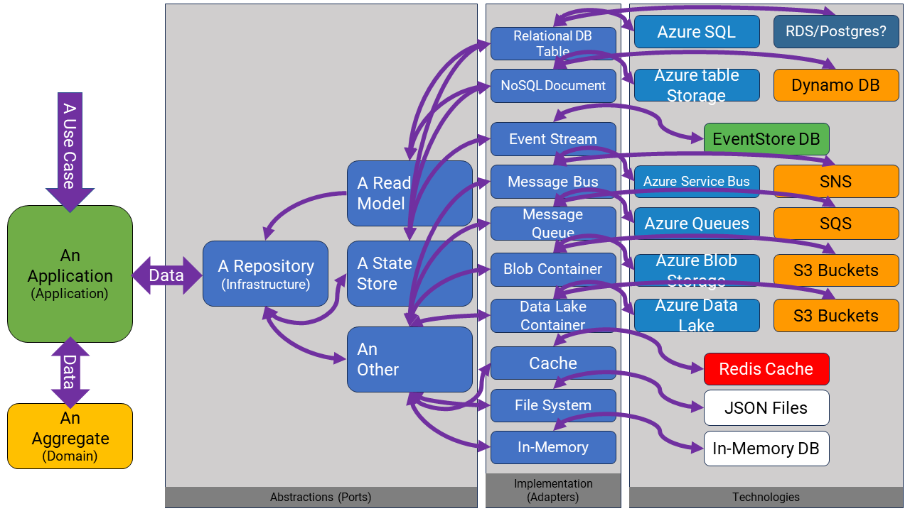
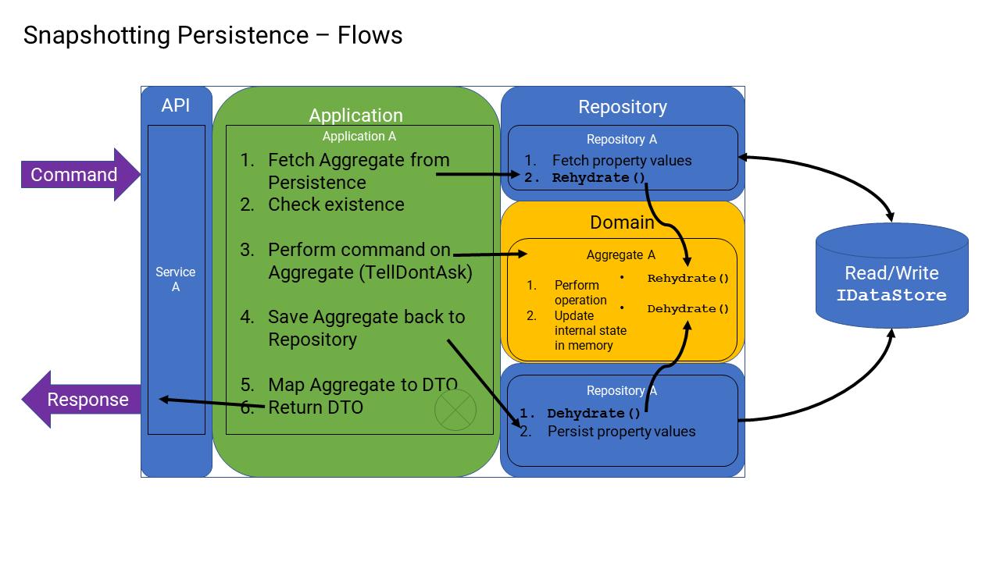
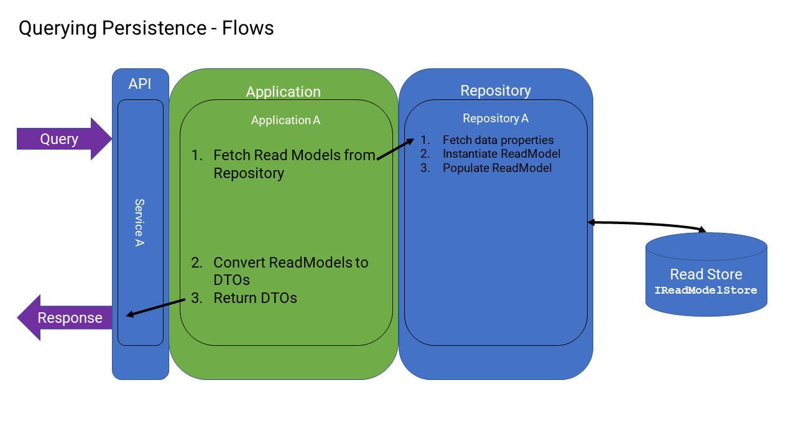
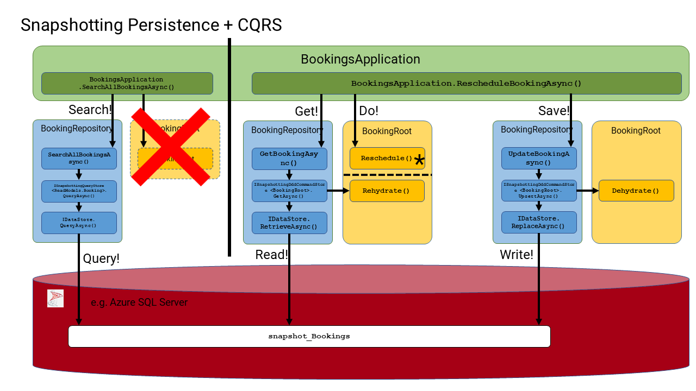
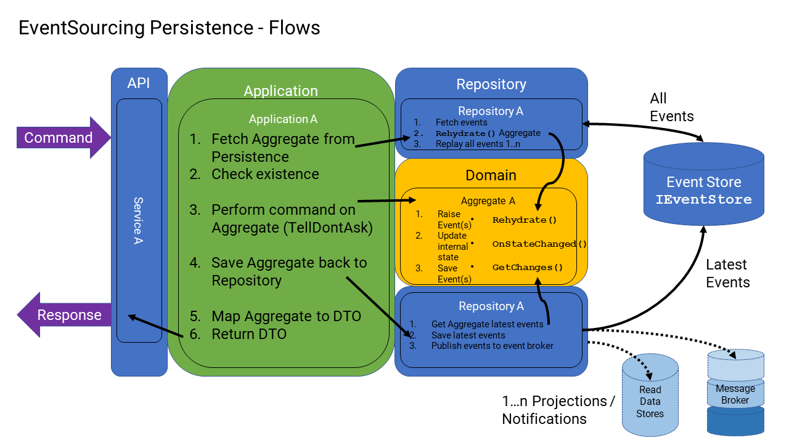
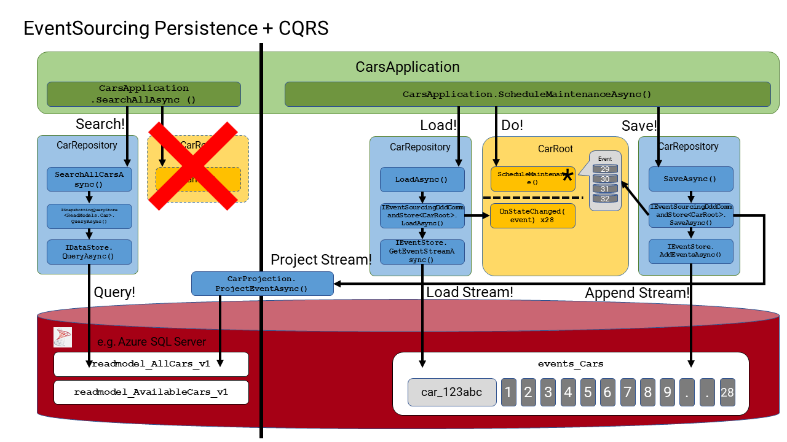

# Persistence



## Design Principles

* We want to move away from data modeling as a core design practice and thus stop designing changes in the software based on data from columns in a relational database table. Instead, we want to focus on modeling the behavior of the system in aggregates of subdomains from the perspective of an API, and have the data look after itself.
* We want to be able to run and debug independent components of the whole system (i.e., whole solutions) without having to start or run other parts of the system. Thus, any and all persistence mechanisms need to be replaced (stubbed) during local development.
* We don't want our local systems dependent on infrastructure components to be installed and configured correctly on our local machines (e.g., databases, caches, buses, queues, cloud components, etc.), in order to run, debug, and test the system. Nor do we want to have to consider environmental issues and configurations when reproducing most of the production issues we will experience in the future. (there will always be a certain class of problems related to the target production environment and its configuration, which we will never be able to reproduce locally on our local machines, but these issues will be few and far between)
* We want the flexibility to use different persistence technologies depending on the specific component in use in the software. For example, aggregate events are to be stored in an event store (e.g., EventStore or other), whereas read models are to be stored in databases (e.g., RMDBS's), and binary data stored in blob stores (e.g., blob storage accounts or data lakes, etc.).
* We want to take advantage of having a clear separation between the persistence of data for CQRS (i.e., commands and queries)
* We want to choose between persisting domain state either as events (i.e., event-sourced) or as records (i.e., snapshotting). In either case, domain events will be raised in either case and shared with other parts of the system (i.e., notifications).
* We want to be able to physically partition individual tenants' data, whether that is to a separate data center or to a separate account/tenant in the cloud. Equally, we want to be able to logically partition a group of tenants and their data in a single data center, or database. This should be configurable dynamically.
* We want the specific technologies that persist the data (in staging/production environments) to not be a concern of the developer at design time, and further, we don't want the developer leaking implementation details of the specific technology beyond the adapter that connects to the specific technology. In other words, the Application and Domain layers have no idea or care about where data comes from or in what specific form.
* We need to design a general set of capabilities for reading/writing data from any persistence technology, that can be supported by any technology. Clearly, this abstraction will not be optimized for any specific technology.
* Any relaying of domain events for updating of read models or of notifications (to other components), needs to be reliable, and in order. We must appropriately guard against any inconsistencies that could occur between the stages of (1) writing of updates to aggregates (either snapshotting or event sourcing) and (2) propagation of domain events. Such patterns as "outbox" must be appropriately deployed.
* We want any propagation of domain events for updating of read models or of notifications (to other components) to be asynchronous by default, since being asynchronous/synchronous has a dramatic effect on both "downstream consumers" and "upstream producers". "Upstream producers" (e.g. API clients) that trigger domain event creation via aggregate commands will need to adopt strategies for retrieval of updated data immediately after issuing state changing commands. As there will be non-deterministic latency (and eventual consistency) between the time of receiving a response from a command, and the time a an updated read model is actually updated. "Downstream consumers" will always be eventually consistent by default.
* We need to be able to rip & replace any implementations of repositories with optimized implementations at a time and place where that is required without having to disruptively change the contract to the rest of the system. In other words, when changing the specific adapter for a specific Application Layer, the Application and Domain layers are not affected (i.e., the ports do not change). Only the implementation of the repository adapter will change from using general storage abstractions to using specific technology abstractions.

## Implementation

Persistence is a big topic and one that is critical in any SaaS product, especially one that maintains any state of its own.

The idea here is to diminish its importance and to elevate the importance of use case design (domain design), so that we are focusing there instead of designing and managing persistence systems in mind.

> Today, as opposed to the 1990's-2000's, storage is now very cheap and very accessible in the cloud. It has become a commodity, and we no longer need to care about how large datasets are or how and where they are stored (for the most part) - thanks to the cloud and advancements in storage technologies. It is now expected that (inside a data center) you are pretty much guaranteed under ~10ms response times from any cloud storage provider (to and from your service client) in the same data center. Whereas, way back when that kind of performance was solely in our hands and how we designed the databases and the data in them. Today, there are simply more options, and they should be utilized in your designs.

If you look at the diagram above, no matter which cloud provider you host your software on (i.e., Azure, AWS or GC), you have a multitude of choices on your storage providers. Long gone are the days when you store everything in a single instance of a favorite RMDBS (like Microsoft SQL Server) simply because that is all you had available to you to use on this build.

Using well-known architectural patterns to manage testability and coupling (like ports and adapters and dependency injection) we can now retrieve and send data to any repository of any kind.

### Technology Abstractions

The missing link for most designs is having a suitable unified abstraction of ALL data sources (within a class of data source and within reason).

> The "within reason" part of this exposes an intentional trade-off that needs to be made. Do you design for maximum throughput and performance from day one?, or do you optimize for changing your mind and evolving your design over time to match your actual growth trajectory? This is a tradeoff that needs to be made before you lay down any patterns in your software because once you get ~6-12 months in your build on the first track, reverting back is daunting for most teams and most businesses, to the point it cannot be done.

What are these (suitable) abstractions in SaaStack?

We have defined the following ports for direct access to the following data source types:

* `IDataStore` - for read/write persistence of "record" type data. The most familiar kind, that you find in databases (RMDBS or NoSQL), caches, file systems, in-memory, etc
* `IEventStore` - for read/write persistence of "event" type data. An event store.
* `IBlobStore` - for read/write persistence of "streams" of binary data. Typically used to store image or file type data.
* `IQueueStore` - for (asynchronous, reliable) read/write persistence of "messages". A message queue.

These interfaces/abstractions are tailored to specific workloads and classes of technologies available out there, and they aim to cover a wide variety of technologies.

For example, the `IDataStore` port could be implemented by an adapter to an RMDBS like Microsoft SQL Server, or AWS RDS+Postgres, or implemented by NOSQL databases like Azure Table Storage, Azure Cosmos, or AWS DynamoDB, MongoDB, or others.

> In SaaStack, we have at least 2 adapters: a `LocalMachineFileStore` and to `InProcessInMemStore` that implement all the above ports in one adapter!

One interesting and key design challenge for `IDataStore` is how to query sets of "records" from the specific technology when they all support different capabilities.

For example, RMDBS's that use the SQL language support concepts like table JOINS and aggregate queries (like COUNT(), SUM(), GROUP(), etc.), whereas most NoSQL databases do not support those operations.

For this kind of design challenge, we've used an agnostic query language (using the [QueryAny](https://github.com/jezzsantos/queryany) library) that has necessarily had to limit the set of capabilities we can use \[generally\] across all technology implementations by constraining what can be queried and how, to maximize flexibility. This means that if some capabilities that are not supported are critically important to your product at some future point in time (you won't know that for some time to come), and you absolutely must have those specific capabilities in your codebase, then you can choose to easily by-pass these abstractions, and create a more optimal technology specific port and adapter instead. However, in the meantime, having these constraints offers a great deal of flexibility in the earlier stages of development.

### Domain Specific Abstractions

On top of the `IDataStore`, `IEventStore`, `IBlobStore,` and `IQueueStore` abstractions, we have implemented a set of classes (adapters) that provide more convenience to the application developer to build themselves domain-specific `IApplicationRepository` implementations, which they will use in their respective application layers.

These `*Store` abstractions are tailored to the common needs of the repository implementations used by the application layer.

The most common stores are:

* `SnapshottingDddCommandStore<TAggregateRootOrEntity>` - for reading/writing aggregate and entity records using the snapshotting scheme. (usually, aggregates have one or more entities that are each persisted in different containers).
* `EventSourcingDddCommandStore<TAggregateRoot>` - for reading/writing aggregate state, using event sourcing scheme to a single stream of events.
* `SnapshottingQueryStore<TQueryableEntity>` - for reading and querying aggregate/entity records stored using the snapshotting scheme. Also, for reading aggregate/entity read-model projections.
* `ReadModelProjectionStore<TReadModelEntity>` - for writing records stored in read models from projections that are triggered from domain events raised by aggregates.
* `BinaryBlobStore` - for reading/writing binary streams of data.
* `MessageQueueStore` - for writing (and then reading later) messages to a queue, bus or broker.

These implementations are then composed of domain-specific `IApplicationRepository` implementations for each subdomain to read/write data to and from the application layer.

For example, for any subdomain (like `Cars`), the application class is likely to retrieve and update the state of its root aggregate for its commands and perform any queries via a domain-specific repository.

The application would first define a repository port to a domain-specific repository, like this:

``` c#
public interface ICarRepository : IApplicationRepository
{
    Task<Result<CarRoot, Error>> LoadAsync(Identifier organizationId, Identifier id,
        CancellationToken cancellationToken);

    Task<Result<CarRoot, Error>> SaveAsync(CarRoot car, CancellationToken cancellationToken);
    
    Task<Result<IReadOnlyList<Unavailability>, Error>> SearchAllCarUnavailabilitiesAsync(Identifier organizationId, Identifier id, SearchOptions searchOptions, CancellationToken cancellationToken);
    
    ...other methods, very specific to the Cars application layer
}
```

Then, implement this repository by composing the various stores mentioned above:

```c#
public class CarRepository : ICarRepository
{
    private readonly ISnapshottingDddQueryStore<Car> _carQueries;
    private readonly IEventSourcingDddCommandStore<CarRoot> _cars;
    private readonly ISnapshottingQueryStore<Unavailability> _unavailabilitiesQueries;

    public CarRepository(IRecorder recorder, IDomainFactory domainFactory,
        IEventSourcingDddCommandStore<CarRoot> carsStore, IDataStore store)
    {
        _carQueries = new SnapshottingQueryStore<Car>(recorder, domainFactory, store);
        _cars = carsStore;
        _unavailabilitiesQueries = new SnapshottingQueryStore<Unavailability>(recorder, domainFactory, store);
    }

    public async Task<Result<CarRoot, Error>> LoadAsync(Identifier organizationId, Identifier id,
        CancellationToken cancellationToken)
    {
        var car = await _cars.LoadAsync(id, cancellationToken);
        if (car.IsFailure)
        {
            return car.Error;
        }

        return car.Value.OrganizationId != organizationId
            ? Error.EntityNotFound()
            : car;
    }

    public async Task<Result<CarRoot, Error>> SaveAsync(CarRoot car, bool reload, CancellationToken cancellationToken)
    {
        await _cars.SaveAsync(car, cancellationToken);

        return reload
            ? await LoadAsync(car.OrganizationId, car.Id, cancellationToken)
            : car;
    }

    public async Task<Result<CarRoot, Error>> SaveAsync(CarRoot car, CancellationToken cancellationToken)
    {
        return await SaveAsync(car, false, cancellationToken);
    }

    public async Task<Result<IReadOnlyList<Unavailability>, Error>> SearchAllCarUnavailabilitiesAsync(
        Identifier organizationId, Identifier id, SearchOptions searchOptions, CancellationToken cancellationToken)
    {
        var unavailabilities = await _unavailabilitiesQueries.QueryAsync(Query.From<Unavailability>()
            .Where<string>(u => u.OrganizationId, ConditionOperator.EqualTo, organizationId)
            .AndWhere<string>(u => u.CarId, ConditionOperator.EqualTo, id)
            .WithSearchOptions(searchOptions), cancellationToken: cancellationToken);
        if (unavailabilities.IsFailure)
        {
            return unavailabilities.Error;
        }

        return unavailabilities.Value.Results;
    }
    
    ...other methods, very specific to the Cars application layer
}
```

These store implementations make it very easy to access data through the lower-level technology adapters (i.e., `IDataStore` and `EventStore`, etc) that they use.

> Note: at no point in this code does the developer have to know what technology adapter is being used at runtime. There is no leaky abstraction from the actual technology adapter in this code, such as what query language is being used. The developer has no idea if the data is saved to an RMDBS like Microsoft SQL Server or as a KV pair to a Redis cache. That is all defined by dependency injection, making all of this code highly testable and decoupled.

### Persistence Patterns

As you may appreciate by now, specifically for aggregate state persistence (as opposed to blob or queues, etc.), there are two schemes for persisting the state of your root aggregates. Snapshotting and Event Sourcing.

> Note: it is important to remember that even though all aggregates generate and consume domain events in order to change their internal state, their internal state can be persisted in different ways. The domain events are there to communicate state changes with other domains.

Both persistence schemes can persist the state of an aggregate (and all its descendant entities and value objects), but each scheme uses different mechanisms to do it. The choice of this scheme affects the code you need to write in the aggregate and the code you need to write in your domain-specific `IApplicationRepository`. However, the code you write in the application layer can remain the same.

> This means that if/when you change your mind down the track and you switch from one scheme to the other, you only need to change the implementation of your domain-specific `IApplicationRepository,` and you need to add/remove the `Dehydration()` method and constructor to/from your aggregate classes.

The code flows from the Application's perspective are the same, but the implementation of the domain-specific `IApplicationRepository` and the aggregate are slightly different.

#### Snapshotting Persistence

In this scheme, you want to persist the state of your aggregate as "records" in some data store (i.e., rows in a database table). Because of the hierarchical nature of aggregates, you will be storing the state of your aggregate in one container and all of its descendant entities in other containers. This will be very familiar to developers who are used to working with ORM's and relational databases. Except there is no ORM.

In essence, the code flow looks like this:



The code flow looks like this:

1. An API in `ServiceA` is called, the request is unpacked, and the call is delegated to a "command" method in `IApplicationA`.
2. In a method of `IApplicationA`, it first "loads" the state of the aggregate by calling a method like: `IRepositoryA.LoadAsync(Identifier id, CancellationToken cancellationToken)`.
3. The repository uses an injected instance of the `ISnapshottingDddCommandStore<TAggregateRoot>` to delegate the call to `GetAsync(Identifier id, bool errorIfNotFound, bool includeDeleted, CancellationToken cancellationToken)`. The instance of `SnapshottingDddCommandStore<TAggregateRoot>` will use the injected `IDomainFactory` to call the `TAggregateRoot.Rehydrate()` method on the aggregate, which will, in turn, call a private rehydrating constructor on the aggregate to set its internal state in memory.
4. If the aggregate is composed of any descendant entities, then those entity instances will need to be loaded separately (using other instances of `ISnapshottingDddCommandStore<TEntity>`) and then assigned to the aggregate separately (using methods like `TAggregateRoot.Rehydrate(TEntity entity)`).
5. The "assembled" instance of the aggregate is then returned to `IApplicationA`
6. A method in `IApplicationA` now does some work on the aggregate by calling its public methods (never accessing descendant entities directly). These public methods on the aggregate always raise one or more `IDomainEvent,` which are then stored in the aggregate root and then used to update the internal state of the aggregate in the `OnStateChanged()` method of the aggregate. Aggregate invariants are then validated.
7. When the `IApplicationA` is finished working with the aggregate, then it will "save" the state of the aggregate by calling a method like `IRepositoryA.SaveAsync(TAggregateRoot root)`.
8. The repository uses the `ISnapshottingDddCommandStore<TAggregateRoot>` to delegate the call to `UpsertAsync(TAggregateRootOrEntity entity, bool includeDeleted, CancellationToken cancellationToken)`. The instance of `SnapshottingDddCommandStore<TAggregateRoot>` will use the injected `IDomainFactory` to call the `TAggregateRoot.Dehydrate()` method on the aggregate, which will get its internal state from memory.
9. If the aggregate is composed of any descendant entities, then those entity instances will need to be saved separately (using other instances of `ISnapshottingDddCommandStore<TEntity>`) by enumerating the instances of the entities on the aggregate and calling `UpsertAsync(TAggregateRootOrEntity entity, bool includeDeleted, CancellationToken cancellationToken)`. The instance of `SnapshottingDddCommandStore<TAggregateRoot>` again, will use the `IDomainFactory` to call the `TEntity.Dehydrate()` method on the entity, which will get its internal state from memory.

One or more "records" are then written to various containers in the injected instance of the `IDataStore` implementation.

Querying for data in this scheme, is as you might expect.



In this flow, no aggregate is accessed, the "records" are considered as "read models" instead.

> In general, most inbound query requests will not need to do any checks or run any rules that involve an aggregate. If, however, permissions to query data, or other rules need to be asserted, then an aggregate may be required to check permissions or check those rules.

The code flow for querying data looks like this:

1. An API in `ServiceA` is called, the request is unpacked, and the call is delegated to a "query" method in `IApplicationA`.
2. In a method of `IApplicationA`, it performs a "query" by calling a method like: `IRepositoryA.SearchAllAsync(SearchOptions searchOptions, CancellationToken cancellationToken)`.
3. The repository uses an injected instance of the `ISnapshottingQueryStore<TReadModelEntity>` to delegate the call to `QueryAsync(QueryClause<TQueryableEntity> query, bool includeDeleted, CancellationToken cancellationToken)`. The instance of `SnapshottingQueryStore<TReadModelEntity>` will perform the query and retrieve the data, and may use the injected `IDomainFactory` to call the `TValueObject.Rehydrate()` method on any value objects found in the read model.
4. If the read model is composed of any descendant entities, then those entity instances can be logically "joined" in this query.
5. The "assembled" instance of the read model is then returned to `IApplicationA`
6. The method in `IApplicationA` then returns the read model to the API.

One or more "records" are read (as "read models") from various containers in the injected instance of the `IDataStore` implementation.

This is an example overview of how both these persistence flows work for the `BookingsApplication`:



#### Event Sourcing Persistence

In this scheme, you want to persist the state of your aggregate as "events" in an event store. This is event sourcing. This will not be so familiar to most developers who are used to working with ORM's and relational databases. However, it is the most powerful scheme, and surprisingly, there is no specific write model to view, manage, or migrate when data schema changes!

In essence, the code flow looks like this:



The code flow looks like this:

1. An API in `ServiceA` is called, the request is unpacked, and the call is delegated to a "command" method in `IApplicationA`.
2. In a method of `IApplicationA`, it first "loads" the state of the aggregate by calling a method like `IRepositoryA.LoadAsync(Identifier id, CancellationToken cancellationToken)`.
3. The repository uses an injected instance of the `IEventSourcingDddCommandStore<TAggregateRoot>` to delegate the call to `LoadAsync(Identifier id, CancellationToken cancellationToken)`. The instance of `EventSourcingDddCommandStore<TAggregateRoot>` will use the injected `IDomainFactory` to call the `TAggregateRoot.Rehydrate()` method on the aggregate, which will, in turn, call a private eventing constructor on the aggregate. It will then "replay" all the events of the event stream that have been fetched from the event store onto the aggregate via the `TAggreagteRoot.OnStateChanged()` method. This method will incrementally update the internal state of the aggregate, one event at a time, to its final state.
4. If the aggregate is composed of any descendant entities, then those entity instances will be automatically created and updated by the aggregate, raising events to its descendant entities.
5. The "assembled" instance of the aggregate is then returned to `IApplicationA`
6. A method in `IApplicationA` now does some work on the aggregate by calling its public methods (never accessing descendant entities directly). These public methods on the aggregate always raise one or more `IDomainEvent`, which are then stored in the aggregate root and then used to update the internal state of the aggregate in the `OnStateChanged()` method of the aggregate. Aggregate invariants are then validated.
7. When the `IApplicationA` is finished working with the aggregate, then it will "save" the state of the aggregate by calling a method like: `IRepositoryA.SaveAsync(TAggregateRoot root)`.
8. The repository uses the `IEventSourcingDddCommandStore<TAggregateRoot>` to delegate the call to `SaveAsync(TAggregateRootOrEntity aggregate, CancellationToken cancellationToken)`. The instance of `EventSourcingDddCommandStore<TAggregateRoot>` will then persist only the most recently raised events (stored in the aggregate) to the event stream.
9. One or more "events" are then written to the injected instance of the `IEventStore` implementation.
10. These new "events" are then projected into any registered read model projections, and to any registered notification subscribers.

Querying for data in this scheme is as you might expect.


In this flow, no aggregate is accessed, the "records" are considered as "read models" instead.

> In general, most inbound query requests will not need to do any checks or run any rules that involve an aggregate. If, however, permissions to query data, or other rules need to be asserted, then an aggregate may be required to check permissions or check those rules.

The code flow for querying data looks like this:

1. An API in `ServiceA` is called, the request is unpacked, and the call is delegated to a "query" method in `IApplicationA`.
2. In a method of `IApplicationA`, it performs a "query" by calling a method like: `IRepositoryA.SearchAllAsync(SearchOptions searchOptions, CancellationToken cancellationToken)`.
3. The repository uses an injected instance of the `ISnapshottingQueryStore<TReadModelEntity>` to delegate the call to `QueryAsync(QueryClause<TQueryableEntity> query, bool includeDeleted, CancellationToken cancellationToken)`. The instance of `SnapshottingQueryStore<TReadModelEntity>` will perform the query and retrieve the data, and may use the injected `IDomainFactory` to call the `TValueObject.Rehydrate()` method on any value objects found in the read model.
4. If the read model is composed of any descendant entities, then those entity instances can be logically "joined" in this query.
5. The "assembled" instance of the read model is then returned to `IApplicationA`
6. The method in `IApplicationA` then returns the read model to the API.

One or more "records" are read (as "read models") from various containers in the injected instance of the `IDataStore` implementation.

This is an example overview of how both these persistence flows work for the `BookingsApplication`:



### Projections and Notifications

Regardless of the chosen persistence scheme, when the state of any aggregate is saved, it will yield some change events (most recently raised domain events, since the last rehydration) that can and will be relayed to other components in the system to drive Read Model Projections (Event Sourcing) and Notifications (Event Driven Architecture).

See [Eventing](0170-eventing.md) for more details
