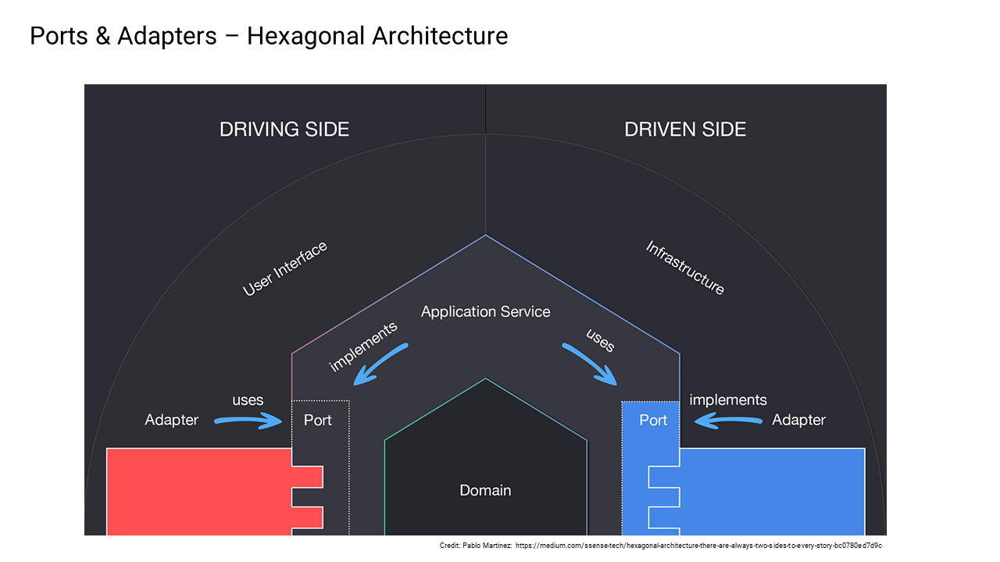

# Ports and Adapters

The underlying architectural style in this codebase is the Ports and Adapters. This means that the application is designed to drive and be driven by the domain model, and the domain model is not dependent on any external infrastructure.



In this way, we can re-focus on the core domain model and be protected by changes in infrastructure.

Possibly the most powerful effect of this approach is that any data, any service, and interaction that is needed by the core domain is accessible by a domain specific "port" and can be implemented by one or more "adapters" connecting to other components or external systems. For the developer, this liberates them to tackle a complex interaction in testable steps.

This is achieved by using the [Adapter Pattern](https://en.wikipedia.org/wiki/Adapter_pattern) to connect the domain model to the external infrastructure.

In general, this de-coupling pattern can also be applied in any layer of the code, but it is particularly useful in the "Application Layer" and in the "Infrastructure Layers". The pattern can also be used in composing infrastructure components together to offer several abstraction layers, between the logical and physical layers.

> In other words, you don't need to go from a single "port" to a single "adapter" representing physical infrastructure (like a database). Your "port" can be implemented by an "adapter" that exposes a lower level "port" that can be implemented by a lower level "adapter".

A "port" defines the data and behavior required by the consumer of it. Thus, the consumer is always protected from changes in any implementation of the "port".
> This pattern is also known as the "[Plug-in Pattern](https://en.wikipedia.org/wiki/Plug-in_(computing))", which is common in reusable libraries or frameworks that offer extensibility points for those using them.

A "port," in code is simply defined in an interface.
> It is designed to be as small as possible, and as specific as possible, adhering to the [ISP principle](https://en.wikipedia.org/wiki/SOLID).

A "service" that implements the "port", is known as an "adapter"

An "adapter" is realized as a concrete class, that simply implements the "port" interface.
> An adapter, in code, rarely ever uses the term "adapter" as part of its name or identifier. Rather, it is usually named after the behavior it provides, the 3rd party library it wraps, or the 3rd party service it integrates with.

Whenever a port is required to be used by a component, it declares the port in its constructor, and dependency injection is used to inject a real adapter into the component at runtime (depending on what is currently registered in the container at that time).

An "adapter" class typically implements a specific kind of behavior that is self-describing in the class, or it will wrap a third-party library to implement this behavior, or it will wrap a 3rd party SDK that relays the information to a remote 3rd party system. In general, these "adapters" facilitate access to infrastructure components, such as databases, message queues, or machine infrastructure like clocks, disks, encryption, configuration, etc., or access to remote 3rd party services. Any I/O of any kind. Sometimes, they provide access to other subdomains and deployed modules in the same codebase. Essentially they help the developer separate multiple concerns into services that can be independently tested and developed.

This concrete "adapter" is then registered in the dependency injection container at runtime, for injection to where ever the port is required.
> In this way, the consumer of the port is completely de-coupled from the implementation of the port, and the implementation of the port is completely de-coupled from the consumer of the port.

What this also enables is that the code for the port and code for the adapter(s) can be kept in different libraries, further reducing the coupling of code in reusable libraries in the code. This leads to far better maintainability and portability of shared libraries in the code. Which is a key enabler for modular monoliths, when they have to be split up.

## Design Principles

* We want to maintain high levels of de-coupling for performing any actions outside subdomain aggregates in the "Domain Layer". This means that access to any data outside a subdomain requires the use of a "port" to obtain it, which provides data that can be presented to the aggregate in the subdomain. This is the primary job of the "Application Layer".
* We want to be able to swap out the implementation of any "adapter" (something that provides/processes its own data) without changing the domain model or requiring a change in it.
* We want to be able to unit test the domain model in isolation without requiring any external infrastructure. (A domain model should only require data and, in some rare cases, require  "domain services" which can be mocked in order to be tested).
* We want to be able to test the real infrastructural "adapters" in isolation also, without needing to use the domain model.
* If the real infrastructure "adapters" require external 3rd party services to run properly, then we want to be able to test them in isolation as well. (using testing-only configurations)
* Given that we can reliably unit test the domain model independently, and we can reliably unit test the infrastructure components independently and given that we can integration test the domain model with "stubbed" infrastructure "adapters" (that can "fake" the behavior of real infrastructure "adapter"), then we can then be very confident that the system will work as expected when it is deployed with real infrastructure "adapters" in staging/production environments. In fact, if this is the case, then the only unknown should be whether the staging/production configuration used by the real infrastructure "adapter" is valid or not in the staging/production environments. If it is valid, then the system should work in staging/production as designed.
* When we run the code locally in the local environment (for manual testing or demos, etc.) we want to avoid having to install any infrastructural components that cannot be swapped out for adapters that run in memory or on disk on the local machine. For example, we don't want to install databases, or data servers of any kind.
* When we run the code in automated testing we also do not have to install any infrastructural components, especially if they require network communication. Local automated testing and automated testing in CI should be offline, and trivial to configure.

## Implementation

### Application Services

Many of the ports and adapters in the codebase are to be found in the "services" used by the classes in the "Application Layer" (not exclusively).

> They are often known more commonly as "services" borrowed from other, more traditional architectures.
>
> There are examples of the same mechanism of ports and adapters all over the "Infrastructure Layer" too.
>
> Ports and adapters (as a pattern) are implemented at "Domain Services" in the "Domain Layer"

The main class in the "Application Layer" of any subdomain (e.g., `CarsApplication`) defines new "ports" (e.g., `ICarRepository`) to either access data from other components or to delegate certain operations to other components. Ports are also the prescribed way to communicate with other subdomains.

Typically, the main "Application Layer" class consumes (or "drives") these "ports".

> This is an important mechanism to separate concerns of the classes in the application layer, whose primary purpose is to obtain data for the aggregate of the "Domain Layer" to operate.

Conversely, the classes in the "Application Layer" of a given module (e.g., `CarsApplication`) are, in fact, "adapters" themselves. They implement the declared "port" (e.g., `ICarsApplication`) that is "driven" by the upstream API class that consumes this "port".

#### Unit Testing

Ports are never unit tested, as they are interfaces.

Most "adapters" are unit tested. Or if not, they are covered in integration tests. Sometimes both are necessarily used.

There are some notable exceptions to that unit testing rule:

* API "service" classes (define the API) - they implement the two-way adapter to the internet. They are typically not unit tested because they simply delegate calls to the underlying domain-specific "Application Layer". Unit tests here would not achieve much that API integration tests wouldn't verify. In some rare cases, where there is less-trivial processing or mapping of data, there may be unit tests to cover that logic.
* Data "Repositories" (used by the "Application Layer") - they implement a two-way adapter to some kind of data store. They are typically not unit tested because they simply delegate calls to underlying generic "ports". Unit testing here would not achieve much that integration tests wouldn't verify.
* Inter-module "Service Clients" (used by the "Application Layer") - like repositories above, they implement two-way adapters to another subdomain. They are typically not unit tested because they simply delegate calls to underlying generic "ports" (e.g., an application interface like `ICarsApplication` or an HTTP service client). Unit testing here would not achieve much that integration tests wouldn't verify.

> Repositories are only referred to as "repositories" for historical reason; in general,l they are just a specialization of a "service".

### 3rd Party Services

Adapters to 3rd party remote systems (a.k.a. "3rd party integrations") are a special kind of "adapter" requiring additional and special treatment in the codebase, so that they are properly tested and configured correctly for use in local environments, as well as in staging/production environments.

The main difference between them is that they:

1. Typically, require the creation of accounts in the 3rd party online system (e.g., register an account with a 3rd party service and obtain an API key, a client ID, a client secret, etc.). In these cases, they require separate accounts for testing-only and separate accounts for staging/production use. Testing-only accounts can never lead observers to compromising staging/production accounts. Some 3rd party providers mitigate this with sandbox environments, but not all provide that service.
2. They often offer the use of a 3rd party SDK, a 3rd party library, or a 3rd party service to communicate with the 3rd party system. These can be very useful sometimes, depending on their sophistication (particularly with caching, retry policies, etc.), but they must be configurable to point to local "stubbed" versions of them in order to be used in local development environments.
3. They require connection configuration (and often secrets) to access the 3rd party system, which often differs between local, staging, and production environments. Details for staging/production environments can never be hard-coded into the codebase, and must be configurable at deployment time.
4. They require us to build one or more "stub" implementations of the 3rd party system so that they can be used in local development and in automated testing without requiring access to the real 3rd party system.

In practice, to build one of these 3rd party adapters, you need to take extra time and care to provide (at least) these six things:

1. An "adapter" to the real 3rd party system.
2. A number of accounts with the 3rd party
3. Integration tests that test the adapter against the real 3rd party system, using real configuration.
4. Register the adapter in the dependency injection container.
5. A stub adapter that can be used in local/CI automated testing.
6. A stub API that can be used in local development.

#### Adapter

Most external adapters for 3rd party integrations, that you build, should be built and maintained in the `Infrastructure.Shared` project in a folder called: `ApplicationServices/External`.
> This single project would be the only project that would take a dependency on any 3rd party NuGet packages required by these adapters, which should be kept to a minimum.

Your adapter will likely act as an HTTPS "Service Client" to a remote 3rd party service (in the cloud or deployed in your cloud, a.k.a. on-premise). Thus, the name of your adapter is likely to follow the naming pattern: `VendorHttpServiceClient`.

Your adapter can use the vendor-provided SDK library (from NuGet), but consider these challenges:

1. If the adapter has significant complexity to it, and/or your adapter has behavior that you feel should be unit tested, then using the SDK library will make it very hard to unit test the adapter since you cannot be accessing a remote system during unit testing.
2. If this adapter is going to be used in local development (i.e., it is injected into the DI container in local development), then the SDK will be required to be configured to direct all its HTTP traffic to a stub API that you must provide (refer to step 6 above).

If you want to unit test your adapter (not always necessary), then an easy technique to use is to wrap the SDK code inside another port (e.g. , `IVendorServiceClient`) and then implement that adapter using the vendor-provided SDK, with an internal constructor used only for testing. This will allow you to unit test your original adapter, by injecting a `new Mock<IVendorServiceClient>()`.

For example,

```c#
public class VendorHttpServiceClient : IMyPort
{
    private readonly IVendorServiceClient _serviceClient;

    // used to inject into DI container
    public MyAdapter(IRecorder recorder): this(recorder, new VendorServiceClient()
    {
    }
    
    // used only for unit testing
    internal MyAdapter(IRecorder recorder, IVendorServiceClient serviceClient)
    {
        _serviceClient = serviceClient;
    }

    // remaining methods of the IMyPort interface
}
```

If you are plugging in your adapter for local development and automated testing, then you will be providing a stub API (as per step 6 above). In this case, the vendor SDK will need to be able to send its HTTP requests to another URL other than the one in the cloud where their service is hosted (e.g., `https://api.vendor.com`). The SDK must support a way for you to change that `BaseUrl`.

If not, you have very few good choices other than to:

1. Inject a different implementation of the `IVendorServiceClient` above.
2. Forgo using the vendor SDK altogether, and instead use the `ApiServiceClient` and send the HTTP requests yourself to the remote vendor API. This is more work, but it is the only way to ensure that the adapter can be used in local development and automated testing properly.

#### Accounts with 3rd party

In general, most 3rd party vendor-provided services will require you to register and create accounts with them to gain access to their public APIs.
> Note: some of the services require being paid for, which is another hurdle.

For most of these integrations, you are going to need to create at least two accounts with the 3rd party:

1. One account called "testingonly" that will be used for local development and automated testing.
2. One/more account(s) for "staging/production" that is used for staging and production environments.

> Some vendors provide sandboxes for testing, which can be used in place of the "testingonly" account. This is a great feature, but not all vendors provide this.

Regardless, the credentials, access, and configurations between these accounts must be managed separately.

You must never expose staging/production credentials or configuration outside your organization. This is a serious security risk.

You can, however, expose testing-only credentials and configuration inside your organization, but only if they cannot lead to those used in staging/production environments. Separate secured and protected accounts are strongly recommended.

> In this SaaStack codebase template, the contributors have registered testing-only accounts with various vendors, and we have hard-coded some of those credentials in the various `appsettings.Testing.json` files of the various adapter integration testing projects, in the codebase. This is a security risk, but it is acceptable for the purposes of this template since this cannot lead to any staging/production environments. These accounts can be compromised with little exposure. In a real derivative project, you are using, if this code was exposed outside your organization (for example, in open source), you should not do this. If the codebase is not exposed outside your own organization, there is also some risk in exposing these to those with access to your code. You might consider using secrets files, environment variables, a secret manager, a key vault, or a configuration service to manage this sensitive configuration.

#### Integration Testing

Integration tests are REQUIRED to test the real adapter against the real 3rd party vendor systems, using real configuration, to ensure that the adapter works as designed.

These integration tests are different from others, in many ways:

1. They are of a different category called "Integration.External"
2. They should not be executed frequently by the team, like other integration tests are, since they are testing against real 3rd party systems, can be slow, can be rate limited, and can incur costs to your organization (depending on the 3rd party system, and pricing).
3. They should be executed infrequently in CI builds, perhaps once a week/month or whenever the code in the adapters is changed.
4. They can fail from time to time, depending on how well-managed the 3rd party vendor is at maintaining their systems. When these tests do break, it's a pretty clear indicator that the 3rd party service has changed from what it used to be, and your team needs to know ASAP. Or perhaps your adapters are now broken and need to be fixed.

#### Configuration

The adapter must be configurable at runtime, so that it can be used in local development, automated testing, and in staging/production environments.

This configuration is likely to be kept in `appsettings.json` files in each of the host projects that use the adapter (e.g., `ApiHost1.csproj`).

Configuration for each of these adapters is done under the `ApplicationServices` section of the `appsettings.json` file, usually under a key named after the vendor.

For example,

   ```json
   {
   "ApplicationServices": {
     "Vendor": {
       "BaseUrl": "https://api.vendor.com",
       "ClientId": "client-id",
       "ClientSecret": "client-secret"
       }
     }
   }
   ```

Now, from a security perspective and a testing perspective, you do not want to define any real configuration settings here since that would expose them to anyone who can see the code.

In automated "External" Integration testing (as described above), the configuration used there to talk to a real online service, is kept in `appsettings.Testing.json` (and in `appsettings.testing.local.json`) in the testing project.

In automated "API" Integration testing, your adapter is going to be swapped out for a "stubbed" adapter that is injected at testing time, using overrides in the integration testing project so that your adapter is not used at all.

Configuration in the host project is there for running the adapter in local development and in staging/production environments.

For staging/production environments, your automated deployment process should be substituting/replacing the configuration in `appsettings.json` just before deployment time with the correct configuration to real 3rd party systems.

But for local development (manual debugging and testing), you need settings here that can be used in your adapter, to talk to a stub API (see below). This means that you want predominantly empty placeholder or testing entries in `appsettings.json` that have no sensitive values.

> Remember: to update all staging/production configurations to your CI/CD systems so that you don't forget those settings on the next deployment of code.

#### Register in Dependency Injection Container

The adapter must be registered in the dependency injection container, so that it can be injected into consumer classes that need it at runtime. That can be done in one of two places:

1. In the `HostExtensions.cs` file of the `Infrastructure.Web.Hosting.Common` project, in the `ConfigureApiHost` method.
2. In the respective `ISubDomainModule` class of the subdomain that uses the adapter, in the `ISubDomainModule.RegisterServices` method.

Furthermore, you can use compiler compilation directives to register this adapter in different build configurations or different hosting environments.

For example, if you want it only to be used in local development and automated testing, or never in either of those, you can use the `#if TESTINGONLY` directive.

For example, if you want it only to be used in an AZURE deployment, not an AWS deployment, or never in either of those, you can use the `#if HOSTEDONAZURE || HOSTEDONAWS` directives.

#### Stub Adapter

In automated "API" Integration testing, we do NOT want to be using the real adapter at all. Instead, we want to use a programmable "stub," so we can control its behavior, and we don't want to use online access to real systems across the network.

Depending on which subdomain the adapter is used in, you will need to provide a stub adapter that can be used in automated "API" Integration testing, rather than using the real adapter at all.

This "stub" adapter replaces your adapter, and provides a fake implementation of the real adapter. Often providing limited data or default behavior, enough to test the API under test.

You have two choices depending on the scope of your adapter.

1. If your adapter is used by all subdomains and all hosts (i.e., it is used everywhere), then you can create a "stub" adapter in the `IntegrationTesting.Web.Api.Common` project in the `Stubs` folder, and you can inject it into the `WebApiSetup<THost>` in the `ConfigureWebHost` method along with the other global adapters.
2. If your adapter is only used in one (or more) specific subdomains, then you can create the "stub" adapter in the integration testing project of that subdomain (i.e., the `SubdomainInfrastructure.IntegrationTests` project), in a folder called `Stubs`, and you can inject that sub into the `OverrideDependencies` method of your test class.

For example, if you take a look at the `StubFeatureFlags` in the `IntegrationTesting.Web.Api.Common` project, you can see how it is injected into the `WebApiSetup<THost>` in the `ConfigureWebHost` method.

For example, if you look at the `StubEmailDeliveryService` in the `AncillaryInfrastructure.IntegrationTests` project, you can see how it is injected into the `OverrideDependencies` method of the `EmailsApiSpec` class.

#### Stub API

In local development, we DO want to be using the real adapter, but we want to have a programmable 3rd party "stub" API so that we can control its behavior, and we don't want to use online access to real systems across the network.

This "stub" API stands in for the real 3rd party API, and the real adapter communicates with this "stub" API.

> This additional step is only necessary for adapters that access 3rd party online systems. If your adapter does not access a 3rd party online system, then you do not need to provide a stub API.

To make this work, we need the configuration defined in the `appsettings.json` file of the Host project to point to the "stub" API instead of pointing to the real 3rd party system. This API will always be hosted by the `TestingStubApiHost` project at `https://localhost:5656`.

For example, the `BaseUrl` configuration setting in the `appsettings.json` file of the Host project for your adapter could be set to `https://localhost:5656/vendor`.

```json
{
  "ApplicationServices": {
    "Vendor": {
      "BaseUrl": "https://localhost:5656/vendor/"
    }
  }
}
```

In the `TestingStubApiHost` project, in the `Api` folder:

1. Create a class that derives from `StubApiBase` (e.g., `StubVendorApi`).
2. Consider applying a `BaseApiFromAttribute` to define a prefix for this API (e.g. `[BaseApiFrom("/vendor")]`) to separate this API from the other vendors that will also be hosted at `https://localhost:5656`.
3. Implement the HTTP endpoints that your adapter uses, and provide empty or default responses that your adapter expects to receive. (same as the way we implement any endpoints)
4. The Request types, Response types (and all complex data types that are used in the request and response) should all be defined in the `Infrastructure.Web.Api.Operations.Shared` project in a subfolder of the `3rdParties` folder named after the vendor (i.e., `3rdParties/Vendor`). These types follow the same patterns as requests and responses for all other API operations in the codebase. Except these may use additional JSON attributes to match the real 3rd party APIs. (e.g., `JsonPropertyName` and `JsonConverter` attributes).
5. Make sure that you trace out (using the `IRecorder`) each and every request to your Stub API (follow other examples) so that you can visually track when the API is called (by your adapter) in local testing. You can see this output in the console output for the `TestingStubApiHost` project.

For example,

```csharp
[BaseApiFrom("/vendor")]
public class StubVendorApi : StubApiBase
{
    public StubVendorApi(IRecorder recorder, IConfigurationSettings settings) : base(recorder, settings)
    {
    }

    public async Task<ApiGetResult<string, VendorGetDataResponse>> GetData(
        VendorGetDataRequest request, CancellationToken cancellationToken)
    {
        await Task.CompletedTask;
        Recorder.TraceInformation(null, "StubVendor: GetData");
        return () =>
            new Result<VendorGetDataResponse, Error>(new VendorGetDataResponse("data"));
    }
}
```