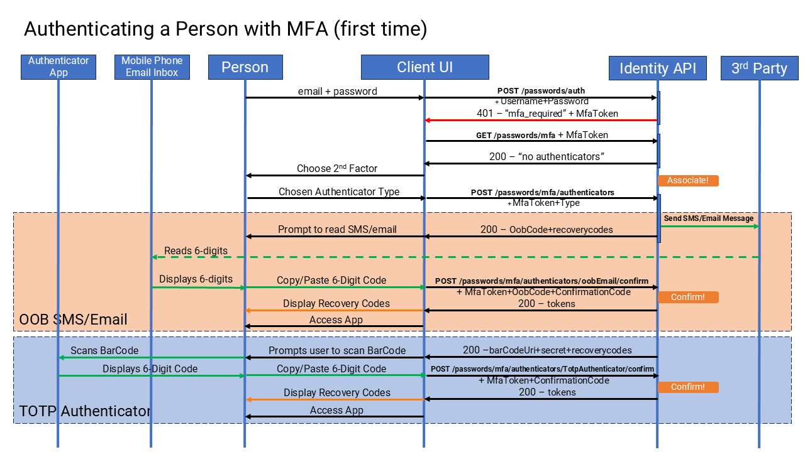
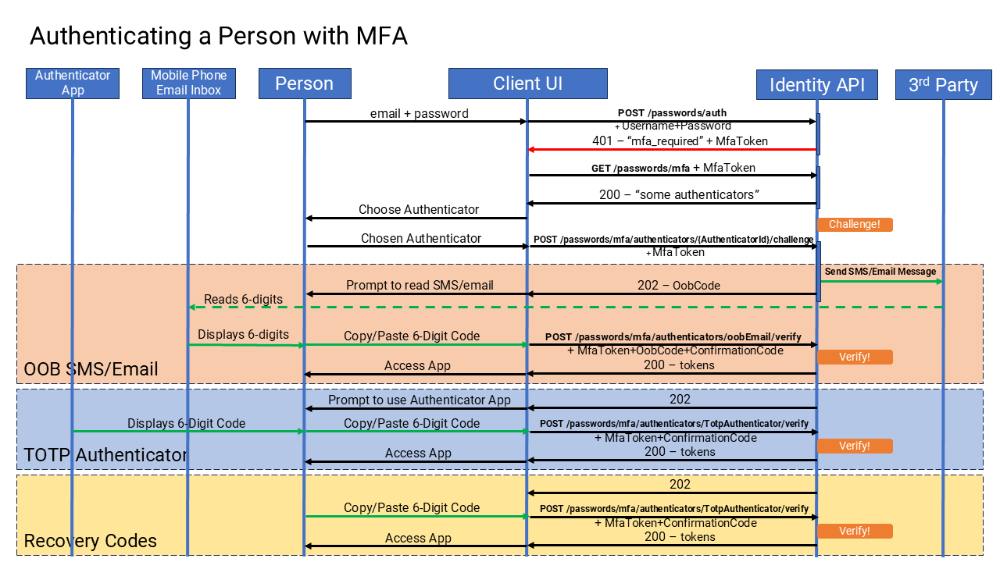
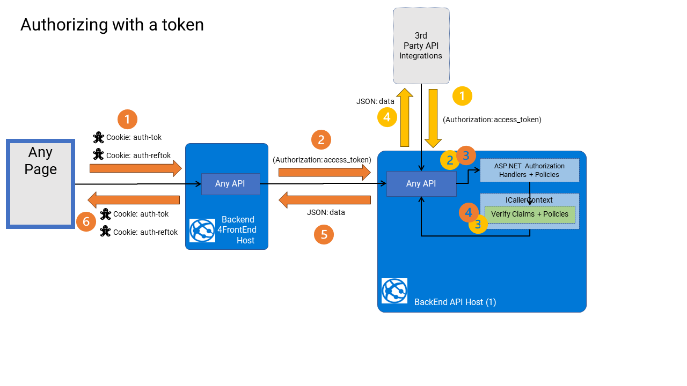

# Authentication & Authorization

## Design Principles

1. We want a simple authentication and authorization mental model that developers are already familiar with.
2. For authentication, we want to create and maintain our own JWT tokens (transparent or opaque), irrespective of how the user is actually authenticated, be that through Credentials, HMAC, or even SSO with 3rd parties (e.g., Google, Microsoft etc.). At the end of the day, our token is the authority in the entire system.
3. We want to store only the bare necessary claims in a JWT token, that have short lifetimes (with longer-lived refresh tokens), to minimize these tokens get out of sync when roles/permissions change for any particular end user of the system.
4. We want Authorization to be discoverable and well-defined (not too many options), but also extensible (add your own options)
5. We want to layer several authorization schemes overlaid on each other. e.g. Role-based (RBAC), Feature-based and feature flags.
6. We want it to be declarative and seamlessly integrated (and tooled) along with the other patterns we are introducing, particularly in the API declarations.
7. Since roles and permissions can quickly get out of hand in many systems, we will want to avoid defining fine-grained permissions that could end up bloating tokens. Initially, we won't be managing tokens centrally, but that can change in the long run.
8. We are offering credential-based authentication (username + password) as a starting point, and encourage the adoption of 3rd party integrations later as the product finds success (e.g. Auth0, Okta, IdentityServer, etc.).

## Implementation

We are using and configuring standard Microsoft AP.NET authentication and authorization mechanisms to implement both authentication and authorization, and to keep close to that familiar model for most ASPNET developers.

For Authentication schemes, we are initially supporting Password Credentials, HMAC, and API Key. Others can be added as needed. (i.e. to support various webhook callbacks from 3rd party systems).

For Authorization, we are utilizing the minimal API "authorization policies" mechanism, and also defining dynamic policies based on static declarative configuration of APIs.

In web clients, we will use (HTTPOnly) cookies to store JWT tokens (between the browser and the BEFFE), and will relay those JWTs to backend APIs via a reverse proxy.

We will prevent those JWT tokens ever being seen by any JavaScript running in a browser, and go to extra lengths to guard against CSRF attacks.


### Password Credential Authentication

Out of the box, we will offer Password-Credential authentication via the `IPersonCredentialsApplication`

This will enable quick adoption of the SaaS product, and a foundation to extend out into SSO and 3rd party identity solutions later.

We are providing support for password authentication in a standalone "Identities" subdomain to provide all the services around password management. This whole subdomain/module can then either be extended later, or deleted, and replaced with integration to 3rd parties.

Today it manages these aspects of identity: Authentication via Password, Email Registration Confirmation. Password Reset, 2FA, API key management, etc.

#### Passwords

Passwords must be 8-200 characters long, and contain at lest 1 number, 1 lowercase letter, 1 uppercase letter, and 1 special character.

They are stored (at rest) as salted password hashes, using [B-Crypt encryption](https://github.com/BcryptNet/bcrypt.net), (salts are generated with 4,096 iterations).

When passwords are verified in a login attempt, the authentication process introduces a random time delay to counter timing attacks.

#### Confirmations

Since password credentials include email addresses, these emails addresses, and passwords require resetting, it is important to confirm that the email address is accessible by a human end-user to manage future communications.

### Multi-Factor Authentication

MFA or 2FA (Two-Factor Auth) is only applicable to credential based authentication systems (e.g., those that manage usernames and passwords).

> It does not apply to SSO, HMAC or APIKey authentication mechanisms.

The main idea behind 2FA is to introduce a second "factor" to identify a specific person, since a human having only "Something You Know" like a password (or pin-number), is easily compromised (i.e., with social engineering attacks, or poor password management behaviors).

Having a second "factor" introduces some certainty of one of the following: "Something You Have", "Something You Are", "Somewhere You Are", or "Something You Do".

> See this [OWASP cheatsheet](https://cheatsheetseries.owasp.org/cheatsheets/Multifactor_Authentication_Cheat_Sheet.html) for more information.

There is now good support for 2FA, using the following built-in second factors:

* TOTP Authenticator App - You typically scan a bar code form a website, and use an authenticator app on your mobile device that generates a one-time, time-based secret code (lasting only 30 seconds) and you copy and paste it into the website.
* OOB SMS messages - Your mobile phone is sent an SMS text message containing a 6-digit code that you enter into the website.
* OOB Email messages - You are sent an email message containing a 6-digit code that you enter into the website.

> These second factors are backed up by 16 recovery codes, should the user lose access to their mobile device, access to their authenticator app or access to their email inbox.

#### How it works

MFA can be enforced, by default, for all new users of the product, or it can be allowed/disallowed to be turned on/off by individual users.

> See the `MfaOptions` in the  `PersonCredentialRoot` for these default settings.

When MFA is enabled, users will fail to complete authenticate with just their username + password. instead, they will receive a `HTTP 403 - Forbidden` error containing the message `mfa_required`.

This response means that the authentication has partially succeeded, but a second factor is required to complete the authentication. The error response will contain a value for an: `MfaToken` that will need to be used to authenticate the user with their chosen second factor, in subsequent API calls.

Whether the user has already set up a second factor or not, they will receive this error, and it at this point that they can either set up a second factor, or be challenged by the second factor they already set up in a previous authentication attempt.

The response will look like this:

```    
POST /credentials/auth

HTTP 403
{
  "type": "https://tools.ietf.org/html/rfc9110#section-15.5.4",
  "title": "mfa_required",
  "status": 403,
  "detail": "Authentication requires another factor\"",
  "MfaToken": "oZJUUJxElejxHESgiGryfP7YlqUmdMSH3jyKr6804R0"
}
```

At this point, the client (i.e., web app) will need to request for the available second factors to challenge.

It will issue this request, and receive a list of "authenticators" to challenge:

``` 
GET /credentials/mfa/authenticators

HTTP 200 
{
    "authenticators": [
        {
          "isActive": true,
          "type": "recoveryCodes",
          "id": "mfaauth_NWa2wP0iXUi3bcbOcfJog"
        },
        {
          "isActive": true,
          "type": "totpAuthenticator",
          "id": "mfaauth_bkmOn7kPX0ifxWoMxZrSiA"
        },
        {
          "isActive": false,
          "type": "oobSms",
          "id": "mfaauth_3J8f0guUGj9bmNXKzDg"
        },
        {
          "isActive": true,
          "type": "oobEmail",
          "id": "mfaauth_wgg5K3E4H0i82MBKfI1kMQ"
        }
      ]
}
```

If this list of authenticators above is empty, then a second factor needs to be "associated" now.

If this list of authenticators contains any authenticators that are `IsActive == true` (other than `type == recoveryCodes`) then the client needs to give the user the choice to challenge one of those authenticators.

It works likes this:

1. The first time the user is authenticated, after enabling MFA, the user will have 10 minutes to complete the association of a second factor. If this time elapses, the user will be required to authenticate from the start again (where they need to give their username + password again). An `HTTP 401 - Unauthorized`  be received during the association process.
   1. The user can only complete the association of one "authenticator" (i.e., one OTP, OOB authenticator) at this time. By completing the association of the first authenticator, they will be authenticated at that moment. If the user wishes to add more "authenticators", they can do so, once they are authenticated. Typically, in their "account settings" user interface.
   2. To complete the association of an authenticator it is always a two-step process. The client must first request to "associate" the authenticator, and this will give the user instructions to complete to set up the second factor, and then after that the client must "confirm" the association, with the input from the user (sent over whatever channel, e.g., mobile phone, email or authenticator app).
   3. When associating the first "authenticator" the client will receive a set of 16 recovery codes in the first step. The client MUST display those recovery codes to the user, and the user SHOULD be strongly advised to make a permanent note of them for later, should they need them to authenticate if they lose access to their second factor.
   4. During the first "associate" step, the client can allow the user to modify their association (e.g., correct an incorrect phone number).
   5. Once the "confirm" step is complete, the second factor cannot be modified. The user will be authenticated at this point in time, and can go into their "account settings" user interface to either delete the second factor association or add others.
2. If this is not the users first time through this authentication process, they will already have at least on authenticator associated at this time (authenticators that have `IsActive == true`).
   1. The client can offer the user to choose from the active authenticators, but then MUST challenge that authenticator, and the user must answer the challenge (or select one other active authenticator).
   2. The user cannot associate a new authenticator at this point in time (this would be a serious vulnerability).
   3. Depending on the user's choices, they will be given the relevant instructions to either associate or challenge one of the follow authenticators.

##### Associating a Second Factor

Associating a second factor (during the authentication process), is only necessary when the user has not already associated any second factors yet.

> An authenticated user can add/remove existing second factors at anytime



At this point (during the authentication process), the client will need to first request `GET /credentials/mfa/authenticators` to determine what authenticators are already associated.

If the client determines that there are any associated authenticators already (`IsActive == true`) the client will not be able to associate others, and the client must move to challenging one of the existing authenticators. See [Challenging](#Challenging-a-Second-Factor).

If there are no already associated authenticators (during the authentication process) the client will need to offer to the user a choice to "associate" one of the available second factors below:

###### TOTP Authenticator

If the user chooses to use an Authenticator App, then they are choosing the `TOTP Authenticator` option, which is a time-based one-time password.

This method uses an Authenticator App (e.g., Microsoft, Google, etc.), typically installed on a mobile device.

The client will need to make this request:

```
POST /credentials/mfa/authenticators
{
  "MfaToken": "{{mfa_token}}",
  "Type": "TotpAuthenticator"
}
```

and get a response like this:

```
HTTP 200
{
  "authenticator": {
    "barCodeUri": "otpauth://totp/SaaStack:auser@company.com?secret=ET77VTFQS4NHGZ1G&issuer=SaaStack&algorithm=SHA1&digits=6&period=30",
    "recoveryCodes": [
      "3b54fd93",
      "f041820d",
      "92a42776", up to 16 recovery codes
    ],
    "secret": "ET77VTFQS4NHGZ1G",
    "type": "totpAuthenticator"
  }
}
```

At this point, the client will need to render the `barCodeUri` in the user interface, and instruct the user to open their Authenticator app on their mobile device, and scan it with their Authenticator App.

The client can also offer to display the `secret`, if the user needs to input it manually into their Authenticator app, in the case where the bar code scanner is not working.

Once configured in their Authenticator App, the user will see a revolving 6-digit code (every 30secs), they will need to copy and paste that code back into the user interface and the client will issue this request:

``` 
PUT /credentials/mfa/authenticators/TotpAuthenticator/confirm
{
  "MfaToken": "{{mfa_token}}",
  "ConfirmationCode": "123456"
}
```

If successful, the response will be:

```
HTTP 200
{
  "tokens": {
    "accessToken": {
      "expiresOn": "2024-11-24T00:24:14.7736408Z",
      "type": "accessToken",
      "value": "eyJhbGciOiJodHRwOi8vd3d3L..."
    },
    "refreshToken": {
      "expiresOn": "2024-12-08T00:09:14.7736415Z",
      "type": "refreshToken",
      "value": "XZ31YG9lY85_Of1_hb3rJhCh0jIVG7WudpqsqIqeuvI"
    },
    "userId": "user_jTGSLJFnyUGUJ4aD9AU5iQ"
  }
}
```

###### Out of Band SMS

If the user chooses to use their mobile phone device, then they are choosing the
`SMS OOB` option, the client will need to make this request:

```
POST /credentials/mfa/authenticators
{
  "MfaToken": "{{mfa_token}}",
  "Type": "OobSms",
  "PhoneNumber": "+6498876986"
}
```

> Note: the `PhoneNumber` in this request is necessary if the user has not provided a phone number in their
`UserProfile` already, otherwise if blank, their
`UserProfile.PhoneNumber` will be used. Unfortunately, there is no way at this point in time for the client to know that in advance.

and get a response like this:

```
HTTP 200
{
  "authenticator": {
    "oobCode": "vPRoGCB6FEmQ-sXbsIFL5Xzi2B8wl2v7vcuTsR5XqyU",
    "type": "oobSms"
  }
}
```

Shortly, the user will receive an SMS message that will contain a secret code in the body of the text message, which they will need to copy and paste back into the user interface, and the client will issue this request:

``` 
PUT /credentials/mfa/authenticators/OobSms/confirm
{
  "MfaToken": "{{mfa_token}}",
  "OobCode": "{{oob_code}}",
  "ConfirmationCode": "123456"
}
```

If successful, the response will be:

```
HTTP 200
{
  "tokens": {
    "accessToken": {
      "expiresOn": "2024-11-24T00:24:14.7736408Z",
      "type": "accessToken",
      "value": "eyJhbGciOiJodHRwOi8vd3d3L..."
    },
    "refreshToken": {
      "expiresOn": "2024-12-08T00:09:14.7736415Z",
      "type": "refreshToken",
      "value": "XZ31YG9lY85_Of1_hb3rJhCh0jIVG7WudpqsqIqeuvI"
    },
    "userId": "user_jTGSLJFnyUGUJ4aD9AU5iQ"
  }
}
```

###### Out of Band Email

If the user chooses to use their email, then they are choosing the
`Email OOB` option, the client will need to make this request:

```
POST /credentials/mfa/authenticators
{
  "MfaToken": "{{mfa_token}}",
  "Type": "OobEmail",
}
```

> Note: there is no input required for the `EmailAddress` in this request. By default, the users email address in their
`UserProfile` is used.

and get a response like this:

```
HTTP 200
{
  "authenticator": {
    "oobCode": "vPRoGCB6FEmQ-sXbsIFL5Xzi2B8wl2v7vcuTsR5XqyU",
    "type": "oobEmail"
  }
}
```

Shortly, the user will receive an email message that will contain a secret code in the body of the message, which they will need to copy and paste back into the user interface, and the client will issue this request:

```
PUT /credentials/mfa/authenticators/OobEmail/confirm
{
  "MfaToken": "{{mfa_token}}",
  "OobCode": "{{oob_code}}",
  "ConfirmationCode": "123456"
}
```

If successful, the response will be:

```
HTTP 200
{

}
```

##### Challenging a Second Factor

Challenging a second factor, during authentication, is necessary when the user has already associated one or more second factors.



That, is when the call to `GET /credentials/mfa/authenticators` yields one or more authenticators where
`IsActive == true` (other than `type == recoveryCodes`).

In all cases, a request is issued to challenge the authenticator, like this, given the data in the response to:

```
GET /credentials/mfa/authenticators

HTTP 200 
{
    "authenticators": [
        {
          "isActive": true,
          "type": "recoveryCodes",
          "id": "mfaauth_NWa2wP0iXUi3bcbOcfJog"
        },
        {
          "isActive": true,
          "type": "totpAuthenticator",
          "id": "mfaauth_bkmOn7kPX0ifxWoMxZrSiA"
        },
        {
          "isActive": false,
          "type": "oobSms",
          "id": "mfaauth_3J8f0guUGj9bmNXKzDg"
        },
        {
          "isActive": true,
          "type": "oobEmail",
          "id": "mfaauth_wgg5K3E4H0i82MBKfI1kMQ"
        }
      ]
}
```

The client makes the challenge for each authenticator like this:

```
PUT /credentials/mfa/authenticators/{{AuthenticatorId}/challenge
{
	"MfaToken": "{{mfa_token}}",
}
```

and if successful gets a response based on the authenticator type, like this:

```
HTTP 202
{
	"oobCode": "vPRoGCB6FEmQ-sXbsIFL5Xzi2B8wl2v7vcuTsR5XqyU"
	"type": "oobEmail"
}
```

In the case of the OOB channels, an SMS/Email message is sent to the user containing the secret code.

In the case of OTP Authenticator, the user simply opens their Authenticator App and copies the secret code from the app.

Now the client needs to "verify" the "challenge" with input from the user, that the user typically harvests from the second factor channel (i.e., SMS text message, Email or Authenticator App).

###### TOTP Authenticator

To verify a TOTP authenticator, the client needs to collect from the user the 6-digit code from their Authenticator App (e.g. from Microsoft, Google, etc.).

Then send this request:

```
PUT /credentials/mfa/authenticators/totpAuthenticator/verify
{
	"MfaToken": "{{mfa_token}}",
	"ConfirmationCode": "123456"
}
```

If successfully authenticated, the client will receive a response like this:

```
HTTP 200
{
  "tokens": {
    "accessToken": {
      "expiresOn": "2024-11-24T00:24:14.7736408Z",
      "type": "accessToken",
      "value": "eyJhbGciOiJodHRwOi8vd3d3L..."
    },
    "refreshToken": {
      "expiresOn": "2024-12-08T00:09:14.7736415Z",
      "type": "refreshToken",
      "value": "XZ31YG9lY85_Of1_hb3rJhCh0jIVG7WudpqsqIqeuvI"
    },
    "userId": "user_jTGSLJFnyUGUJ4aD9AU5iQ"
  }
}
```

###### Out of Band SMS

To verify a OOB SMS authenticator, the client needs to collect from the user the 6-digit code that had just been sent to their mobile phone device.

Then send this request:

```
PUT /credentials/mfa/authenticators/OobSms/verify
{
	"MfaToken": "{{mfa_token}}",
	"OobCode": "{{oob_code}}",
	"ConfirmationCode": "123456"
}
```

If successfully authenticated, the client will receive a response like this:

```
HTTP 200
{
  "tokens": {
    "accessToken": {
      "expiresOn": "2024-11-24T00:24:14.7736408Z",
      "type": "accessToken",
      "value": "eyJhbGciOiJodHRwOi8vd3d3L..."
    },
    "refreshToken": {
      "expiresOn": "2024-12-08T00:09:14.7736415Z",
      "type": "refreshToken",
      "value": "XZ31YG9lY85_Of1_hb3rJhCh0jIVG7WudpqsqIqeuvI"
    },
    "userId": "user_jTGSLJFnyUGUJ4aD9AU5iQ"
  }
}
```

###### Out of Band Email

To verify a OOB Email authenticator, the client needs to collect from the user the 6-digit code that had just been sent to their email inbox.

Then send this request:

```
PUT /credentials/mfa/authenticators/OobEmail/verify
{
	"MfaToken": "{{mfa_token}}",
	"OobCode": "{{oob_code}}",
	"ConfirmationCode": "123456"
}
```

If successfully authenticated, the client will receive a response like this:

```
HTTP 200
{
  "tokens": {
    "accessToken": {
      "expiresOn": "2024-11-24T00:24:14.7736408Z",
      "type": "accessToken",
      "value": "eyJhbGciOiJodHRwOi8vd3d3L..."
    },
    "refreshToken": {
      "expiresOn": "2024-12-08T00:09:14.7736415Z",
      "type": "refreshToken",
      "value": "XZ31YG9lY85_Of1_hb3rJhCh0jIVG7WudpqsqIqeuvI"
    },
    "userId": "user_jTGSLJFnyUGUJ4aD9AU5iQ"
  }
}
```

###### Recovery Codes

To verify the Recovery Code authenticator, the client needs to collect from the user one of the 8-digit recovery codes that had been displayed when associating their first authenticator.

Then send this request:

```
PUT /credentials/mfa/authenticators/RecoveryCodes/verify
{
	"MfaToken": "{{mfa_token}}",
	"ConfirmationCode": "12345678"
}
```

If successfully authenticated, the client will receive a response like this:

```
HTTP 200
{
  "tokens": {
    "accessToken": {
      "expiresOn": "2024-11-24T00:24:14.7736408Z",
      "type": "accessToken",
      "value": "eyJhbGciOiJodHRwOi8vd3d3L..."
    },
    "refreshToken": {
      "expiresOn": "2024-12-08T00:09:14.7736415Z",
      "type": "refreshToken",
      "value": "XZ31YG9lY85_Of1_hb3rJhCh0jIVG7WudpqsqIqeuvI"
    },
    "userId": "user_jTGSLJFnyUGUJ4aD9AU5iQ"
  }
}
```

##### 2FA Management

Once successfully signed in, any user may add/remove and change their chosen second factors.

They may choose to set up several second factors. This will mean that the next time they authenticate, they can choose another factor that they can use next (e.g., send me an SMS to my mobile phone, or email me a code to my email).

###### Recovery Codes

Recovery codes are used as a backup for the cases when the second factor is not available to the user.

For example, they lose their mobile phone device, or access to their email inbox.

The client should always allow a user to select the recovery code option to complete an authentication.

Recovery codes are also an OTP (One Time Password) and can only be used once.

There are only ever 16 recovery codes allowed or each user, and they are re-generated when enabling MFA for the user.

There is no way to refresh or renew recovery codes, once issued.

However, there is one workaround that only works if users are permitted to disable MFA for their account.

> This is controlled in `MfaOptions` set in the `PasswordCrdentialRoot` at user creation time.

A user can disable and then re-enable MFA, and when they do this, they will re-generated 16 new recovery codes.

###### Reset MFA

As a last resort, for users, they can of course call the businesses support help desk if they get locked out of their accounts.

There is an API that only operations staff can use in a support context, that can be used to reset a users MFA settings.

``` json 
POST \passwords\mfa\reset
```

This API call will reset the users account back to the default MFA options that it was created with, removing all MFA configuration, and allowing the user to reset all MFA settings when they next authenticate.

### SSO Authentication

We will offer SSO authentication via the `ISingleSignOnApplication`

SSO authentication is typically achieved by authenticating with a 3rd party provider (e.g. Google Microsoft, Facebook, etc.) using the [OAuth2](https://oauth.net/2/) "Authorization Code Flow" in the Frontend JS app, and once authenticated and authorized, the user gains access to the whole system.

> Regardless of whether the user is authenticated by the built-in credentials mechanism, or by an SSO integration, access to this system is still governed by the centralized JWT token that this codebase produces. Any tokens obtained from an SSO integration can be stored and used in integrations later, but those tokens are not used to maintain access to this codebase.

The OAuth2 "Authorization Code Flow" is usually performed in a browser, that can be redirected to a 3rd party website and back. The flow has several steps where the user signs in and authorizes access to their data provided by the 3rd party.

The final step of this specific flow ([Authorization Code Flow](https://aaronparecki.com/oauth-2-simplified/#web-server-apps)) is to exchange a generated code for a set of tokens (typically an `access_token` and in some cases a `refresh_token`). This step often requires a "secret" to be provided that the 3rd party already knows belongs to a specific client (e.g. `client_id` and `client_secret`). Storing these secrets in browsers is problematic and represents security vulnerabilities.

Managing the first few steps of this flow is typically done by a 3rd party JavaScript library in the browser. However, the last step (exchange code for tokens) can be performed either in the front end browser or in the back end web server.

There are two reasons that this step is performed in the backend API (in the `Identities` subdomain).

1. The `client_secret` (if any) cannot be accessible to any JavaScript, nor stored anywhere in the browser where it is possible to be accessed by any XSS vulnerability.
2. The backend can trust and verify the OAuth2 "code", as being from a trusted 3rd party by performing the exchange itself. The returned tokens are proof of that.
3. The returned tokens (i.e., `access_token`,  `refresh_token` and possibly `id_token`) can be used to identify the user in the 3rd party system, and link them to a user in this system. (e.g., find the `EndUser` with the same email address as found in the claims of the 3rd party tokens)
4. Furthermore, the tokens that are made available by the 3rd party service (i.e. `access_token` , `refresh_token` and possibly `id_token`), can be stored for future use, and can be used to perform activities with the 3rd party system when necessary.
5. The API has full encapsulated control of what the user can and cannot do with 3rd party systems, as opposed to having that code deployed or duplicated to the Frontend JavaScript application.

### HMAC Authentication/Authorization

HMAC authentication is a legacy hybrid, authentication authorization system. HMAC authentication and authorization is performed as a single interaction between client and the API, by the `HMACAuthenticationHandler`

HMAC authentication is primarily used by trusted external services within the infrastructure of the architecture. (i.e. Azure Functions/AWS Lambdas).

HMAC authentication is performed by the client signing the body of an inbound HTTP request with a signing key (that the client knows). The signature that is calculated is then send with the request in a `X-Hub-Signature` header in the HTTP request.

When the request is received the signature is compared against the calculated signature of the request body (using a signing key that the server knows). If the signatures match it confirms the signature was created with the correct signing key, and thus proves that the sender is to be trusted.

> The signing keys are typically symmetrical keys, but can be asymmetrical also

When the signature check is confirmed, the API then assigns claims to the HTTP request, identifying the caller as a limited service account, and authorization checks are then performed for that service account.

#### Inter-service Communication

HMAC authentication is never used for inter-service communication, only for direct communication with a service.

### Declarative Authentication Syntax

When describing your API's, each API defines a single `IWebRequest` request type and associated `IWebResponse` type.

For example,

```c#
    public async Task<ApiGetResult<Car, GetCarResponse>> Get(GetCarRequest request, CancellationToken cancellationToken)
    {
        var car = await _carsApplication.GetCarAsync(_callerFactory.Create(),
            MultiTenancyConstants.DefaultOrganizationId, request.Id,
            cancellationToken);

        return () => car.HandleApplicationResult(c => new GetCarResponse { Car = c });
    }
```

In the API layer, authentication is declarative, using the `[Route]` attribute, and the `AccessType` enumeration which defines whether it should be authenticated or not and by what provider. The choices are:

* Token authentication (`AccessType.Token`)
* HMAC authentication (`AccessType.HMAC`)
* Private InterHost API authentication (`AccessType.PrivateInterHost`) for calling private API's between subdomains
* No authentication (`AccessType.Anonymous`) this is the default, if none is specified.

For example,

```c#
[Route("/cars/{Id}", OperationMethod.Get, AccessType.Token)]
[Authorize(Roles.Tenant_Member, Features.Tenant_Basic)]
public class GetCarRequest : TenantedRequest<GetCarRequest, GetCarResponse>
{
    public string? Id { get; set; }
}
```

### Token Authorization

Now that we've seen all the ways that users can be authenticated it is time to see how they are authorized.



Token authorization is provided by the `JwtBearerHandler`, that produces JWT `access_tokens`.

> No matter how the user is actually authenticated (in-built or 3rd party), an `access_token` only issued by this system will be used to gain access to this system.

The primary form of performing authorization, used in this system, are to verify "claims". As opposed to proprietary forms of authorization in the past (i.e. cookies, and opaque tokens etc.).

> Note: ASP.NET still supports and uses older forms of authorization is legacy libraries. These are to be avoided if possible.

Every end-user must have a set of "claims" that represent who the end-user is (authenticity) and what they are entitled to do (Access).

The first step in authorization is to ensure that the user has a set of claims that can be authorized. This is performed by the authentication step. Without which the user should be denied access.

In "Token" based authorization, those "claims" are contained within a [transparent] and signed JWT token, with a well-defined structure. (see [JWT.io](https://jwt.io) for details)

> In some systems, making this JWT token "opaque" by encrypting it is necessary to hide the values of the actual claims inside it. However, this is not always necessary, and should be avoided if possible for performance reasons in high-throughput systems.

JWT tokens can be passed easily between modules and components of a whole system as a "bearer token" in the `Authorization` header of an HTTP request.

1. When an incoming request (that must be from an authenticated user) is processed, the token is extracted from the `Authorization` header first. If not present, then a `401 - Unauthorized` response if returned.
2. Next, the token itself is unpacked into its component parts, and the signature on the token is verified to be from the trusted issuer. In a system like this, the issuers is the system itself. If the signature check fails, then so does authorization and a `401 - Unauthorized` response is returned.
3. Lastly, if the signature is good, this means that the claims in the token, are to be trusted by the receiving party. The claims are unpacked and used to verify the token is valid (from the correct issuer, and not expired), and used to identify the user, and figure out what access the user might have.

JWT tokens, always declare their issuers (backed up with a signature), and always have an expiry date, which is usually short-lived to limit exposure should the token fall into the wrong hands (e.g. 15 minutes).

#### Inter-service Communication

When the system is split into individual services each containing one or more subdomains (a.k.a. microservices), then the subdomains need to communicate across HTTP (whereas in the beginning they are all hosted in the same runtime host, and thus, can consume each other in-process).

When split, the incoming JWT token, in the request form the client, must be relayed from the first host to access other subdomains in other hosts.

This is achieved by using the `ICallerContext` and using the `InterHostServiceClient` that knows how to collaborate to relay calls between different APIs that are hosted in different subdomains.

> The built-in `JsonClient` is not intended to be used cross-subdomain host, and is not aware of this behavior. 

##### Private APIs

There exist a concept of "Private" API's that are accessible only by other subdomains across HTTP, and not accessible to public clients.

These APIs are typically used for inter-service communication (when hosts are split), and these APIs are not supported publicly.

They are also unlisted in the OpenAPI, and should NEVER be used by any public client other than any of the API hosts in the system.

#### Refresh Tokens

When an end-user is authenticated, either from one of the in-built authentication mechanisms above, or by 3rd parties, the authentication step often returns a short-lived `access_token`, along with a long-lived `refresh_token`.

The `refresh_-token` can then be stored and used later to re-issue another `access_token` when a previous one has expired. In this way, a user's access to a system can be longer lived (until the `refresh_token` expires). And older `access_tokens` automatically retired (expired).

When the `refresh_token` finally expires (e.g. after 7 days). The end-user will be forced to authenticate again, to obtain access to the system.

### API Key Authorization

API key authorization is provided as a convenient alternative to Token based authorization, primarily for use in long-lived machine-to-machine interactions. API Key authorization is provided by the `APIKeyAuthenticationHandler`

API keys can be issued for accessing the system by both `machine` and `person` end-users.

API keys can be included in any HTTP request as either the
`username` component of a "Basic Authentication" request, or as a `&apikey=` parameter in the query string of a request.

They have expiry dates and can be more tightly controlled (in terms of validity) by the API, since they themselves do not contain any claims.

#### Inter-service Communication

When the system is split into individual services each containing one or more subdomains (a.k.a. microservices), the incoming API key, used to access one service can be relayed to access other services. This is achieved using the `ICallerContext` and the `InterHostServiceClient` that know collaborate to relay calls between services.

#### Refresh Tokens

API keys do not support refreshing issued API keys. When issuing the API key the client gets to define the expiry date, and should acquire a new API key before that expiry date themselves.

### Declarative Authorization Syntax

Authorization is enforced at a coarse-grained level declaratively in the API layer, as well as being enforced at fine-grained level downstream in the Domain Layer.

> In the Application layer, the current users' roles and features can be accessed through the `ICallerContext` object.

In the API layer, authorization is declarative, using the `[Authorize]` attribute.

For example,

```c#
[Route("/cars/{Id}", OperationMethod.Get, AccessType.Token)]
[Authorize(Roles.Tenant_Member, Features.Tenant_Basic)]
public class GetCarRequest : TenantedRequest<GetCarRequest, GetCarResponse>
{
    public string? Id { get; set; }
}
```

> Incidentally, the syntax used here, uses `enums` that are source generated for you at compile time.

There are two kinds of aspects to authorize, Roles and Features.

### Role-Based Authorization

In this mechanism, there are two sets of "roles" to manage access to any APIs and underlying subdomains.

This is commonly referred to as [RBAC](https://en.wikipedia.org/wiki/Role-based_access_control).

1. For "Platform" APIs and subdomains that are untenanted (all tenants)
2. For "Tenant" APIs and subdomains that are specific to a tenant (or an organization).

All `End-Users` should have, at least, a minimum level of access to all untenanted API's based on their role, otherwise they literally have no access to do anything in the system. By default, every end-user in the system should have the `PlatformRoles.Standard` role, used for accessing all untenanted APIs, and some Tenanted APIs.

This means, that despite what specific roles are required access to any tenanted API or subdomain (which are tenant specific), a user can access untenanted API and subdomains (e.g. `EndUsers`, `Organizations`, `Images`, etc.).

While it is possible in some products to add more "Platform" level roles, it is not usually necessary.

However, adding or updating "Tenant" level roles is often the case for many SaaS products, beyond just `TenantRoles.Member` and `TenantRoles.Owner`.

> Warning: even though RBAC is common in many SaaS products, so is the next level of granularity: "Permissions". Using permissions (as well as roles) can get very fine-grained very quickly if not designed very carefully. It is not recommended to go there easily, and this approach should be done very cautiously. The implications of using fine-grained permissions, over time, typically means that `access_token` start to contain a large number of claims related to permissions (for all kinds of resources), depending on the design of the system. There is a real danger of stuffing too much authorization information in these claims and this can lead to performance and synchronicity issues that have not been thought out carefully beforehand.

### Feature-Based Authorization

Feature-based authorization is about what level of access to a feature/capability does a user have with respect to their associated billing subscription (if any).

Just like the roles above, there are two sets of "features" that apply separately to "Platform" resources as well as "Tenant" resources.

1. For "Platform" APIs and subdomains that are untenanted (all tenants)
2. For "Tenant" APIs and subdomains that are specific to a tenant (or an organization).

All `End-Users` should have, at least, a minimum level of access to all untenanted API's based on a specific feature set, otherwise they literally have no access to do anything in the system. By default, every end-user in the system should have the `PlatformFeatures.Basic` feature set, used for accessing all untenanted APIs, and some Tenanted APIs, no matter what subscription plan they have.

In most SaaS products, there are one or more pricing tiers. These are analog to "features".

It is likely that every product will define its own custom tiers and features as a result.

By default, we've defined `Basic` to represent a free set of features that every user should have at a bare minimum. This "feature set" needs to be made available even when the end-user loses their access to the rest of the system. For example, their free-trial expired. We've also defined `PaidTrial` to be used for a free-trial notion, and other tiers for paid pricing tiers. These are expected to be renamed for each product.

### Web Application Authentication/Authorization

Web applications are typically implemented in a browser using JavaScript. A browser application (or JS app) operates in a very hostile environment, where the running code is more open to attack than many other kinds of applications.

In this kind of environment, web browsers must collaborate with web applications to provide stateless and secure environments to run. Unlike other platforms, standard measures like encrypted storage of secrets are not 100% achievable, and stateless are harder to achieve.

There are few reliable measures that can be utilized, like Http-Only cookies, and even then, additional measures need to be taken (i.e., CSRF measures) to ensure that those are not compromised either.

See [BEFFE](0110-back-end-for-front-end.md) for more details on how Authentication and Authorization are implemented in the web application. 