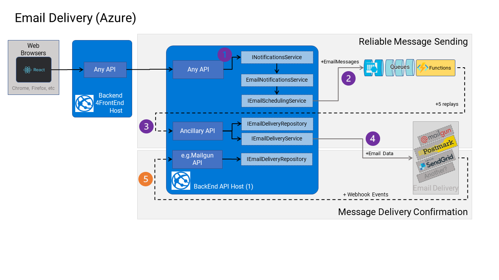

# Email Delivery

## Design Principles

Many processes in the backend of a SaaS product aim to notify/alert the end user to activities or processes that occur in a SaaS product, that might warrant their attention. Most of these notifications/alerts are ultimately delivered by email/SMS/Push (albeit some are delivered by other means, too, i.e., in-app, etc.).

Sending emails/SMS is often done via 3rd party systems like SendGrid, Twilio, Mailgun, Postmark, etc., over HTTP.

> Sending emails/SMS directly in a use case, can be very unreliable, and is it optimal with systems under load, where 3rd party API availability may not be 100%, and they can also apply rate limits. These aspects can lead to a poor user experience is the user is waiting for these workloads to complete before they can move on with their work.

Messaging, especially email/SMS is inherently "asynchronous" (from the users' point of view) because it is always out of band (OOB) from the application sending the messages. Thus:

* We need to "broker" between the sending of emails/SMS, and the delivering of them, to make the entire process more reliable, and we need to provide observability when things go wrong.
* Since an inbound API request to any API backend can yield of the order ~10 emails per API call, delivering them all reliably across HTTP can require many seconds/minutes of time, if you consider the possibility of retries and back-offs, etc. We simply could not afford to keep API clients blocked and waiting while email delivery takes place, let alone the risk of timing out their connection to the inbound API call in the first place.
* Delivery of some emails is critical to the functioning of the product, and this data cannot be lost, in a failure. e.g. Consider the email sent to a user to confirm the registration of their new account, or the SMS used to provide two-factor authentication to gain access to your account. These messages must be delivered, albeit in a reasonably short period of time.

Fortunately, an individual email arriving in a person's inbox, or SMS text message arriving on your phone, is not a time-critical and synchronous usability function to begin with.

> Some delay, in the order of seconds to minutes, is anticipated by the user, and is common even today.

Thus, we need to take advantage of all these facts and engineer a reliable and usable mechanism.

## Implementation

This is how emails and SMS messages are delivered from subdomain, using the Ancillary API:

> Although, not shown in this diagram (explicitly), SMS text messages have the same mechanisms.

### Sending notifications

Any API Host (any deployed subdomain) may want to send notifications to users.

They do this by calling very specific and custom `IUserNotificationsService.NotifyXXXAsync()` methods.

Injected into the runtime will be an instance of the `IUserNotificationService`, which can then deliver notifications to new and existing users based on communication preferences that those users have set up in the system.

> At present, this mechanism is pretty rudimentary. It does not abstract the users messaging details much at all. However, it is open to be extended in the future, if you needed to look up the users preferences from another service to decide how to deliver notifications, or if you needed to send notifications to multiple users at once, etc.

Without such information present in the system (as is the present case), a simple default implementation of the
`IUserNotificationsService` is being used to deliver notifications via email, and via SMS. It is called the:
`MessageUserNotificationsService`.

> This simple adapter is going to send an email notification to a user based on the email address, and an SMS notification to a user based on their phone number. (future implementations of "notifiers" may behave very differently).

### Sending emails/SMS

Receiving emails and SMS text messages from a SaaS product often participate in the flows of critical end-user processes, be those just "alert" notifications or instructional "call to action" (CTA) type notifications.

> For example, a user may need to confirm their email address at registration time, or they may need to reset their password, or they may need to confirm a booking, etc.

These email/SMS communications, thus, require asynchronous "reliable delivery" in order to improve the chances of the recipient getting the email at some point in time in the future.

Typically, emails/SMS will be actually delivered by 3rd party online services (e.g., SendGrid, Twilio, Mailgun, or Postmark), and those systems can employ their own management and rules for delivering these messages.

> For example, they may support rate limits, daily/monthly quotas, and email templates, and may even support blocked-email lists, and things like that to prevent emails from being received by recipients.

For most businesses using these services, operationally, they will need to manage those systems directly with whatever tools are available.

On the automation side, these 3rd party services may support API integration, and also support Webhook integrations so that they can "call back" to the SaaS product asynchronously later and report delivery statuses.

#### Reliable delivery

The injected implementation of the
`MessageUserNotificationsService` hands off the scheduling of the delivery to an implementation of the
`IEmailSchedulingService`. This service packages up the scheduled email and enqueues it to the
`emails` queue, and the thread that sent the notification is returned immediately.

Delivery of the actual email to the 3rd party service is not performed at this point, and the original request thread is not blocked waiting for that process to occur. This is a key design principle, since the client probably cannot do much in the case when the email/SMS fails to be delivered the first time, and the client certainly does not want to be kept waiting for a response back from the 3rd party email/SMS delivery service. These are typically notifications, not critical synchronous responses.

A scheduled email message goes onto the `emails` FIFO queue (an SMS goes into the
`smses` queue), where a cloud-based trigger (i.e., an Azure Function or AWS Lambda) picks up the message and calls back the Ancillary API to "send" the message using the configured Email Provider (i.e., SendGrid, Twilio, Mailgun, Postmark, etc.).

This cloud-based mechanism is designed with queues to be reliable in several ways.

1. The queues are always FIFO.
2. When a message is "dequeued" (processed) by a "client" (a piece of code like an Azure Function or a Lambda), the message is not removed/deleted from the queue immediately, but it becomes "invisible" to further processing by either the same client or another client. However, this message is only "invisible" for a [configurable] period of time (by default: 30 seconds).
3. The message is only "deleted" from the queue when the client explicitly instructs the queue to delete the message after successfully processing it. Failing to explicitly delete the message from the queue (by the client) returns the message to the queue (making it "visible" again) after the visibility timeout has expired.
4. Also, any exception raised by the client while processing the message will automatically return the message to the queue, making it "visible" to be consumed by another client again.
5. If the client fails to process the message, they can explicitly return the message to the queue, and this then counts as a "try".
6. The queue will keep track of the number of "tries", and when it reaches the [configurable] maximum retries, it will move the message to a "poison" (or "dead-letter") queue
7. Messages in the "poison" queue must be handled manually by operations.

> It is generally recommended to send alerts to the operational team when messages are dropped into "poison" queues.

The cloud-based "client" dequeues one message from the queue and simply forwards the message to the Ancillary API.

If it gets an `HTTP 200 - OK` response, it will delete the message from the queue. If it gets an HTTP - 4XX or HTTP - 5XX response, it will inform the queue and try again until it reaches the maximum number of queue retries. At this point, the message is automatically moved to the "poison" queue.

In the Ancillary API, the message is processed by the injected instance of the `IEmailDeliveryService`.

> The actual injected implementation of the `IEmailDeliveryService` will be responsible for getting the message to a recipient. Typically, via a 3rd party service (e.g., SendGrid, Mailgun or Postmark, etc.)

The specific adapter will likely use an exponential back-off retry policy, which will allow about three attempts to succeed before failing.

Any exception that is raised from this processing will fail the API call, and that will start another delivery cycle from the queue.

#### Templating

In some products, you might want to control the HTML body of emails being sent.

> In some products you may also want to allow your customers to control their emails.

Most 3rd party provides support email templating in some capacity or another.

Emails can be sent either as hardcoded HMTL, or by specifying a collection of "substitutions" that are rendered by the templating engine of the 3rd party provider (e.g., MailGun, Twilio, etc).

### Delivery status

Even though the attempt to send the email message to the 3rd party service succeeds, that 3rd party service may, later, fail to deliver the email message, even though they respond to the delivery request with success.

> They may employ retry strategies themselves, or they may configure policies like: blocked email domain lists, unverified email addresses, etc.

Some 3rd party email delivery services report these kinds of delayed failures via webhooks that would need to be wired into the Ancillary API service.

When delivered successfully to a real person's email inbox, the 3rd party can notify the Ancillary API of successful delivery. This is usually achieved with setting up webhooks, and receiving events, or by polling the 3rd party API.

For example, for the Mailgun adapter, you can see an API called the `MailgunApi.cs`, which handles events fired at this endpoint, from configuring a webhook in Mailgun to reporting delivery status.

> Not all 3rd parties support webhooks, and if they do, they all implement them in unique ways, particularly around authentication. Check the developer documentation for that integration.
