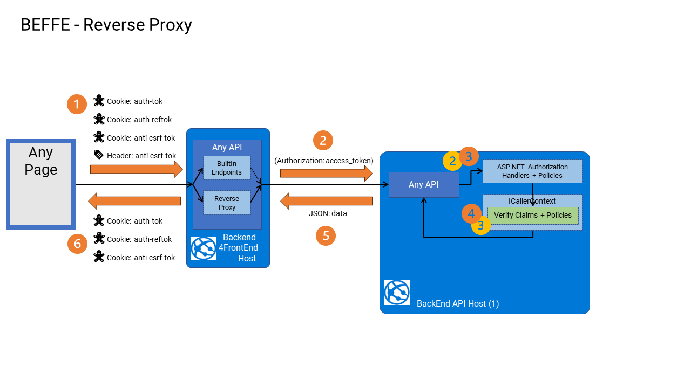
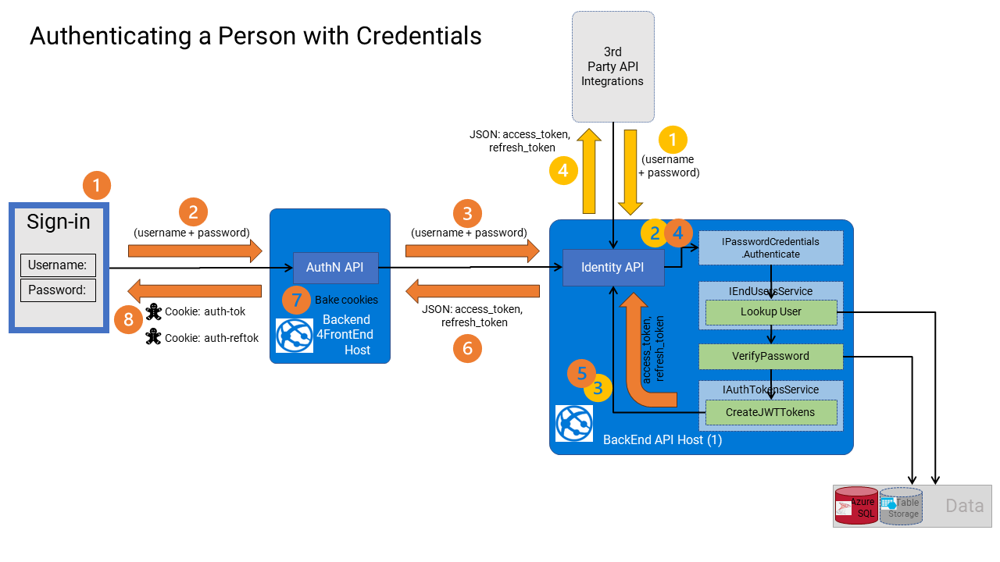
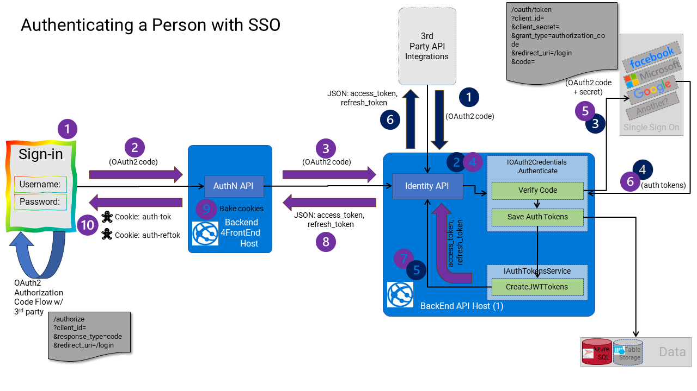

# Back-End for Front-End

(a.k.a BEFFE or BFF) coined by [Sam Newman](https://samnewman.io/patterns/architectural/bff/) circa 2015

A web BEFFE is a web server designed specifically to serve a web application (i.e. a JavaScript application like those created with a framework like ReactJs/AngularJs/VueJs application).

* The BEFFE is typically (but not always) the same web server that serves up the JS app that runs in the browser. i.e. Same Origin
* It is always the web server that the JS app sends requests to for HTML and JSON.
* Sometimes, a BEFFE exposes its own customized JSON APIs; other times, it forwards those JSON requests to other Backend APIs.

A BEFFE is a de-coupling design strategy to avoid designing a Backend API that is directly coupled to a specific Frontend, or a Backend API that has to be all things to several Frontend applications (e.g., a web application, an admin web application, a mobile application, and a desktop application), all of which have different needs for data processing.

> This frees the designer of the Backend to focus on designing REST APIs instead of RPC/CRUD APIs to only serve a single Frontend.

## Design Principles

* A BEFFE is a dedicated boundary to a specific type of client application. Typically, a web application. Its purpose is to serve assets and data to a web application just the way the web application likes it, and to abstract the visual interface from the machine interface of the Backend APIs.
* A BEFFE should remain stateless
* A BEFFE can offer caching of responses to make the UI more responsive and typically aggregates data from various backend sources (e.g., different APIs).
* A BEFFE is a necessary strategy when the same development team designs both the Frontend and the Backend of a system simultaneously. Without this, it is easy for the team to forget that both HTTP interfaces (HTML for Frontend and JSON for Backend) are designed for two quite different [human] audiences. A Frontend is a visual [human] interface designed for the end-users of the product, focused on performing familiar tasks easily. The Backend is a machine interface designed around business processes for [human] developers who then integrate other systems with the API of the product (regardless of what subsequent interface they are building and for whom). Thus these two interfaces are necessarily designed quite differently. Without a BEFFE, a team is likely to fall back to creating RPC/CRUD-like APIs, which does not achieve much more than making an API directly to their database. Then that simplification leads them to distribute core logic between various layers of the overall system (if they have any bounded layers at all), and that lack of structure and lack of encapsulation creates a big-ball-of-mud which slows them down in later stages, as the product onboards more [incidental complexity](https://en.wikipedia.org/wiki/No_Silver_Bullet).
* A BEFFE typically provides a secure way to maintain stateful (but not sticky) user sessions. Typically using [HTTPOnly, Secure] cookies to avoid the need for clients to store any secrets or tokens in the browser (which is always to be avoided since XSS vulnerabilities are ever-present). The BEFFE can then store and forward tokens created by Backends when calls are forwarded from BEFFE to Backend APIs. This avoids the tendency that many developers have to project cookies or sessions (or other legacy web application authentication mechanisms) onto their Backend API, which makes them far harder for machine integration.
* A BEFFE may provide its own API tailored to the JS app, or it may provide a reverse proxy to forward requests on to other Backend APIs.

## Implementation

The `WebsiteHost` project is a BEFFE. It performs these tasks:

1. It serves up the JS app (as static files).
2. It serves up other HTML, CSS, JS assets (as dynamic assets).
3. It implements a Reverse Proxy in order to forward JSON requests to Backend APIs
4. It implements its own Authentication API endpoints so that [HTTPOnly, secure] cookies can be used between the BEFFE and JS app to avoid storing any secrets in the browser.
5. It necessarily protects against CSRF attacks (since it uses cookies).
6. It provides API endpoints for common services, like: Recording (diagnostics, usages, crash reports, etc), Feature Flags, etc.
7. It provides a platform to add dedicated API endpoints tailored for the JS app that can be easily added as required.
8. It provides the opportunity to deploy (and scale) the web application separately from backend APIs.

### Reverse Proxy



BEFFEs are intended to be built specifically for a specific Web Application.

> BEFFEs can also be built for Mobile applications

They are responsible for returning data to client applications (i.e., the JS app) in the most efficient form. Thus they are tightly coupled to the JS app. To do this well, they often filter and aggregate data fetched from other Backend sources (via HTTP service clients).

> In general, a BEFFE does not directly access databases for application data. They use Backend APIs to obtain that data. However, they may implement their own caches to enhance performance.

Strictly speaking, the APIs that they serve are dedicated APIs (to the JS app), and strictly speaking, that would require implementing APIs in the BEFFE as well as implementing APIs in a respective Backend. In many cases, this can be extra work with little economic value in the long run. Therefore, the BEFFE offers a simple Reverse Proxy so that API calls can simply be forwarded to the Backend, and no additional BEFFE API needs to be implemented.

In other cases, specifically around some queries and some user workflows, dedicated APIs in the BEFFE are a more economical option (as they can aggregate, filter, and cache many sources of data).

Another performance consideration is that the network latency between the BEFFE and Backend API is typically orders of magnitude faster and more reliable than the network latency and reliability between the Browser and the BEFFE (especially when the BEFFE and Backend API are deployed in the same cloud datacenters).

#### How the Reverse Proxy Works

The BEFFE handles ALL inbound requests from the JS app.

> All requests from the JS app should go to the BEFFE directly, no calls from the JS app should go to any Backend API - ever.

Depending on the route (and the request type), the inbound call is either routed to:

1. An MVC controller (avoiding the Reverse Proxy), or
2. An in-built API Endpoint (if one has been implemented in the BEFFE - as a minimal API), or
3. Forwarded by the Reverse Proxy to a Backend API.

### Authentication

Since there is a Reverse Proxy handling inbound calls, and since we do not want to allow the JS app to handle any session secrets (i.e., JWT access/refresh tokens), we must also provide a way to manage the user's session using [HTTPOnly, secure] cookies, as the only secure means to keep these secrets from the browser.

> There are so many security challenges when JavaScript clients handle *access_tokens* and *refresh_tokens*, particularly if those tokens are not protected sufficiently from disclosure in the browser to JavaScript vulnerabilities.
>
> Even when protected diligently, there are always future chances of XSS exploits in the JS app (e.g., security exploits discovered later in 3rd party libraries), and when a future XSS exploit is successful, there is no longer any effective way to protect disclosure to any of those tokens in the JS app.
>
> Assuming that any JS app is fully protected against XSS, and the secrets that it holds cannot be disclosed, is a very bold assumption to make these days. Because XSS is so difficult to fully protect against, and once it is compromised, all secrets are revealed, the only really secure means to protect *access_tokens* and
*refresh_tokens* from disclosure in the JS app is NOT to have them present (or accessible) to the JS app at all.

The BEFFE offers a dedicated API for authentication (`POST /api/auth`) that intermediates the authentication process. Regardless of what data is used to authenticate the user (i.e., password credentials or SSO tokens, etc.), the call is made directly with the BEFFE and then relayed to the various authentication endpoints in the backend.

If the attempt to authenticate is successful, the authentication response from the Backend API (e.g., from `POST /passwords/auth` or `POST /sso/auth`) will always include an `access_token` and a `refresh_token`.

These "auth tokens" are then added to [HTTPOnly, secure] cookies that are then returned to the browser to be used between the browser and BEFFE for subsequent requests/responses.

At some point in time, either of those auth tokens will expire, at which point either the `access_token` can be refreshed (using the `refresh_token`), or the `refresh_tokesn` expires, and the end user will need to re-authenticate again.

#### Login

To authenticate (login) a user from the browser, make a XHR call to `POST /api/auth` with a body containing either, the user's credentials,

For example,

```json
{
    "Username": "auser@company.com",
    "Password": "1Password!",
    "Provider": "credentials"
}
```



or with a body containing an SSO authentication code,

For example,

```json
{
    "AuthCode": "anauthcode",
    "Provider": "google"
}
```

> Note: The Backend API call to authenticate this "OAuth2 identity" will receive some tokens (from the 3rd party provider) that should include an email address \[claim\] that identifies the actual person to the system. However, some OAuth2 providers today do not include that email address claim in the returned tokens, and in those cases the parson cannot be identified. Instead, their email address can be included in the above request (as `Username`) which can be available in the first steps of the "OAuth Authorization Flow".



> Note: you will also need to include CSRF protection in these requests, like all others coming from a JS app.

A successful response from either of these requests will yield the following body,

For example,

```json
{
    "UserId" : "user_auserid"
}
```

But, the response will also include these cookies (for the current domain):

`auth-tok=anaccesstoken`

`auth-reftok=arefreshtoken`

#### Logout

To logout explicitly, call `POST /api/auth/logout` with an empty JSON body:

> Note: you will also need to include CSRF protection in these requests, like all others coming from a JS app.

A successful logout request will remove both the `auth-tok` and `auth-reftok` cookies (from the current domain).

#### Refreshing Session

When the `access_token` cookie (`auth-tok`) expires (by default, after 15 mins), it will be necessary to refresh the `access_token`.

To refresh the session, call `POST /api/auth/refresh`

> Note: you will also need to include CSRF protection in these requests, like all others coming from a JS app.

A successful token "refresh" should renew both the `auth-tok` and `auth-reftok` cookies (from the current domain).

However, If the current `refresh_token` has expired, or there is no refresh token cookie (`auth-reftok`) to begin with, then a `HTTP 401 - Unauthorized` will be returned. Signaling that the user is no longer authenticated.

### CSRF Protection

Since there are several cookies exchanged between the browser and BEFFE, there must be [CSRF protection to avoid forgery exploits](https://owasp.org/www-community/attacks/csrf).

> Note, if there were no cookies, then there would be no need for CSRF protection.
>
> Note: No cookies should ever be exchanged between the BEFFE and the Backend APIs.


Implementing CSRF protection correctly requires that the JS app adheres to the strict CSRF implementation policy:

1. All XHR calls (using any method) must go directly to the BEFFE, which must also be the origin server of the JS app that is making the request. No requests (of any sort) from the JS app should <u>ever</u> bypass BEFFE and go directly to any Backend API.
2. This policy applies to all "un-safe" API methods: `POST`, `PUT`, `PATCH`, and `DELETE`, but it excludes `GET`, `HEAD`, and `OPTIONS`.

3. Any "un-safe" XHR call (from JS app to the BEFFE) that changes any state must be implemented with the methods: `POST`, `PUT`, `PATCH`, `DELETE`, and not `GET`, `HEAD`, or `OPTIONS`.
4. Include in all "unsafe" XHR calls (e.g., `POST`, `PUT`, `PATCH`, `DELETE`), an HTTP header called `anti-csrf-tok`. The value of this header can be read from the `meta` header called `csrf-token` found in the header of the HTML of `index.html`. For example,

    ```
    var csrfToken = document.querySelector("meta[name='csrf-token']").getAttribute("content");
    ```
5. The JS app must not store the value of the `csrf-token` anywhere in the browser. Neither in-memory, nor in local storage, nor any other cache or store in the JS app. It must read the value from the HTML of `index.html` each and every time it needs it since the value will change every time `index.html` is requested from the BEFFE.

6. Ensure that this `csrf-token` value is never included in any "safe" XHR call (e.g., `GET`, `HEAD`, or `OPTIONS`), and never exposed in any browser history.

7. After the user is authenticated, or after the authenticated user logs out, a new value of both the `anti-csrf-tok` cookie and metadata header `csrf-token` will be updated by the BEFFE. The JS app must implement a scheme that re-fetches the `index.html` page containing these new values for subsequent XHR calls. Failing to do so, will block all subsequent XHR calls to the BEFFE.

#### How it works

Every fetch of  `index.html` will change the value of the `anti-csrf-tok` cookie (same domain), and change the related `csrf-token` value in the `meta` header in the HTML. These two values are paired and work together to mitigate CSRF forced-browser attacks. They are also specific to the authenticated user, if any, at the time. Thus, these paired values change value after the anonymous user changes to be authenticated (i.e., login) and after when the authenticated user changes to be anonymous (i.e., logout).

> All failures due to CSRF violations are reported as a `403 - Forbidden`.

The CSRF cookie (`anti-csrf-tok`) has a value that expires every 14 days (by default). When this expires, any subsequent XHR request is likely to fail and continue to fail until the `index.html` page is re-fetched.

> One way to deal with this issue is to re-fetch `index.html` and, thus, renew the token and cookie.


In the BEFFE, we are using a defense-in-depth strategy (informed by the OWASP guidance) to mitigate against CSRF. These are the three mechanisms that are used together:

1. Double Submit Cookie (per session)
2. Verifying Origin
3. CORS

##### Workflow

- Each request to `index.html` creates a CSRF token and writes it into the `csrf-token` metadata tag of the `index.html` page.
- The value is unique for each fetch of `index.html` regardless of whether the user is authenticated or not.
- A corresponding `anti-csrf-tok` cookie is also updated with the HMAC signature of the CSRF token.
- The JS app is then required to send back (in any "unsafe"  XHR call to the BEFFE) the value of the `csrf-token` metadata value in a request header called `anti-csrf-tok`.
- The two values sent to the BEFFE are paired, but not the same, and they are compared (via HMAC signatures) in the BEFFE to prove that they are paired.
- The CSRF token corresponds to the currently authenticated user, but it is encrypted.
- In addition, the `origin` header of the request (or the `referer` header of the request) is compared to ensure the request originated from JavaScript served from this BEFFE. Otherwise, `HTTP 403 - Forbidden` is returned.
- A [same-origin CORS policy](https://developer.mozilla.org/en-US/docs/Web/Security/Same-origin_policy) is also enabled.

##### Defeating CSRF

To defeat the CSRF protection, an attack would have to send an "un-safe" state-changing request to the BEFFE, that:

1. Included in the request is a signed `anti-csrf-tok` cookie, signed with the same HMAC key stored on the BEFFE.
2. Included in the request is an `anti-csrf-tok` header containing a CSRF token (paired to the cookie above), encrypted with the same AES encryption key stored on the BEFFE.
3. That CSRF token (above) would have had to include the ID of the currently authenticated user (a.k.a session ID). Or include no user ID for an anonymous call.
4. Included an `origin` header (or included a `referer` header) that matched the origin of the JS app.
5. By-passed the browsers CORS pre-flight check.

For an attacker to do this from JavaScript running in the same browser, they need to defeat these challenges:

* Point 1 (above): The current cookies (including `anti-csrf-tok`) are automatically sent to the BEFFE (by the browser) when making a cross-origin request from www.hacker.com to www.yourproduct.com. In a compliant browser, JavaScript should not be allowed to create (read or write) its own HTTP-Only cookies. Even if they could do this, they would have to know the same HMAC secret as the BEFFE to create a valid signature for that cookie value.
* Point 2: The JS on www.hacker.com would have to download a request to www.yourproduct.com/index.html and read the HTML to retrieve a value for the `csrf-token` from the HTML. This is forbidden by the [Same Origin Policy](https://developer.mozilla.org/en-US/docs/Web/Security/Same-origin_policy) (SOP) in compliant browsers. The JS on www.hacker.com would have to write the `anti-csrf-tok` header on the request with the value it reads from the `index.html` page. Writing custom headers on requests (like: `anti-csrf-tok`) is forbidden by SOP in compliant browsers.
* Point 3: The JS on www.hacker.com would have to know the AES encryption key on the BEFFE to create their own token value. (They could, however, use their own encrypted token and related cookie- from monitoring their own account on the site - to force a re-login of their account and initiate a "Login CSRF").
* Point 4: The JS on www.hacker.com would have to spoof the `origin` or `referer` headers on the request. The browser should not allow JavaScript to do this.
* Point 5: The JS on www.hacker.com would have to bypass the CORS preflight check set on www.yourproduct.com in order for any state-changing API call to succeed.

All of these things above would have to happen in JS on www.hacker.com to bypass the CSRF protection on any state-changing XHR request.

> For these reasons, only compliant browsers should be used to access the JS app and BEFFE

##### Testing CSRF

Finally, it is worth noting that in automated testing, specifically in the API integration tests that test the CSRF protection, we actually fabricate both the cookie and header values (using the same code that the BEFFE does to generate them), as opposed to downloading those values from a live version of `index.html` from the BEFFE.

At present, the BEFFE is not keeping track of past generated values against requested values, so this means that as long as we are using the same Signing and Encryption secrets as the BEFFE is using, at testing time, we can correctly test the CSRF protection mechanism.

> In the future, we may decide to track incoming CSRF tokens and signature values against an index of previously issued tokens/signatures by the BEFFE, to ensure that they have not been fabricated outside the browser. If that happens, the testing would have to adjust to fetching values from a request to `index.html` each time.

### API calls from JavaScript

All API calls will be proxied through the Reverse Proxy in the BEFFE (to the Backend API).

After the user is authenticated, those proxied calls will include the JWT `access_token` in an `Authorization` header, extracted from the `auth-tok` cookie.

It is possible that subsequent calls to the Backend API will eventually respond with `HTTP 401 - Unauthorized` response, once the token has expired (or been revoked). This response will get proxied back to the JS app.

The JS app now has a choice to make on how to handle the `HTTP 401 - Unauthorized` response:

1. It can handle that response and direct the user to the login page for them to authenticate again, and redirect them back to where they started.
2. It can attempt to refresh the `access_token`, obtain refresh `access_token`, and then retry the call to the Backend.

> Clearly, due to the short lifetimes of access_tokens (being in the order of 15 mins), users would experience poor usability if they were asked to log in on the same frequency that an `access_token` expired, especially in most SaaS-based products.


The following process should be implemented in the JS app, to maintain a reasonable usable experience for most users:

1. In a global handler, for each XHR call, handle the case when an `HTTP 401 - Unauthorized` is received.
   - Otherwise, process the request as a normal response.
2. When  `HTTP 401 - Unauthorized` is received, attempt to refresh the users' authentication "session" by calling `POST /api/auth/refresh`.
   - If this refresh call fails with `HTTP 401 - Unauthorized` (either the refresh token has expired or the cookie containing it did not exist to begin with) then redirect the user to a login page to re-authenticate.
   - If this refresh call succeeds with `HTTP 200 - OK` then retry the original XHR request (as this request should now be proxied with a valid and refreshed `access_token` by the BEFFE)
   - If the retried request fails a second time with `HTTP 401 - Unauthorized`, redirect the user to a login page to re-authenticate. This could indicate that the `refresh_token` has now expired, or the `access_token` has been revoked, or is, at this point in time, invalid for some other reason.

> Note: responses that include `HTTP 403 - Forbidden` are likely to be from CSRF violations which are also applicable to all these XHR interactions.

### Ancillary Services

The BEFFE also implements a number of general-purpose ancillary API endpoints for use by the JS app. These include:

* Recording - recording crashes in the JS app, recording usage data, etc
* Feature Flags - for controlling the behavior of features in the JS app
* Health check - for checking the responsiveness of the BEFFE and its deployed version
* Other ancillary APIs.

### Custom APIs

The BEFFE has been designed to be extended to include additional (domain-specific) endpoints to support the JS app when those calls special handling, such as caching, aggregation, and filtering of data from Backend APIs.

These endpoints can simply be added in the same way API endpoints are added to any host. The Reverse Proxy will detect requests to these endpoints and route them directly to the BEFFE API to process first.

