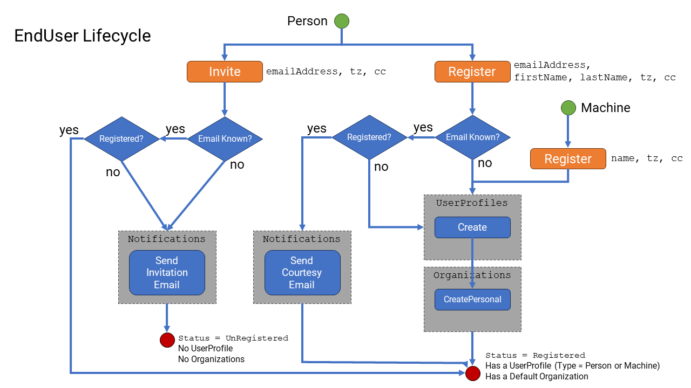

# User Lifecycle

## Design Principles

* We want to use the email address as a unique identifier for each person's identity (in the universe), and we only want one representation of that person's identity across all organizations (tenants). However, a person will likely have several identities (i.e., a specific company identity versus a personal identity).
* We want any registered person in the system to invite another person (via an email address) to register themselves to the system. We want to capture their email address early for referral purposes.
* Only the invited person can self-register after they were "warm" invited, or they approached the platform "cold".
* When a person self-registers, regardless of whether they were invited (via an email address or not), they can choose the email address they wish to register with.
* A person can be invited to the platform or to a specific organization. In the latter case, they join that organization by default.

## Implementation

### End Users

Users of the product are managed in the `EndUser` subdomain.

* Essentially an `EndUser` is a representation of an "identity".

* Users cannot be deleted. Once registered, they can be "disabled" (`Access=Suspended`) and cannot authenticate to use the product any further.

* Once registered, the email address they registered with becomes their username. Even though they may change that email address (in the future), no two users on the platform can use the same email address.

Users self-register in the `Identity` subdomain via either `PersonCredentials`, `SSOUsers`, or other methods, each responsible for its own onboarding flow (e.g., passwords require email confirmations and a managed registration flow, whereas SSO can just automate it).

* New users can be invited by another party and can respond to that invitation (e.g., a "warm" guest invitation) or register without an invitation (e.g., a "cold" direct registration).

### Organizations

An `Organization` has a classification of either `Personal` or `Shared`.

* `Shared` organizations are intended for use by companies/workgroups/organizations/teams/etc.
* `Personal` organizations are for each `EndUser` (person or machine) to use on the platform and cannot be shared with others.
* A person/machine will have a membership to one `Personal` organization at all times, and can have a membership to one or more `Shared` organizations.

> Note: By default, The primary use case of a `Personal` org is for the user to still be able to log in to the platform and at least use basic functionality of the product without having to upgrade to paid features. The basic plan is assumed by default to be a "free" (unpaid) plan. This is intended so that they have to have a space in the product of their own, from which they can still use the product even if they are removed from other companies organizations, and from there add other (paid) organizations if they wish to, or be invited into other organizations later.

#### Roles and Responsibilities

* Any person can have the `Member` and/or `Owner` and/or `BillingAdmin` roles in an organization. Machines can be members of other organizations too.
* Only `Owner` roles can assign/unassign the roles of other members.
* Any person (not machine) can have the `BillingAdmin` role of an organization, but they must also have the `Owner` role.
* Every organization (`Shared` or `Personal`) will always have a person who is the "billing subscriber". This person has a fiscal responsibility to pay for billing charges for that organization (tenant). The "billing subscriber" must always have the `Owner` and  `BillingAdmin` roles at all times. (A "Billing Subscriber" is not a role, but it is an attribute of an organization).
* When a person (not a machine) creates a new `Shared` organization, they automatically become an `Owner` and `BillingAdmin` of it, as well as the "billing subscriber" for it.
* From that point, they can assign the `Owner` and `BillingAdmin` roles to one or more other members of the organization.
* The "billing subscriber" responsibility can only be transferred via a (voluntary) payment method submission from another `BillingAdmin` of the organization. (and when the current 'Billing Subscriber' payment method has expired, and then an existing `BillingAdmin` can assume the position)

#### Personal Organizations

* Every `EndUser` (person or machine) has one `Personal` organization.

* It is automatically created for them when they register on the platform. It is named after that person/machine.
* That person/machine is the only member of that organization. No other members (person or machines) can be added to it.

* They have the roles of `Owner` and `BillingAdmin`, and they are also the "billing subscriber" for it.

* This organization cannot be deleted, and that person cannot be removed from it, nor can their roles be changed.

> This organization is very important so that the product can be accessed at all times by them, regardless of whether the owner is a member of any `Shared` organizations or not.

#### Shared Organizations

* `Shared` organizations can be created at any time by any person (not machine) on the platform.
* Any other person/machine can be invited to join them. When the person/machine is added, they are created a `Membership` to that `Organization` with a set of default roles (i.e. `Member`). Each `Membership` maintains its own roles.
* A person (or machine) can be a `Member` (role) of any number of `Shared` organizations into which they can be invited, removed, or they can leave themselves.
* A person (not a machine) can be assigned/unassigned any number of other roles in those other organizations. A machine can only be a `Member`, and not a `Onwer` or `BillingAdmin`.
* A `Shared` organization must have at least one `Owner` (role) and one `BillingAdmin` (role) at all times, and they can be the same person or different persons. Like a `Personal` organization, a `Shared` will have one and only one "billing subscriber", who is ultimately responsible for any charges for the organization.
* A `Shared` organization can be deleted. However, they have to be deleted by the designated "billing subscriber" and only once all members are removed from it.

### Memberships

When an `EndUser` joins an `Organization` they get a membership to that organization.

Memberships belong to the `EndUser` (subdomain), not to the `Organization`.

> Although, in practice, there is a very tight coupling between `EndUser` -> `Membership` <- `Organization`. Nonetheless, since the `EndUser` and `Organization` subdomains are presently separated, `Membership` belongs to `EndUser` subdomain. You may notice that the `Organization` keeps mementos of its `Memberships` in that subdomain also.

A user can have one or more memberships. A user will always have at least one membership to their own `Personal` organization. Which they should never lose.

Every user will also have a "default" membership (a.k.a. their "default organization"). That is, a membership that the system can assume is the one they are working with at any time. Of course, this default can change at any time.

When a user is invited into another organization, or if they create a new organization themselves, this default will always change to be the last organization they joined.

### Guest Invitations

Guest invitations are the mechanism to introduce (and refer) new users to the product.

#### To The Platform

* Any authenticated user can invite a guest to the platform (i.e., without any affiliation to any organization)
* A "guest invitation" requires only an email address and has an expiry (14 days, by default)
* The person is contacted at that email address and given a link to register with the platform (in the web app). The link contains an `InvitationToken`.
* In the web app, the `InvitationToken` is first verified to check if it is valid (and not expired), and if so, the guest is presented with a registration form, which accepts an email address and password, which is pre-populated with the email address and a "guessed" name (derived from their email address). Or they can sign up with an SSO provider.
* In either case, when signing up with password credentials or signing in with SSO, the registration could include the referral `InvitationToken`. It will not include this token if they sign up on their own.
* On the server, the `InvitationToken` is used to "accept" the "guest invitation" before registering the user. This `InvitationToken` essentially ties the previous guest invitation to the `Unregistered` user that will now be registered with the new email address provided in the registration process (regardless of the email address they were invited with).
* The user is registered with their own `Personal` organization and has no other memberships with any other organizations.

#### To An Organization

* Any organization owner (role) can invite a guest to their organization (by email) or invite an existing user to their organization (by email or by ID)
* As above, a "guest invitation" requires only an email address and has an expiry (14 days, by default)
* A "guest invitation" follows the same process as above, except that when they eventually register (either by accepting the guest invitation with a different email address or by registering with the same email address that they were invited with), they will be added to the organization.
* This organization (or the last one they were invited to) will become their "default" organization (rather than their `Personal` organization).
