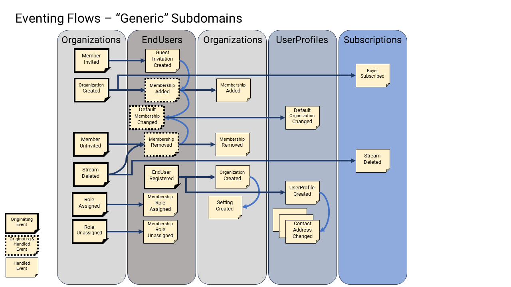

# Eventing

Eventing is the gateway to Event Driven Architecture (EDA), but it starts in the Domain Layer of the software.

## Design Principles

1. We want all DDD aggregates to utilize domain events to drive use cases, irrespective of whether we are sourcing/capturing their current state from events (a.k.a Event Sourcing) or sourcing/capturing their current state from data snapshots.
2. For [event-sourcing persistence schemes](0070-persistence.md) (that are by definition "write models" only), we need to build associated "read models" so that we can query domain aggregates.
3. We want the flexibility to change our "read models" at any time, as the software changes, and ideally not have lost any data.
4. We may want denormalized data models to query for maximum efficiency.
5. We want to de-couple subdomains from each other as much as possible. Even for subdomains that are highly-coupled to begin with (e.g., `EndUsers` and `Organizations` and `Subscriptions`.
6. We want to deploy certain groups of subdomains into separate hosts and split the modular monolith into many APIs (i.e., micros-services) later in the lifecycle of the product, but not have to re-engineer flows to accommodate those changes.
7. We want the flexibility to make changes to key use cases in the product, without changing multiple subdomains at the same time.
8. We want to be able to communicate across process boundaries without coupling the processes.

## Implementation

In the design of most distributed systems, of the nature of this system or of systems that are expected to evolve into distributed systems later, it is common to decouple each of the subdomains from each other. De-coupling effectively is absolutely vital to allowing the system to change, grow, and evolve over time.

Lack of effective de-coupling (at the technical level) is the main reason most software systems devolve into big-balls-of-mud, simply because of the coupling of many components to many other components often striving for maximum data and code reuse.

There are several techniques for de-coupling your subdomains, including: separating layers, using ports and adapters, starting with a modular monoliths and decomposing it into microservices later etc.

Another one of these techniques is the use of Event-Driven Architecture (EDA), where change is communicated within process boundaries, and across process boundaries.

EDA relies on the fact that your system will emit "domain events" that it can share both within specific bounded contexts (as "domain events"), and externally to other systems (as "integration events").

> When sharing events within a bounded context (or within the same process), the process can remain consistent. We call these "domain events."
>
> When events are shared across bounded contexts (or across processes and hosts), they are called "integration events."

In SaaStack:

1. We use "domain events" to signal changes (within the Domain Layer) and within all aggregates and entities. Regardless of whether we are using event sourcing for persistence or not.
2. We publish all "domain events" whenever the state of any aggregate is saved in any repository via the `EventSourcingDddCommandStore` or via the `SnapshottingDddCommandStore`.
3. We treat "domain events" and "integration events" slightly differently:
   1. "domain events" are published synchronously and handled synchronously after the aggregate is saved, and are always consistent.
   2. "integration events" are published synchronously, but are expected to be handled asynchronously (by a message broker) and be eventually consistent.

> We assume that all "domain events" are only ever published to other subdomains that are in the same "bounded context" and, thus, we also assume the bounded context in deployed in the same host process. When this is not true, for example, if subdomains of the same bounded context are split into separate host processes, then these subdomains will need to communicate with "integration events" instead, and they will necessarily become "eventually consistent" with each other.

The diagram above illustrates the "logical" process that is triggered when an aggregate state is updated.

> The implementation details of this "logical" process can be different depending on the specific "relay" mechanisms in place.

### Consistency

Read model projections and notifications (one or more of them) are created by publishing "domain events" raised by aggregates from a specific subdomain.

In a typical stateless API, this publication and subsequent updating of read models and notifications can occur synchronously or asynchronously with respect to the aggregates producing the "domain events" in a specific subdomain.

Projections and Notifications should try to be "consistent" as possible with updating the aggregates that produce the change events as much as possible, although "eventually consistent" is also possible, and likely in highly distributed systems.

Consistency requires "reliable" implementations (e.g., Outbox Pattern), and these implementations must guarantee the delivery of the "domain events" in order (e.g., FIFO Queues). If either of these technical requirements cannot be guaranteed then there is a high probability that when the system comes under load or stress, that downstream consumers of these change events will be permanently out of date, affecting the data integrity of downstream dependent systems.

Eventual consistency can cause problems for clients who are making changes in synchronous "commands" and then shortly after, expecting that changed data in subsequent "queries".

> By default, the mechanism of updating read models should be done reliably and asynchronously after a source aggregate is changed, such that the collective system is eventually consistent. This asynchronous update (typically expected to take anywhere between ~100ms-500ms) means that read model data and consumers of notifications can be "immediately" out of date with the subdomains that update their source aggregates.
>
> When this update process is synchronous (and in-process), that part of the system will achieve 100% consistency, which is convenient, but this is not a true reality for when the system is eventually split up and becomes a distributed system. (as is the goal of all modular monoliths). In distributed systems that are eventually consistent, API clients are required to employ different strategies to handle this eventual consistency, which are disruptive when switching later when a monolithic backend becomes distributed.
>
> For example, if a client calls a command API and then after receiving a response, immediately calls a query API that would include the changed data, the queried data may have not yet been updated yet. This is one reason why commands can return changed data synchronously in their responses, to help clients predict the changed data, and avoid the subsequent querying of it.
>
> Because of this constraint, it is better to start the modular monolith on an eventually consistent model rather than start a fully consistent model since these client strategies should be established sooner rather than later being re-engineered.

### Read Model Projections

A "Read Model" is the term used to describe data that is readable, usually by a query of some kind.

A "Projection" is a word used in databases to "project" (verb) data from one container into a specific view of that data.

> For example, in SQL databases, all `SELECT` statements represent projections of data into an output.

Read Model Projections are essentially views of data produced by projecting "domain events" onto a data container. In most cases, projecting data into the rows of tables of a database, optimized for fast querying.

Read model "projections" are a mechanism to produce (and keep up to date) one (or more) "read models", which are typically "records" that represent the latest state of the aggregates and entities in event-sourced persistent schemes. These read models are typically used directly by CQRS queries to retrieve the latest state of the system.

> Note: In snapshotting persistence schemes, the "read models" already exist, and are the exact same as the "write models"; they share the exact same data. However, there is no "read model" in an event source scheme, and "write models" cannot be efficiently queried.

One major advantage of producing "read models" is that they are all built from the historical stream of events. This means that we can have several of them at the same time, containing different data and all coherent with each other, unlike what is possible with snapshotting stores, with one and only one read model possible.

Another advantage of having read models is that we can build several "denormalized" sets of records at the same time (e.g. in a relational database) that are optimized for specific queries - no longer requiring complex joins to give desired results.

Another advantage (only available to event-sourced persistence scheme) is that we can rebuild any read model at any time, in any way we like, and never lose any historical data. Now that this is possible, read models become temporary and disposable (since we can rebuild them in any representation at any time). All the source data is in the event streams! The advantage here is that when the software changes and the queried data needs changing, we can use any of the historical data that already exists in the aggregate event streams to rebuild different data in completely new read models. No longer do you need to protect the one and only read model that defines the state of the system.

> This capability is impossible in snapshotting persistence schemes.

### Event Notifications

Notifications are the mechanism by which subdomains can communicate to other subdomains (or to other processes) about what is happening in the source subdomain. This means that a source subdomain does not have to [imperatively] instruct another [dependent] target subdomain to update its state, when the source subdomain state changes. Typically, this is done by a direct synchronous method/API call.

Instead, the target domain can simply "observe" and react to the appearance of a "domain event" from the source subdomain, and take appropriate action.

The coupling of the imperative method/API call is eliminated.

> This is particularly useful when you have highly inter-dependent subdomains, that require that their data be in sync with each other (i.e., `EndUser` memberships with `Organizations` and `UserProfiles`. As seen below.

This eventing capability is particularly necessary in distributed deployments, where direct calls between separately deployed components are realized as HTTP calls (requiring both the source and target subdomains to be synchronously responsive and consistent to each other).

Instead, decoupling this asynchronously via "integration events" would normally done in distributed systems with a message broker of some kind (i.e., a queue, a message bus, etc.).

The synchronous publication of all "domain events" is handled automatically by the `IEventNotifyingStoreNotificationRelay` (after events have first been projected by the `IEventNotifyingStoreProjectionRelay`).

Domain/Integration events are published synchronously (round-robin) one at a time:

1. First, to all registered `IDomainEventNotificationConsumer` consumers. These consumers can fail and report back errors that are captured synchronously.
2. Then to all registered `IIntegrationEventNotificationTranslator` translators, that have the option to translate a "domain event" into an "integration event" or not. This translation can also fail, and report back errors that are captured synchronously.
3. Finally, if the translator translates a "domain event" into an "integration event" it is then published to the `IEventNotificationMessageBroker` that should send the "integration event" to some external message broker, who will deliver it asynchronous to external consumers. This can also fail, and report back errors that are captured synchronously.

