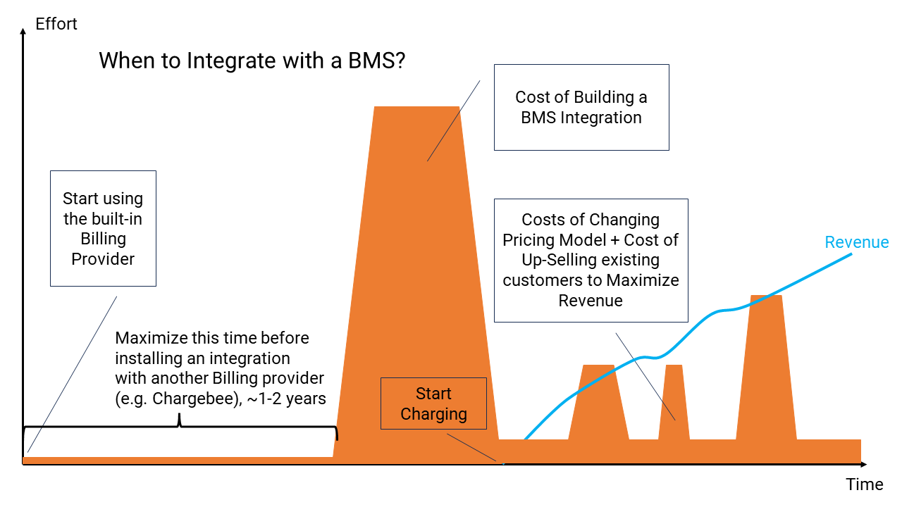

# Billing Integration

Here, we refer to the integration between the SaaS product and a preferred Billing Management System (BMS).

Examples of typical online BMSs are: [Chargebee](https://www.chargebee.com/), [Maxio (formerly Chargify)](https://www.maxio.com/subscription-management), [Recurly](https://recurly.com/), [Zoho](https://www.zoho.com/us/billing/), and [Stripe Billing](https://stripe.com/billing).

We have some significant goals here with a billing integration:

* We want to give our end-users the ability to self-serve their billing subscription needs. That means choosing an appropriate pricing plan and then having the free will to cancel, upgrade, and downgrade their plans at will, without human intervention. (Imagine having to negotiate with a Sales person to cancel a subscription to an online service - it is not happening) They will also need access to their invoices and see the costs related to all activities. This transparency, accuracy, and ease of changing commitment go a very long way toward building trust in the product. This means the product has to be integrated in several places and pretty extensively integrated with the BMS.
* We want to avoid reinventing the wheel and building our own Billing Management Systems (BMS). As tempting as it may be to some over-confident engineers, this is a galactic-sized accomplishment (even for only the simplest scenarios that might be naively foreseen at the start of the business). Considering some businesses have spent billions of dollars doing it right, it should itself be an indication that doing this is too expensive for a starting-up SaaS business, either at the start or in several years' time. For every other SaaS business, this capability is something you buy and integrate with, not build. There are many providers available today, some optimized to your business-specific model and some more generalized, and you might be changing your mind about the growth trajectory of your SaaS business. When that time comes, we want to facilitate that change in SaaStack easily.
* An integrated SaaS product with a BMS will be not only surfacing billing information and allowing the user to change it, but it will also be in a position to surface and enforce some of the limitations imposed by different billing pricing plans. For example, limits, quotas, and feature sets. When these things change, the SaaS product needs to co-ordinate with the BMS policies, both ways (enforce, and notify).
* Every SaaS business prices and charges differently, and every SaaS business changes those policies pretty regularly. The software needs to adapt easily.

## Overview

As SaaS products evolve, eventually, the critical questions of "What is going to be charged (to customers) for the use of this product?" and "What is the pricing strategy going to be?" moving forward arise.

How and when should a SaaS business introduce charges? and start earning revenue?

Let’s explore this journey, considering both short-term revenue gains that can be had versus the long-term, more sustainable revenue attainment from the repeated use (and payment) for the product over time (recurring revenue).

These are always two competing forces keeping SaaS product businesses alive and thriving. Short term revenue growth, and long term revenue growth. The classic battle between Sales-led revenue (once-of), and Product-led revenue (recurring).

1. **Early Days and Product Market Fit:**
   - You should prioritize achieving product-market fit (PMF) for a larger market of adopters, over earning early revenue, specifically from a set of fewer prospects with bespoke needs and demands.
   - Initially, focus on building a more broadly desirable product, without incurring the burden of introducing integrated billing and customer charging complexities.
   - Integrating billing systems at an early stage (which is significant and non-trivial product work) can divert precious resources from core research and development of the product, missing critical opportunities in the market for long-term growth.

2. **Product-Market Fit and Scaling:**
   - PMF is the holy grail of an early-stage startup. It’s about creating a product that resonates with a broad enough audience, who will eventually pay money for it (irrespective of whether they pay now or later).
   - Marketing and PMF validation are key to unlocking the door to scalable business model later, especially for Product-Led Growth (PLG) products, but also for predominantly Sales-Led Growth products (SLG). If you haven't got PMF nailed early on, then scaling is hard if not impossible to attain, regardless of the size of the markets you desire to move into.
   - Direct sales to individual customers (one at a time) may help validate PMF, but they don’t scale well across a large global market.

### The Perils of Early Revenue Focus

There are real dangers in pursuing early revenue, pre-PMF stages of the business.

> This is a common pitfall for founders who are prior service-oriented (i.e., expect invoice payment for services rendered) who are happy to settle for a small number of paying customers and serve them a customized service (i.e. former consultants, solution providers, etc), as opposed to founders who are more focused on creating a more desirable generalized product for a larger market, and deferred payment.

- Pursuing revenue too soon risks misallocation of resources that would be better applied to R&D for PMF. Defer, and avoid turning the product business into a boutique services business.
- Premature billing integration can distract the product team from critical PMF discovery. This kind of work is intense, error-prone, and, in many cases, over-engineered to guard against uncertain and unknown futures. All those things are all hinderances long term. Focus on PMF.
- Bespoke billing management solutions may emerge (from over-confident and naive engineers), hindering the scalability of the business in the long-run, and ultimately lost revenue from all but the simplest pricing models. This hubris should be avoided at all costs.

### Converting Free to Paid Users

- You need to have identified when your free users are ready to convert to paid users, while already using the product. This is not trivial work.
- When converting free users to paid users, experiment with pricing strategies; expect not to get it right the first time, and you can't be afraid to change it.
- Then, install, configure, and migrate subscription data to a reliable third-party billing provider.
- Pricing strategy changes will still happen (less frequently), and when they do, you'll be thankful that the BMS has comprehensive facilities to handle them. These are opportunities to connect with paying customers and upsell them added value in the product introduced since the last price pricing change.

### The Point Of No Return

- Once billing integration is introduced, there’s no turning back. You will have existing paying customers, and their billing needs will need to be managed far into the future.
- Refine pricing strategies and amounts every year.
- Product Managers play a pivotal role in quantification at these stages.

### Managing Economics Over Time

- Make charge payments (e.g., credit cards) for subscriptions in advance and save on fees using direct debit and other low-fee banking payment instruments. The longer the advanced period, the better.
- Manage upgrades, downgrades, discounts, and refunds in the BMS portal, while the data is automatically synced to the product, where the users can see it.
- With thousands of customers, long retention periods, many plan changes, and pricing experiments — complexity abounds.

Remember, the journey from PMF to scalable revenue involves many strategic decisions about where to expend your precious R&D resources. Choose wisely, and may your SaaS venture thrive in the long run!

At the moment you commit to a billing integration, it will become important to both charge payments (e.g. to a credit/debit card) for any subscription and to track the charges to that subscription as time passes, as well as manage upgrades, downgrades, grandfathering, charging, refunds, and cancellations to those subscriptions. All of this needs management over long periods of time for thousands of customers.

There is much that will change over time with both active subscriptions and the various pricing strategies that are tried over time.

> This is often overlooked by inexperienced founders

### Billing Management Systems

> Creating a billing management system from scratch to handle the operational aspects of a SaaS business is extremely challenging and outrageously costly for all SaaS businesses (except those who plan to be a global billing provider). This endeavor should be avoided at all costs.

Instead of building our own system, SaaStack has been designed to be fully two-way integrated with established 3rd party billing providers (e.g.,  [Chargebee](https://www.chargebee.com), [Maxio](https://www.chargify.com/), or [Stripe Billing](https://www.stripe.com/billing)).

All these providers offer APIs for integration as well as management portals and tools for handling subscriptions, plans, pricing, trials, discounts, and coupons. The API interface (and webhooks) provided by the BMS becomes the user interface of your product that your customers can self-serve with. The management portal the BMS provides becomes an administrative tool your business (product, support & success, etc) can use to manage customers, billing and pricing changes long term.

This bidirectional approach introduces a need for seamless synchronization between your SaaS product and third-party services, as changes can occur in both systems independently (due to different actors). Therefore, the product's backend API will be needed (via webhooks) to modify and synchronize subscriptions from the BMS and ensure consistency between the two systems. Eventual consistency is completely tolerable in this scenario.

This two-way syncing ensures that end-users and administrators can manage billing plans and resolve issues effectively.

### Billing Subscriptions and Multi-Tenancy

In B2B products specifically, it is likely that the "buyer" of the SaaS product is not always the "end-user" of the product (sometimes it is, oftentimes it isn't), whereas in B2C products, the "buyer" and the "end-user" are often precisely the same person.

> By default, SaaStack is configured for B2B out of the box, but can be easily altered to suit B2C models as well.

By default, the "buyer" of a SaaStack product will be the individual taking the financial responsibility for the billing `Subscription` (the buyer) and that is is going to be bound to an `Organization` (the tenant).

The selected "pricing plan" associated with this billing subscription would need to apply to all current and future members of that organization (tenant).

By default, when a new organization for an `EndUser` (buyer) is created, it is associated a new billing `Subscription` for that `Organization`. This billing subscription and organization will collaborate to impose restrictions on the members of the organization, such as access to specific features of the product and possibly limits on the usage of certain features of the product.

Initially, the "creator" of any organization will automatically become the "buyer" of the billing subscription. As a result, they will become the payment authority (via a payment method) for the subscription and will make purchasing decisions (i.e., upgrade/downgrade decisions). This person, the buyer, will be charged for the use of their organization/tenancy on the SaaS product at certain subscription levels (via the `PaymentMethod`), and they will also be the primary user responsible for managing the billing subscription (usually represented as a "customer" in the BMS.

> Ordinary members of an organization will not have access to view or modify the organization's billing information that information may be too sensitive. viewing and management of this data is typically only available to the "buyer" of the subscription associated with the organization, and to others members of the same organization nominated by the "buyer" to act on their behalf (i.e. nominated billing administrators).

### Pricing Plans

Most SaaS products advertise pricing plans, some free, some with "basic" capabilities, and some with more "advanced" capabilities. They often define different levels of cost, and define different levels of service and restrictions.

Billing subscriptions (as a concept) usually define a financial responsibility between a party (the "buyer") and the service provider (SaaS product). The "buyer" decides the level of service they wish and thus determines the pricing of the subscription, and they fulfil that responsibility with a financial instrument like a valid `PaymentMethod`.

It is very important that at least one person (specifically the "buyer") has this responsibility as the subscription can change over time, as can the `PaymentMethod`. It is critically important that this valid `PaymentMethod` remains valid at all times to keep the service paid for and alive, particularly when the service is charged for (i.e. monthly) or when the subscription changes (i.e. plan changes, additional fees/charges are added/removed).

Therefore, a "Plan" is often the main concept used to define the limits, usage, terms, and ultimately the costs of the subscription.

Plans can be "free" or "paid" or hybrids, like paid plans with trial periods, and there can be tiers of them for different kinds of customers with different needs (i.e., Basic, Standard, Professional, Enterprise, etc.). They often involve charging money at some point in time (either in advance or in arrears), and they involve invoicing (sometimes zero) on a specific frequency (e.g. daily, weekly, monthly, annually).

Sometimes a plan also defines levels of access granted to its end-users, to its "features". Sometimes, it defines the usage limits for all the members of the billing "subscription" as well.

Some SaaS products provide one or more pricing plans that are optimized closely to their customers' actual usage of the product. They can be defined in several dimensions:

* In terms of time (e.g. fixed price per month).

* In terms of usage limits (e.g. up to 100 seats).

* In terms of actual usage of the product (e.g. per transaction).

* Sometimes, hybrids are defined that combine usage limits with tiered usages (e.g. fixed price up to the first 50 seats, then some overhead per seat after that).

> The combinations of these dimensions can be highly varied, and some are very complex.

The complexity of pricing plans, in general, becomes a significant impediment to adoption, as prospective customers might find they cannot make a sensible economic decision for their business. In many cases, they end up leaving, trying to identify the correct plan for them.

### Tiers

All plans belong to a specific tier, and the tier governs the level of access to the product.

> It is also feasible to have many plans belonging to the same tier, which may vary in other ways.

The default set of tiers (`SubscriptionTier`), modeled in SaaStack, has been designed for a specific "customer acquisition and growth strategy."

The progression through these tiers represents a variant of a very common "Freemium" model, where:

1. The end-new user starts on the `Standard` tier, which is initially a "free" tier (with or without a Trial period)
2. If Trials are supported by the BMS, the end-user gets to try out `Standard` tier features for a period of time before the trial ends, at which point the subscription will require payment of some kind (a valid `PaymentMethod`). If payment is received (in time), the end-user keeps `Standard` tier access from that point in time (and the Trial ends). If no payment is received (in time), the end-user is automatically downgraded to the `Unsubscribed` tier, which has permanent "free" access to a limited set of basic features.
3. At any time during the trial (or outside a trial period), at any tier, the end-user can upgrade to any other tier. They can also cancel their subscription and will be automatically reverted to the `Unsubscribed` tier.
4. Lastly, in some rare cases, if a subscription in the BMS system itself is "deleted/destroyed" (by a business "administrator" of some kind), the subscription will be reverted to the `Unsubscribed` tier again, as a fallback.

Bottom line, is that this is flexible strategy to get started for most SaaS businesses, that will, no doubt adapt this default workflow moving forward.

> You are free to change these default tiers and add or remove your own. The details that drive the restrictions will come from the plan configuration in the BMS and need to be synchronized in the code, too.

| Tier             | Charging Frequency                                  | Restrictions                                           | Cost                                                          | Default Feature Access | Conditions                                                                                                                                                                                                                                                                                                                                                                                                                                                                             |
|------------------|-----------------------------------------------------|--------------------------------------------------------|---------------------------------------------------------------|------------------------|----------------------------------------------------------------------------------------------------------------------------------------------------------------------------------------------------------------------------------------------------------------------------------------------------------------------------------------------------------------------------------------------------------------------------------------------------------------------------------------|
| **Unsubscribed** | free forever                                        | access to only very basic features                     | NZD$0                                                         | **Basic**              | No member of the tenant/organization is allowed to use any of the features of the product, except some limited set of "read-only" type features. The buyer can of course upgrade to **Standard**, **Professional** or **Enterprise** plans at any time. The buyer and all the members of the organization automatically adopt this tier if any canceled or unsubscribed from.                                                                                                          |
| **Standard**     | free for 14-30 day Trial, then paid each month/year | access all basic features and some paid features       | NZD$0 for Trial period, NZD? configurable in 3rd party portal | **PaidTrial**          | All members of the tenant/organization are allowed to use any of the basic features of the product for a period of 14/30 days (sometimes within some usage limits), after which, if a plan at this tier is not upgraded to a **Professional** or **Enterprise** plan, the plan is automatically downgraded back to the **Unsubscribed** tier above. The buyer of the organization must upgrade the plan, or they are free to create a new organization on the **Standard** tier again. |
| **Professional** | paid each month/year                                | access all basic features, and some most paid features | NZD$? configurable in 3rd party portal                        | **Paid2**              | All members of the tenant/organization are allowed to use any of the basic/paid features of the product (sometimes within some usage limits) for as long as the plan is paid for. The buyer of the organization can upgrade to an **Enterprise** (below) or downgrade to a **Standard** (above) plan.                                                                                                                                                                                  |
| **Enterprise**   | paid each month/year                                | access all features                                    | NZD$? configurable in 3rd party portal                        | **Paid3**              | All members of the tenant/organization are allowed to use all the features of the product (sometimes within some usage limits) for as long as the plan is paid for. The buyer of the organization can downgrade to a `Professional` or **Standard**(above) plan.                                                                                                                                                                                                                       |

> NZD in the "Cost" column is the configured default currency in the 3rd party provider. This can, of course, be changed at any time (provider support withstanding).
>
> The "Default Feature Access" denotes the initial mapping between `Features` (both Platform and Tenant) that users get at those tiers by default.

With a pricing strategy like the one above, there is:

* A clear "onboarding" path for all users and all organizations: starting at **Standard+Trial** and then later (without payment) becoming **Unsubscribed**, and
* There is a clear growth strategy for retained users from **Standard** (or **Unsubscribed**) to **Professional** or **Enterprise**, all demanding a recurring payment every month.

> Ultimately, after a trial period passes, all members of all organizations are either not using the product (remain on **Unsubscribed**), or they are paying for its use (paying on **Standard**, **Professional** or **Enterprise**).

This pricing strategy is just one SaaS growth strategy. There are many other adoption strategies like this one that vary the plans and measures within them.

When tiers change, the conditions of use of the "buyer" of the subscription and the members of their organization will change in sync with that. Where they may have all once had access to certain features (e.g., in a "Trial" or on a "Paid" plan), they may no longer have access to those features.

> This is a useful *dynamic* quality of SaaS products versus, say, physical products.

### Billing Management Systems

Billing Management Systems (like [Chargebee](https://www.chargebee.com), [Maxio](https://www.chargify.com/), or [Stripe Billing](https://www.stripe.com/billing), etc.) are 3rd parties that provide their own tools to manage concepts like customers, subscriptions, payments, plans, charges, etc. Anyone in the SaaS business can use those tools at any time to make critical changes to those customers, subscriptions, and plans. This capability is powerful and effective for business functions like Finance, Support, and Success functions, and these tools and experiences are very mature.

Some BMS's also handle direct credit card payments through their own "Payment Gateway" linked to a "Merchant Account", and some provide integrations to other payment gateways (i.e. Stripe, PayPal, Shopify, etc).

> For example, Stripe is both a "Payment Gateway" (supports "Merchant Accounts") as well as having a "Subscription Management" service (albeit a more limited one). Whereas Chargebee and Maxio are just "Subscription Management" services, and thus require further integration with a "Payment Gateway" service like Stripe.

To use any of these 3rd party BMSs requires SaaS businesses to immediately purchase, manage, and configure them, and that may be an additional distraction/roadblock to getting the first versions of your product off of the ground in the first few months/years of development. Even though many provide simple plugins into products to capture credit cards, and process payments.

> Integrating third-party billing providers into any SaaS platform (beyond a front-end integration) is not a trivial task. It is typically quite time-consuming and expensive to do to any degree of completeness for durability, i.e., backend integration.

To avoid this commitment too early in the life of the SaaS business, SaaStack contains a default billing provider in place of a third-party one, and it is configured so that the integration with the third party can be deferred until much later in the product lifecycle.

> Of course, the default `BillingProvider` it is not in the way if integrating with a 3rd party BMS is required sooner than later.

When the right time comes, the default `BillingProvider` can be easily swapped out for another provider like  [Chargebee](https://www.chargebee.com), [Maxio](https://www.chargify.com/), or [Stripe Billing](https://www.stripe.com/billing), and the existing subscriptions for the existing `Organizations` can be migrated to prepopulate the new BMS systems.

### Two-way Sync

Since business functions in the SaaS business can easily manipulate customer, subscription, and plan data directly in a BMS anytime they want, AND this is an unchecked activity in terms of the fact that mistakes can be made (even drastic ones), AND given the fact that the `BillingProvider` is integrated into the product so that the product can automate decisions about what an end-user can do and not do based on plan limits, AND enable the user to self-serve upgrades/downgrades, and see invoice information. We have a very strong need for syncing the data of any BMS subscriptions both ways, between the product and the BMS, and keep them up to date.

**Product -> BMS:** When changes are made in the product that would affect the BMS data, these changes are sent to the current billing provider over HTTP using service clients (e.g. via the `ChargebeeHttpServiceClient`).

**BMS -> Product:** When data changes changes in the BMS, these changed will need to be sent to the product's `Subscriptions` API, via webhooks events, and the internal state maintained by the product about the subscriptions in the BMS must be updated.

> See the `ChargebeeWebhookService` for how we handle webhooks from www.Chargebee.com, and see how the data that is kept for the Chargebee BMS (`ChargebeeStateInterpreter`), might be different than the set of data kept for, say a Stripe Connect BMS.

# Implementation

By default, in SaaStack, the BMS integration is represented by two main parts:

1. The `Subscriptions` subdomain, containing the APIs and Webhooks and maintaining the state of subscriptions for the 3rd party BMS.
2. An `IBillingProvider` (specific to a 3rd party BMS), plugged in by dependency injection at runtime

### The Subscriptions API

Let's start with the API through which all billing subscription activities occur. It's the `Subscriptions` API.

As you can see from the relationships built into [Multitenancy](0130-multitenancy.md) in SaaStack, by default, a `Subscription` is related one-to-one with a `Organization` (or per tenant).

> This is simply the default, and can be changed for your product. For example if you provide a concept like "projects" in your product and and organization can have several distinct projects, and you wanted a billing subscription defined for each "project". Its might not be common, but it is a possibility.

Through this API, end-users (members of an organization, by default) can perform various actions, like upgrade, downgrade, cancel, and view invoices for their billing subscription.

The API itself, will interact with the `IBillingProvider` to achieve those things. In that way, it delegates some of those [transactional] commands directly with the BMS. But at the same time, it maintains a cache of relevant metadata (about the subscription and plan from the BMS) in the API, so that the API does not have to contact the BMS for all non-transactional activities.

Lastly, in order to maintain eventual consistency between data changing in the BMS, which can change quite independently in the BMS (from other actors), the `Subscription` subdomain needs to handle webhook events originating from the BMS, or use polling techniques to obtain those changes.

> The webhooks will be different for different BMSs.

### The Billing Provider

The billing provider (`IBillingProvider`) is an abstraction that provides two services:

1. Provides a HTTP service client to a (`IBillingGatewayService`) to directly access to the BMS to perform transactional commands.
2. Provides an `IBillingStateInterpreter` to manage the internal [cached] state of the subscription, plans and limits, quotas, etc from the BMS, in the product over time, as things change.

By default, the built-in `SimpleBillingProvider` is configured, and injected at runtime.

> It can be easily unplugged and another `IBillingProvider` can be used to replace it, such as the: `ChargebeeBillingProvider`. See [Migrating To Another Billing Provider](../how-to-guides/900-migrate-billing-provider.md)  for how to do that.

The `SimpleBillingProvider`essentially hardcodes its own behavior, since there is no 3rd party BMS service to integrate with.

As you can see, it keeps track of very minimal state (variables) that define only a unique `subscriptionId` and the `buyerId` of the subscription.

It also defines one hardcoded plan, that has zero cost, no trial period and no limits quotas, on a single tier (`Standard`) that always has a valid `PaymentMethod`. This plan can be canceled or unsubscribed, but changing the plan (i.e. Upgrade/Downgrade) has no effect since it reverts back to the original plan.

It supports all the features any `IBillingProvider` could have, but it works in a limited way like this:

> Note: For any custom billing provider, the optional flows available to it are numerous. Each provider can determine its own flows.

The `SimpleBillingProvider` works like this:

- It defines a single `Standard` plan (named `_simple_standard`).
- Every `Organization` that gets created gets created with a new billing `Subscription` with the plan: `_simple_standard`.
- The `Organization` assigns the creator the org, the following default roles: `BillingAdmin` (also `Owner` and `Member`).
- The new `Subscription` is automatically created (via a notification) with a `BuyerId` to be the `CreatedById` of the new `Organization`.
- Any Upgrade (or downgrade) results in the same plan (`_simple_default`) and the same Tier (`Standard`).
- Canceling the plan (or Unsubscribing it) makes it revert to the `Unsubscribed` tier, with limited access to features.
- If the `Organization` is deleted, which is permitted, the `Subscription` is also deleted.

Bottom line: with this `SimpleBillingProvider`, no `Organization` can exist without a `Subscription` with the same plan (`_simple_standard`).

The benefit of using this `SimpleBillingProvider` as a "default" is that you can get your product running immediately, capture and collect the subscriptions of our customers, advertise a single free plan on your website (i.e., "freemium"), and users can view zero-total invoices every month.

One day in the future, when you are ready and have purchased a BMS, you can easily migrate those existing customers and subscriptions over to your new 3rd party system seamlessly via the built-in APIs of the `Subscriptions` subdomain.

> See [Migrating To Another Billing Provider](../how-to-guides/900-migrate-billing-provider.md) for more details on how to do that.

## Access Control via Subscriptions

In any SaaS product, it is common to restrict access to certain features and functionality of the product depending on the specific plan of the subscription.

Some plans define access to whole feature sets, while others put limits and quotas on the usage of those features.

> Some features of a SaaS product may not be "tenanted" and will require access to be granted to individual users, rather than to specific members of organizations.

Since a plan can be changed at any time during the use of the SaaS product, and since the features of the product cannot be deployed to each user on-demand instantly, access to features is required to be *dynamically* controlled by the software itself, as it is being used by specific end-users.

When a plan is changed, the `EndUser` subdomain responds to that event `SubscriptionPlanChanged` by recalculating the features of every member of the organization.

Access to features of any SaaS product can be controlled by three mechanisms:

* Feature Flags (globally or to a specific cohort of users)
* RBAC (roles and permissions of each individual user)
* Billing subscription plans (defined by the plan of the subscription for each organization)

> You can find out more about how these things work in [Declarative Authorization Syntax](0090-authentication-authorization.md/#declarative-authorization-syntax)

Each of these mechanisms works differently, and is configured differently. But together they provide the controls needed to permit or deny access to any one feature of the product for each user (an `EndUser`), and to each member of an `Organization` (tenant).

## Payments

In order for a "buyer" to purchase the service provided by any subscription at any price (except "free" or "trial"), they need to have provided a valid "payment method" registered with the BMS at or before the time that a charge in advance for the service would need to be made.

> Most payments for online SaaS services are due in advance of consuming the service (rather than in arrears), so billing providers will not let subscriptions be upgraded to paid subscriptions unless a valid payment source is provided beforehand.

### PCI Compliance

Capturing payment methods, such as credit cards and bank account details, involves complex regulations and significant costs. This is regulated by [PCI compliance](https://www.investopedia.com/terms/p/pci-compliance.asp).

For most SaaS companies, it's best to avoid these responsibilities unless it becomes economically viable in the future.

However, capturing credit card information (in your app) is essential for every SaaS product to support self-serve, especially if you want to charge for your services.

The good news is that you don't have to handle payment method capture on your own. BMS can offer this capability for you to seamlessly integrate into your product with an SDK and do so in a way that your business never processes credit card information at all.

SaaStack chooses to exclude payment method capture from the API to avoid PCI compliance requirements. Instead, this task is delegated to BMS-specific SDKs in the web application, which communicates directly with the BMS using JS libraries and code in an `<iframe>` on a page. This approach allows your product to avoid PCI compliance and concerns about handling sensitive credit card information or other payment methods.

These interactions are conducted out-of-band between the JS App and the BMS. But, notification that a new `PaymentMethod` has been created comes back around to the `Subscriptions` API through a webhook from the BMS. At which point the metadata

### Payment Support

BMS can offer different ways for businesses to collect payment information from customers, which can be used by Support/Success functions of the business.

For example, [in Chargebee](https://www.chargebee.com/docs/2.0/pay-now.html), there are multiple options available:

* You can integrate a branded user interface into your web app for self-service (using an SDK).

* Customers can receive an email with a link to enter credit card details in a user interface hosted on the platform.

* A 'Chargebee Administrator' can manually enter credit card details into the portal during a phone call, for example.

  These diverse options provide SaaS businesses with secure ways to obtain payment information in different support scenarios without requiring full automation from the start.

This capability is especially helpful for managing payment reconciliations and handling billing inquiries, such as dealing with expired or blocked credit cards, reaching credit limits, and managing payments that cannot be made.

In every SaaS business, there will ultimately be cases where a human needs to manually resolve these issues, especially since customers often contact support directly when their paid-for service is unexpectedly canceled. Support may also proactively reach out to customers when payments are due or in arrears.

### Payment Methods in Advance

When new customers join the SaaS platform, we would desire a UX that is easy to get started using the product first before making a commitment to pay for the service. This is a primary use case for "Freemium". That is, either a fully "free" service or some part of "free" combined with a limited "trial" (7 days, 14 days, etc.) to create time-bombed access to a service that automatically forces customers to convert to "paid," stay on "free," or leave the platform.

One of the key reasons that this is designed this way to tactically avoid a UX where new users would be required to provide credit card details in order to start using the product, when they register as a user of it. Providing credit card information at registration time is a highly unlikely (at least a strongly un-recommended) approach to want to support for many SaaS businesses.

> However, there may exist SaaS products where that might be an exception to this rule.

By default, when an `EndUser` is registered on the platform, a `Personal`  `Organization`, where they are the only member, and a `Subscription` is also created for that `Organization`. For this to happen, in the default experience, there is no opportunity for the human user to provide any `PaymentMethod`.

> Unless we require payment as part of the registration onboarding flow.

It turns out that most BMS will not allow a "paid" subscription to be created unless there is a valid `PaymentMethod` already registered for that "buyer" at that time.

> This makes a lot of sense, given that the subscription plan is being charged in advance, and if there were any setup fees, they would also be charged at this time.

Should the SaaS business require that all initial billing subscriptions are "paid" subscriptions (without "trials" or periods of free use), then significant redesigns of the onboarding process would be required to make that a possibility.

For example, using an integration with a BMS like Chargebee, we would have to:

1. Create a 'Customer' record in Chargebee first (using data collected from the user's registration) and fabricate a *future* organization ID.
2. Register the payment method to Chargebee directly from the FrontEnd (to that new Chargebee customer)
3. Register the `UserAccount` in the BackEnd API along with the fabricated organization ID.
4. The UX in the front end would need to be significantly altered to ensure the creation of the Chargebee subscription happens just before the registration of the `UserAccount` in the BackEnd.

Bottom line, we recommend supporting Trials or Free plans to defer the need to support a UX where a payment method is required to use the service.

## Subscription Lifecycle

Like most things a billing subscription has a well defined lifecycle, from "creation" to "unsubscribing".

### Creating Subscriptions

As mentioned earlier, ideally, we don't want to be asking for a mandatory payment method (like a credit card) at registration time, long before a customer has had the chance to experience the product and reach at least one ah-ha moment.

As no credit card would be provided, when a `Subscription` is first created, the subscription could not start on a "paid" plan. Instead, it should start on an "unpaid" plan, and preferably one that demonstrates a bunch of valuable features, that could be limited in some way (i.e. in time, or usage limits).

When a new `Subscription` is created (for an `Organization`), it automatically assigns the "creator" of the organization to the "buyer" of the subscription.

As a "buyer" of the subscription, they have full payment authority, and they are responsible for paying any charges for the subscription (e.g. setup fees and/or monthly/annual subscription fees). Charging will happen on a frequency defined by the subscription plan and any other terms of service. But there will not be any `PaymentMethod` at this point in time to charge.

In order to be charged, the "buyer" will have needed to register a valid `PaymentMethod` for the subscription, that can be used to charge when that time comes.

> By default, the `SimpleBillingProvider` will never require any charges, and therefore never requires a valid `PaymentMethod`

Once there are charges, there are generally restrictions on feature access associated with the "tier" of the subscription (e.g., "Basic" versus "Premium").

Therefore, initially when the `Subscription` is created, there can be no charges. If the "buyer" performs any action that incurs charges, like upgrading to a paid plan, then the "buyer" will have needed to have provided a valid `PaymentMethod` as part of that process, or prior to that time.

Once the "buyer" has a valid `PaymentMethod` associated to a specific `Subscription`, that payment method will, in fact, 'logically' be applicable to any charges for any and all members of the `Organization`, that the "buyer" invites into the `Organization`.

From that moment, forward charges in the BMS can start accruing based on the terms of the plan. For example, a new charge might be made for every member invited to an organization, or there may even be limits that need to be enforced on the number of members that can be added at certain plan sizes.

### Transferring Financial Responsibility

There may be times when the "buyer" of the `Subscription` needs to change.

For example, the original purchaser of the product (and one that gives the first credit card payment method) is not the intended party to continue using the service.

For example, the original "buyer" leaves the company (either planned or unplanned), and now another member of the company needs to keep the service going.

The current "buyer" can never leave the `Organization`.

#### Planned Transfer

If a planned transfer of the "buyer" needs to take place, the existing "buyer" can transfer the responsibility to another "billing administrator" of the `Organization`.

1. First of all, another `Member` of the `Organzation` needs to be promoted to have the `BillingAdmin` role.
2. Next, that "billing administrator" needs to either use the existing `PaymentMethod` that the existing "buyer" is using, or provide a new one.
3. Then the "buyer" can simply make the transfer, and that "billing administrator" becomes the new "buyer" and the previous "buyer" becomes just another "billing administrator" of the organization.

Finally, the previous "buyer" may leave the organization at a later date if necessary.

This process can occur as many times as needed over the lifecycle of the `Subscription`.

#### Unplanned Transfer (Disaster Recovery)

If there ever was a time that the existing "buyer" fell behind on making the payments for the charges hat they have financial responsibility for, their `Subscription` could be "force-canceled" by the BMS. (i.e. via webhook notification).

When this happens, access to the service is jeopardized for all the other members of that Organization, and that can be quite dramatic for some consuming businesses of the service your product is providing.

Defaulting on payments (for charges) can be a disaster for the organization, depending on the service, and may restrict access to the data it may gate-keep.

In one way, this "buyer" is always at risk (to some degree) of failing to pay the next charge, and thus deny access service to the members of the `Organization` and the data it governs.

Here are just some common, real-world scenarios that may or may not be anticipated:

1. The "buyer" credit card expires, or a temporary block was issued on it (e.g. by fraud protection)
2. The "buyer" explicitly canceled their subscription, either willfully, or accidentally
3. A BMS administrator (perhaps support/success staff) accidentally canceled or deleted the subscription while performing some important task, or they may have inadvertently done so in response to a customer call instructing them to do it on the caller's behalf. This could be as a result of a regular customer support call, or in response to a scam.
4. The "buyer" physically leaves the company/organization subscribed to the service (willfully or otherwise) and simply forgets to transfer financial responsibility to another member of the `Organization` until it is too late to do so once they lose access to company communications and systems (i.e. their email, and password managers).
5. The "buyer" abruptly stops accessing the system altogether (i.e., they become deceased). Eventually, their `PaymentMethod` will expire, and no one else will be notified of that event.

In cases where an emergency transfer of the `Subscription` needs to take place, there are a couple of supported automated workflows:

##### Force-Canceled Subscription

In this case, the `Subscription` may have been automatically "force-canceled" by the BMS since the "buyer's" `PaymentMethod` has lapsed in some way and has not been resolved. In this case, the `Subscription` will be "force-canceled" (via a webhook notification), and the service will likely be denied to other members of the `Organization` using the product when they go to use it. This might be the first time they become aware of this outcome.

In these cases, since the `Subscription` is already canceled, an existing "Billing Administrator" can actually upgrade from an `Unsubscribed` "Tier" to another "Tier" as long as, there is another valid `PaymentMethod` associated to the BMS subscription. A BMS subscription may support multiple `PaymentMethods`.

At this point, the "Billing Administrator" will claim the "buyer" status and the existing buyer will be demoted to another "Billing Administrator". At which point, they could be removed from the `Organization`, by the new "buyer" or by any other "Owner" of the `Organization`.

##### Active Subscription

In this case, the `Subscription` has not been canceled yet, and is still active. Another member of the organization may be aware that the "buyer" is going to default on their financial responsibility at some point, but they want this resolved before the subscription is "force-canceled", and the service is interrupted.

In these cases, they are going to have to either convince the "buyer" to cancel the BMS subscription, or take an action to force the BMS to "force-cancel" the subscription. Or, as a last resort, they can call the customer support/success function of the SaaS business and have this process enacted by the support staff.

#### Last resorts

Not all scenarios can be automated, however.

A company/business that is subscribed to your product (with a `Subscription`) ought to (by their own operating policies) preemptively, employ some "disaster recovery/business continuity strategy", such as:

* Sharing the financial responsibility around with others in the organization (as "billing administrators") at an early stage. If they do this, there is a supported scenario where any "billing administrator" can "force-takeover" (claim) the "buyer" responsibilities from them, as and when the subscription is automatically canceled when the existing `PaymentMethod` fails.
* The "buyer" uses only a company-owned and shared `PaymentMethod` that can be maintained by others in the organization.
* Employ both mitigations above.

There will always be cases where the financial responsibility cannot be met by a "buyer", either willfully or otherwise (accident or sabotage), where the remaining members of the `Organization` will be required to escalate the problem to the support function of the SaaS business to get it resolved expediently, to get access to the service.

In these scenarios, the support function of the business will have to employ some out-of-band authentication process to verify the claim (by an existing member of the organization) and resolve it manually, which eventually affects the necessary transfer of financial responsibility to another person in the `Organization`.

In the case where the support/success function of the business wishes to "force-cancel" a customer's `Subscription`, they can use the API: `PUT /subscriptions/{Id}/force-cancel` with a privileged `EndUser` with the `PlatformRoles.Operator` role. This will "force-cancel" the subscription and then it gives the customer the opportunity to "reclaim" the `Subscription` with an existing `BillingAdmin` of their `Organization`.

> In these cases, if support/success teams enact these resolutions, some interruption to the service (for all members) may be necessary while the financial responsibility is resolved.

### Normal Operation

By default, there are a number of constraints and rules placed on `Subscriptions`, `Organizations`, and relationships together to ensure that the service being delivered is not compromised as things inevitably change in an `Organization`.

#### Role Access

These are the roles and rules with respect to billing, and organizations.

| End User                                | Is Creator | Is Current Buyer             | Roles                      |
|-----------------------------------------|------------|------------------------------|----------------------------|
| A (Subscription) Buyer                  | by default | Initially, transferred later | `TenantRoles.BillingAdmin` |
| An (Organization) Billing Administrator | never      | Maybe, later                 | `TenantRoles.BillingAdmin` |
| An (Organization) Owner                 | never      | never                        | `TenantRoles.Owner`        |
| An (Organization) Member                | never      | never                        | `TenantRoles.Member`       |

> Note: the roles `TenantRoles.BillingAdmin` and `TenantRoles.Owner` are hierarchical and supersets of other roles (like `TenantRoles.Member`).

Rules:

* A  `Subscription` "Buyer", has the role `TenantRoles.BillingAdmin`.

* An `Organization` "Billing Administrator", has the role `TenantRoles.BillingAdmin`.

* An `Organization`"Owner", has the role `TenantRoles.Owner`.

* An `Organization`"Member", has the role `TenantRoles.Member`.

* **Assigning/Unassigning** other roles to other "Members" of the organization can only be performed by an `Organization` "Owner"(including assigning the `TenantRoles.BillingAdmin` role)

* There must be at least one "Owner" of the `Organization` at all times. The last "Owner" cannot be removed from the organization. (The "buyer" is always an "Owner" of the organization).

* There can be more than one "Billing Administrator" of any organization. (The "buyer" is always a "Billing Administrator").

* The `Subscription` "Buyer" cannot have either of the following roles removed: `TenantRoles.BillingAdmin`, nor `TenantRoles.Owner`, nor `TenantRoles.Member` and they cannot be removed from the organization membership.

#### Subscription Management

These are the rules with respect to managing subscriptions with organizations.

Rules:

* Every `Subscription` must always have one and only one "Buyer".
   * By default, that will be the "Creator" of the organization, that created the subscription.

   * This "buyer" will always have the role of `TenantRoles.BillingAdmin`.

   * This "buyer" will be maintained by the `Organization` as having been subscribed to it.
* The `Subscription` must have at least one valid `PaymentMethod` (i.e. a valid credit card registered with the BMS) to access any "paid" features. That valid `PaymentMethod` fulfills all charges made for use of the service, to whatever capacity the service dictates.
   * Failure to maintain this `PaymentMethod` as valid will ultimately and eventually result in the `Subscription` being "force-canceled" by BMS.
   * If the `Subscription` is canceled, "force-canceled", unsubscribed or "force-unsubscribed" by either the product itself or by the BMS, then the `Subscription` will revert back to the `Unsubscribed` "Tier" with limited access for all "Members" of the `Organization`. If this happens, only the "Buyer" of the `Subscription` can resolve the situation and restore the `Subscription` to an upgraded "Tier" of service.
* The "Tier" of the subscription is determined by the BMS, usually via the selected Plan, that the "Buyer" chooses.
   * The product decides the mapping between the current "Tier" and access to specific "Features" which in turn gives dynamic access to certain APIs and other capabilities in the product.

   * The "Tier" of the `Subscription` can only be changed by the "Buyer".

   * The access to features of the product associated with the specific "Tier" applies to all "Members" of the `Organization` at all times (until either the "Tier" changes or the `Subscription` is canceled/unsubscribed).

> Note: Most 3rd party MBS systems enact some kind of payment resolution process that gives the "buyer" a buffer and a chance to resolve unfulfilled charges due to temporary and unexpected conditions on their `PaymentMethod`.For example, credit cards expiring, or being locked by fraud protections.
>
> Chargebee, for example, employs a managed [Dunning Process](https://www.chargebee.com/docs/2.0/dunning-v2.html) that may notify the "Buyer" through other channels.

* **Upgrade/Downgrade** of the `Subscription` (or its plan) can only be performed by the "Buyer".

* **Cancellation** of the  `Subscription` can only be performed by the "Buyer". Any change to the plan can be done at any time, and the BMS can resolve any charges (pro-rata, etc) on future invoices.
* If a `Subscription` (or plan) is changed and a corresponding subscription (or plan) does not exist in the BMS, a new subscription is automatically created in the BMS.
* **Transferal** of the `Subscription` can only be performed by the "Buyer". When that happens, new billing details for the new buyer are usually required by the BMS, and they are transferred to the BMS from the new buyer's `UserProfile`.

### Ending Subscriptions

Billing subscriptions, in general in SaaS, are paid for in advance before the service is consumed by the members of the `Organization` using it.

At some point, a "Buyer" may wish to end the subscription, or they may perform an action that has their subscription forcibly removed from them. Such as violating the terms of service of the SaaS business, or failing to take financial responsibility.

#### Cancellation

The "Buyer" of a `Subscription` is free to cancel the subscription at any time.

As long as the SaaS business is charging in advance, subscriptions will always be canceled in the future since the service is already pre-paid for the period remaining when it is canceled. Usually, the service resumes until the future cancellation date, whence it becomes canceled, and the service stops. This scheduling is usually handled by the BMS, and the product is notified via webhooks when that action takes place.

When the `Subscription` is finally canceled in the product, the `Subscription` is automatically reverted to the `Unsubscribed` "Tier" of service.

In this state, the "Buyer" (or any "Billing Administrator" of the `Organization` can subscribe again, or can upgrade to any other "Tier", and normal service is restored.

#### Forced-Cancellation

As discussed at length above, a `Subscription` can be "force-canceled" if and when a "Buyer" defaults on their financial responsibility.

When this occurs, the `Subscription` is automatically reverted to the `Unsubscribed` "Tier" of service.

In this state, the "Buyer" (or any "Billing Administrator" of the `Organization` can subscribe again, or can upgrade to any other "Tier", and normal service is restored.

#### Forced-Unsubscribed

> This scenario must be supported by all `IBillingProvider` and BMS, where they allow "Administrators" from the SaaS business to change data that drives the integration between the BMS and the product.

It is possible, and likely at some point in time, for an "Administrator" of the SaaS business to change critical records in the BMS, that would affect the integration with the BMS.

For example, for Chargebee, it is actually possible to delete a Subscription record, and worse, it is possible to delete a Customer record. If either of these actions occurs accidentally or purposefully, the product will immediately have to terminate service to the `Organization` using that `Subscription`.

In these cases, the `Subscription` reverts to the `Unsubscribed` "Tier".

The "Buyer" would need to subscribe again (triggering a new "Trial" period), or they could upgrade to a new plan.

> In principle, any given `Organization` should never be able to experience more than one trial period. However, in this exceptional case, the "Buyer" has not triggered this scenario. And rather, the SaaS business "Administrator" has likely caused it (accidentally/intentionally). So this may be considered compensation for the interruption of service.

#### Forced-Deletion

> This is not a supported scenario by default in SaaStack

Deleting an `Organization` would certainly end all service for all members of the organization using it, and it would delete the associated `Subscription`. For this reason, there are very strict rules about deleting `Organizations`, and those rules ensure that these effects are managed and impacts minimized.

If a "Buyer" were to be able to delete one of their `Organizations`, then they would have to terminate the subscription and service immediately. They would essentially be forgoing any prepaid service.

Some BMS may provide a refund mechanism to cover that, and some may not. T&Cs for the SaaS business may mandate special rules or not.

## Additional Capabilities

### Metering

> This is not yet supported in SaaStack.

Metering is a common strategy for limiting and/or charging for the use of specific features of a product.

Either defining limits or quotas for specific kinds of plans.

### Grandfathering

Subscription pricing for SaaS businesses can change frequently, and existing subscriptions are bound by legal agreements. "Grandfathering" allows past purchasers to retain their original terms, or be moved to equivalent new plans in the new pricing model.

While third-party BMSs (e.g.,  [Chargebee](https://www.chargebee.com), [Maxio](https://www.chargify.com/), or [Stripe Billing](https://www.stripe.com/billing), etc.) provide support for grandfathering, supporting it fully may require some additional work in each `IBillingProvider`, depending on the extent of it.