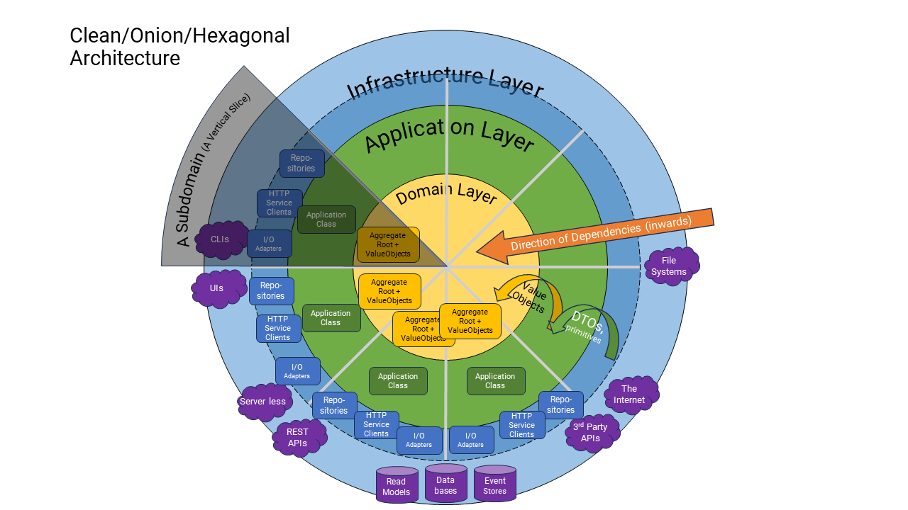

# Create a Subdomain Module

## Why?

You have a new aspect/capability/subdomain to add to your product

> It may, one day, be deployed independently, but right now it is deployed with all the other modules.



## What is the mechanism?

A "subdomain" is realized (in the solution file) as a collection of projects (usually about 8-10 projects, both code and tests).

A subdomain represents a "vertical slice" of the software and is further divided into 3 horizontal layers: Infrastructure -> Application -> Domain.

It includes (at the very least) all the code for the subdomain, unit tests for each component within each horizontal layer, and integration tests for testing the public interfaces of the whole vertical slice (i.e., API).

Altogether, all this code is wrapped up in a single "module" that can be injected into any host project (i.e., `ApiHost1`)

## Where to start?

### Naming

Often, defining a name for your subdomain (disparate from others) is the hardest part of this exercise.

The truth is that you should give it some thought before starting, but at some point in time, you have to accept that you may not get this right the first time around, and it will change as you learn more about your own problem domain.

Sometimes, as you investigate your subdomain further, this means renaming your subdomain and its concepts (i.e., aggregate root, entities, and value objects), or it may lead you to combine your subdomain with another subdomain or split your subdomain into one or smaller subdomains.

At the end of the day it is about the use-cases you have to support, and the coupling with other subdomains, that determine how small or large a subdomain should/will be.

> Note: You are aiming to reduce coupling while grouping use cases better.

Every subdomain requires a name. Usually a noun (with a singular and plural form).

> Your subdomain name may, in fact, differ subtly from the name of your root aggregate, and in some cases, you may decide to support more than one root aggregate in the same subdomain(for example, see the Ancillary and Identity subdomains)

### Classification

Technically, the subdomain you are about to build will be classified as a "Core" subdomain or a "Generic" subdomain.

> These are DDD terms. A "core" subdomain is unique to your product, as opposed to a "Generic" subdomain, which can be found in most other SaaS products.

Most subdomains will have at least one publicly accessible interface; more often than not, this interface is as a REST API.

> Or it may also be other channels, like queues, message buses, or other kinds of communications infrastructure.

The best way to get started with a new subdomain is to use the same patterns and assets that you see being used already in existing subdomains.

> Note: We have included several project templates in this codebase to use to construct your subdomain. You will need to install them into your IDE first. See [Tooling](../design-principles/0140-developer-tooling.md) for instructions on doing that.

### Solution and Projects

Your subdomain is going to be implemented in about 7-8 different projects, all in the same solution folder in the solution.

Create a new Solution folder with the name of your subdomain, in either the `Subdomains/Core` or `Subdomains/Generic` solution folder.

To that solution folder, add another one called `Tests` . This is where your various test projects live.

Now follow the following sections to build out the skeleton of your subdomain in projects.

We are going to start at the innermost projects, move outwards to the project where your API is built, and then back inwards with your implementation.

### Create the Domain Projects

See [Add the Domain Layer](040-domain-layer.md) for more details

### Create the Application Projects

See [Add the Application Layer](030-application-layer.md) for more details

### Create the Infrastructure Projects

Generally speaking we would start by creating the API of the subdomain. You would start from the API and work inwards towards your domain logic.

> Note: In some cases, you may start at the domain and work "inside-out" from there. But we strongly recommend against the "inside-out" approach, despite many programmers feeling more comfortable with this approach coming from a data-modelling background, where you are thinking about the database table before the behavior of the core domain.
>
> The "inside-out" approach in "domain modeling" requires a great many details and design decisions to be known upfront and lots of focused time to track progress to complete it end to end. Whereas starting at the API contract, thinking about the use cases, and working "outside-in" (may sound counter-intuitive), it more naturally tends to present the design decisions at the right times in the right places where they can be qualified and acted upon much easier. In other words, you don't need to have so many details in your head to get started. Those details will present themselves "in context" at the right moments, at a better time than far into the future. This is a key practice to avoid over-engineering by default.
>
> One exception to this rule is when you have very detailed and accurate specifications to start with (for example, you are porting from one piece of code to another, and you are aiming for just parity - which is rarer than you might first think).

### Infrastructure Code

Infrastructure code is the code you need to write for the plug-in "infrastructure components" of your software.

Essentially, infrastructure components are those that deal with any form of IO (input/output). (i.e. memory, disk, internet, database, etc.), and they are the only pieces of software that you would build that are coupled to external services or physical infrastructure like databases, and external 3rd party APIs.

An API is an infrastructure component that is driven by the internet (HTTP requests). All technology "adapters" (a.k.a. ports-and-adapters) are also infrastructure components, whether they are driven by the Application Layer, or whether they drive the Application Layer.

For example, a subdomain that we want to build to model cars might be called a `Car` (singular form).

All the components that talk to databases and the internet belong in this layer, in a project named `CarsInfrastructure` (plural form).

#### The Module

The "module" is the unit of deployment in a codebase like SaaStack.

* It usually contains one or more vertical slices of the software (Infrastructure + Application + Domain). It can be deployed standalone in some kind of runtime host (i.e. a web server or serverless container), or it can be deployed with one or more other modules in a shared host (i.e. a modular-monolith).

* The module is independent of other modules. It likely communicates with other modules via HTTP, (or other protocols like queues, messages buses etc.). It can be independently tested in isolation or as part of a larger collection of modules.

* It defines its own dependencies and configures itself within the host it is registered in. The host instructs the module on when to register its dependencies, and when to configure itself.

The module is a class in a file like `CarsModule.cs` (plural form). The class derives from `ISubdomainModule`, like this:

```c#

public class CarsModule : ISubdomainModule
{
    public Assembly InfrastructureAssembly => typeof(CarsModule).Assembly;

    public Assembly DomainAssembly => typeof(CarRoot).Assembly;

    public Dictionary<Type, string> EntityPrefixes => new()
    {
        { typeof(CarRoot), "hse" }
    };

    public Action<WebApplication, List<MiddlewareRegistration>> ConfigureMiddleware
    {
        get { return (app, _) => app.RegisterRoutes(); }
    }

    public Action<ConfigurationManager, IServiceCollection> RegisterServices
    {
        get
        {
            return (_, services) =>
            {
                // Any Application/Domain services that are consumed by the Application/Domain classes
                services.AddSingleton<IFoundationService, CarFoundationService>();

                // The Application class
                services.AddPerHttpRequest<ICarsApplication>(c =>
                    new CarsApplication.CarsApplication(c.GetRequiredService<IRecorder>(),
                        c.GetRequiredService<IIdentifierFactory>(),
                        c.GetRequiredService<IFoundationService>(),
                        c.GetRequiredService<ICarRepository>()));
                // The Repository class (event-sourcing)
                services.AddPerHttpRequest<ICarRepository>(c =>
                    new CarRepository(c.GetRequiredService<IRecorder>(),
                        c.GetRequiredService<IDomainFactory>(),
                        c.GetRequiredService<IEventSourcingDddCommandStore<CarRoot>>(),
                        c.GetRequiredServiceForPlatform<IDataStore>()));
                // Wire-up the repository to eventing projections and notifications
                services.RegisterEventing<CarRoot, CarProjection, CarNotifier>(c => 
                    new CarProjection(c.GetRequiredService<IRecorder>(),
                        c.GetRequiredService<IDomainFactory>(),
                        c.GetRequiredServiceForPlatform<IDataStore>()),
                    _ => new CarNotifier());

                // Any Application Services exposed by this subdomain
                services.AddPerHttpRequest<ICarsService, CarsInProcessServiceClient>();
            };
        }
    }
}
```

##### Dependency Injection

Let's look at Dependency Injection and the rules around how you should configure the dependencies of your module.

Dependencies are injected, typically into constructors (that is the convention used in SaaStack), and when injected at runtime, an instance of the dependency is used. Like most DI frameworks (we are based on .net > 8.0), there are three levels of instancing of dependencies:

1. **Singleton** - means one and only one instance of the dependency is created (ever) and reused whenever that dependency is resolved or injected into another class.
2. **Scoped** (a.k.a. **PerHttpRequest**)- means one and only one instance of the dependency is created (per HTTP Request) and reused within the same HTTP thread. Other HTTP threads get their own instances. A unique instance per HTTP request.
3. **Transient** - means that a new instance of the dependency is created every time the dependency is resolved or injected into another class.

With these instancing "policies" it should be clear that if we instantiate a Singleton instance, and that class depends on an instance of another class that is a Transient, then that transient dependency is only ever injected once (ever) into the Singleton (at the moment that the Singleton is created). This is a grave mistake, and it may have difficult-to-debug side effects at runtime since the intended behavior of the Transient dependency has been altered by being injected into the Singleton instance.

> Note: This is an easy mistake to make in code at design time. Fortunately, many dependency injection frameworks (including .net8.0) detect this mistake at runtime and will throw an exception notifying the developer of their design-time mistake.

Thus, you should not inject a more volatile dependency into a less volatile dependency. So, it follows that the level of volatility of your dependency is governed by the dependents volatility levels.

Thus, if your class has a `Singleton` dependency injected into its constructor, then this class needs to be registered as `Singleton` (or `Scoped`, or `Transient`). If it has a `Scoped` dependency injected into its constructor, then it needs to be registered as `Scoped` (or `Transient`), and finally, if it has a `Transient` dependency injected into its constructor, then it can itself be registered as either `Singleton`, `Scoped` or `Transient`.

When you are registering the services of your module in the code above, you need to be aware of several underlying things. Let's look at a typical module, and how it wires up its dependencies:

1. Strictly speaking, your Application class (`CarsApplication`) should/could be registered as a `Singleton`, as long as it does not have any `Transient` or `Scoped` dependencies. However, if it has a `Scoped` Repository dependency (for example), then it also needs to be `Scoped`.
2. All "eventing" repositories, such as `IEventSourcingDddCommandStore<CarRoot>` and `IEventSnapshottingDddCommandStore<CarRoot>` (the two most common), must be registered as `Scoped` because:
   1. Reason 1: The eventing mechanism itself MUST be `Scoped` to each HTTP request; otherwise, we could be raising 'domain_events' multiple times - one for each concurrent HTTP request thread, subscribed to the `Singleton` producer of the events! which would be a serious disaster!
   2. Reason 2: For subdomains that are tenant-specific (as most "Core" subdomains will be), repositories (and some services) for that subdomain may use configuration specific to the specific tenant (i.e. connection strings). (see [MultiTenancy](../design-principles/0130-multitenancy.md) for more details on how), and thus, they must be registered as Scoped for that specific HTTP request. Otherwise, they could be sharing configuration. Another serious disaster!
   3. Because of the two reasons above, all of these eventing stores/repositories must be registered as `Scoped` (or `Transient`) but not `Singleton`. And, therefore, so must your `CarsApplication`.
3. Any services that your module defines (to be consumed by other modules in other subdomains), (e.g. `CarsInProcessServiceClient`) if and only if those services are in-process, then they will need to be `Scoped` because they inject the `carsApplication` as a dependency, which is also `Scoped`. If they are running out of process, they will be issuing HTTP calls to other subdomains, so they can probably be `Singleton`.
4. The only remaining services left are those injected into the `CarsApplication` (e.g. `CarFoundationService`). They are being injected into a `Scoped` Application, so they can be either `Singleton` or `Scoped` depending on what dependencies they inject into themselves. `Singleton` would be preferred as a default.

#### The API

You build an API in the `Infrastructure` project of your subdomain.

For example, in the `CarsInfrastructure` project, we create a folder called `Api`.

See [Add a REST API Endpoint](020-api-endpoint.md) for more details
